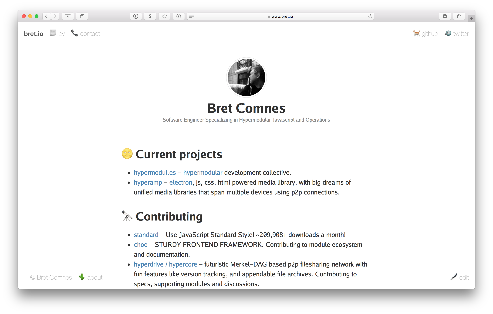

# [bret.io](https://www.bret.io)

[](https://travis-ci.org/bcomnes/bret.io)
[](https://david-dm.org/bcomnes/bret.io?type=dev)
[](https://app.netlify.com/sites/bret-io/deploys)

Source code for [bret.io](https://www.bret.io).

```sh
npm i
npm test
npm start # live reload server for dev
npm run build # build snapshot from src to dist
```

## Features

- Markdown to HTML with [sitedown](https://github.com/hypermodules/sitedown)
- [Modular](https://github.com/bcomnes/bret.io/blob/master/postcss.config.js#L5-L10) CSS in-lining with [post-css](https://github.com/postcss/postcss)
- Modular JS with [browserify](http://browserify.org) tested with [tape](https://github.com/substack/tape)
- ~~Emoji 🐴~~
- CSS base coat provided by: [style.css](https://github.com/ungoldman/style.css), [top-bar.css](https://github.com/ungoldman/top-bar.css), [Go fonts](https://blog.golang.org/go-fonts) [👨‍🎨](https://ungoldman.com)
- Continuous git deployment and PR deploy previews provided by [Netlify](https://www.netlify.com) (I work there now)
- Automated dependency updates by [greenkeeper](https://greenkeeper.io)
- Full external CSS + JS sourcemap support

## Screenshot

(may be out of date)



## License

- Content: © Bret Comnes
- Code: ISC
