<header class="header">
  
  <h1 class="title">Bret Comnes</h1>
  
DevOps • JS • Go • Swift • Crypto • P2P

</header>

<section class="portfolio grid-container">

  

    <h2 id="package-automation"><a href="./projects/package-automation/">pkg automation</a></h2>
    <figure>
      
      <figcaption>Fully Automated Luxury Space Age Package Maintenance, as a blogpost. (<a href="https://lortarkam.wordpress.com/2017/04/12/how-should-the-forerunners-really-look/">Img Source</a>)</figcaption>
    </figure>
    <ul>
      <li class="lang js"><a href="https://github.com/bcomnes/npm-bump">bcomnes/npm-bump</a></li>
      <li class="lang twitter"><a href="https://twitter.com/bcomnes/status/1311034520305569800">Blogpost discussion thread</a></li>
    </ul>
  

  

    <h2 id="vhs-tape"><a href="https://github.com/hyperdivision/vhs-tape">vhs-tape</a></h2>
    <figure>
      
      <figcaption>Generic component unit testing with async/await. (Logo by <a href="https://github.com/tony-go">@tony-go</a>)</figcaption>
    </figure>
    <ul>
      <li class="lang js"><a href="https://github.com/hyperdivision/vhs-tape">hyperdivision/vhs-tape</a></li>
      <li class="lang twitter"><a href="https://twitter.com/bcomnes/status/1153690382703693830">Announcement 📺</a></li>
      <li class="lang twitter"><a href="https://twitter.com/bcomnes/status/1168462157777899527">Headless test runner 📺</a></li>
    </ul>
  

  

    <h2 id="hyperamp"><a href="https://github.com/hypermodules/hyperamp">Hyperamp</a></h2>
    <figure>
      <a href="https://github.com/hypermodules/hyperamp">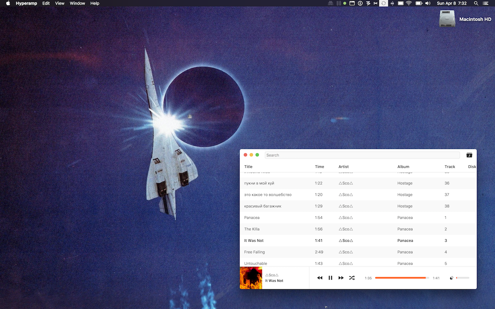</a>
      <figcaption>Cross platform audio library app. (<a href="https://git.io/vFwz6">Download Beta</a>)</figcaption>
    </figure>
    <ul>
      <li class="lang js"><a href="https://github.com/hypermodules/hyperamp">hypermodules/hyperamp</a></li>
      <li class="lang js"><a href="https://github.com/hypermodules/entypo">hypermodules/entypo</a></li>
    </ul>
  

  

    <h2 id="datcast"><a href="https://dat-cast.hashbase.io">Datcast</a></h2>
    <figure>
      
      <figcaption>Podcast exploring the people building the p2p web with <a href="https://twitter.com/jimpick">@jimpick</a></figcaption>
    </figure>
    <ul>
      <li class="lang twitter">Follow <a href="https://twitter.com/dat_cast">@dat_cast</a> on twitter</li>
    </ul>
    
    
  

  

    <h2 id="netlify"><a href="/jobs/netlify/">Netlify Portfolio</a></h2>
    <figure>
      <a href="/jobs/netlify/">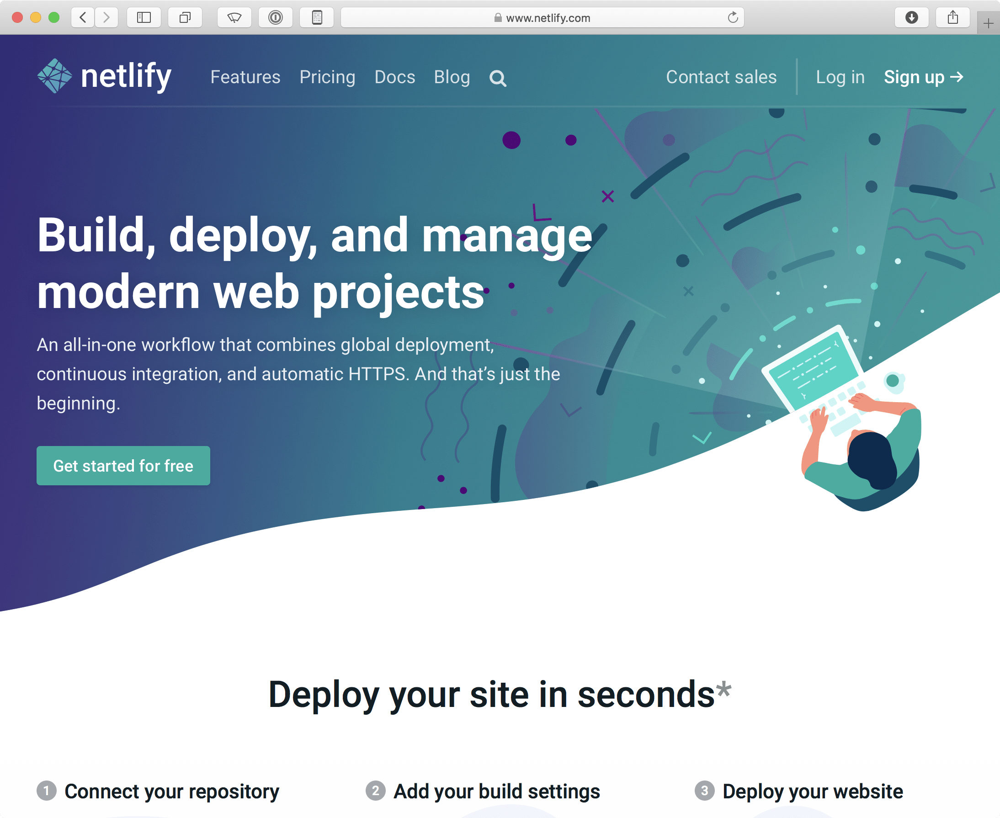</a>
      <figcaption>I worked at <a href="https://www.netlify.com">Netlify</a> on product features, platform architecture and open-source.</figcaption>
    </figure>
    <ul>
      <li class="lang docker"><a href="https://github.com/netlify/build-image">netlify/build-image</a></li>
      <li class="lang go"><a href="https://godoc.org/github.com/netlify/open-api/go">netlify/open-api/go</a></li>
      <li class="lang js"><a href="https://github.com/netlify/js-client">netlify/js-client</a></li>
      <li class="lang js"><a href="http://github.com/netlify/cli">netlify/cli</a></li>
      <li class="lang js"><a href="https://github.com/netlify/cli-utils">netlify/cli-utils</a></li>
    </ul>
  

  

    <h2 id="arch-arm"><a href="https://github.com/bcomnes/archlinux-arm-img">Archlinux Arm</a></h2>
    <figure>
      <a href="https://github.com/bcomnes/archlinux-arm-img">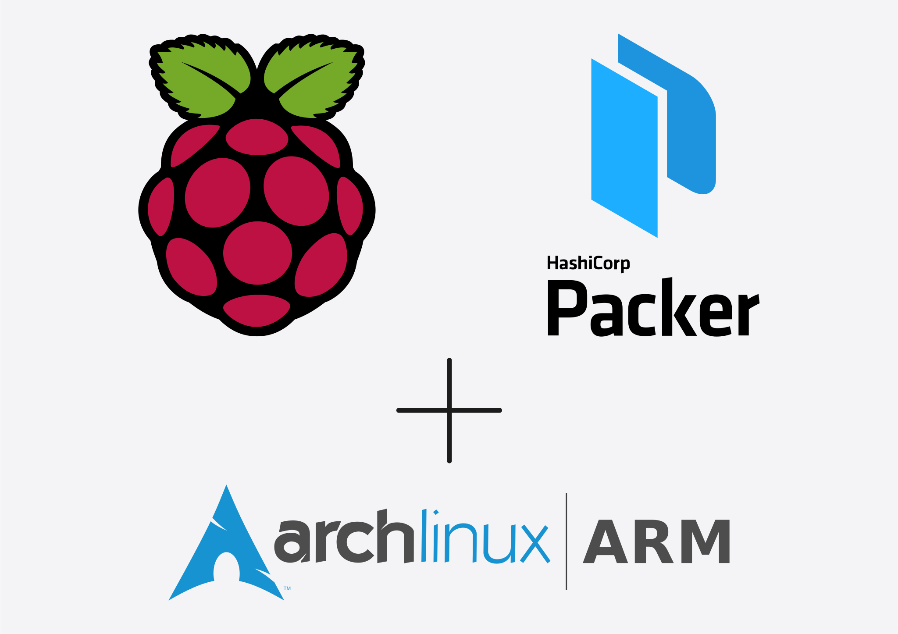</a>
      <figcaption>Automated provisioning of <a href="https://archlinuxarm.org">Archlinx Arm</a> images for Rasberry Pi hardware with <a href="https://www.packer.io">Hashicorp's Packer</a> and other various micro-scale devops experiments.</figcaption>
    </figure>
    <ul>
      <li class="lang sh"><a href="https://github.com/bcomnes/archlinux-arm-img">bcomnes/archlinux-arm-img</a></li>
      <li class="lang go"><a href="https://github.com/bcomnes/raspi-packer">bcomnes/raspi-packer</a></li>
      <li class="lang python"><a href="https://github.com/bcomnes/sbc-bootstrap">sbc-bootstrap</a></li>
    </ul>
  

  

    <h2 id="gumcast"><a href="https://github.com/bcomnes/gumcast-api">Gumcast</a></h2>
    <figure>
      
      <figcaption>Custom API servce allowing you to subscrube to any product on <a href="https://gumroad.com">Gumroad</a> as a Podcast. (WIP)</figcaption>
    </figure>
    <ul>
      <li class="lang js"><a href="https://github.com/bcomnes/gumcast-api">bcomnes/gumcast-api</a></li>
    </ul>
  

  

    <h2><a href="/projects/websockets/">Websockets</a></h2>
    <figure>
      <a href="/projects/websockets/">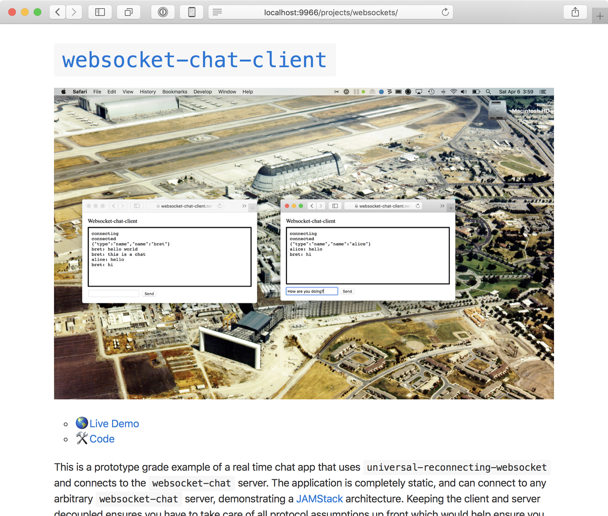</a>
      <figcaption>Experiments and abstractions with Websockets and a write up of the discoveries made regarding universal Node.js/DOM modules.</figcaption>
    </figure>
    <ul>
      <li class="lang js"><a href="https://github.com/bcomnes/universal-reconnecting-websocket">bcomnes/universal-reconnecting-websocket</a></li>
      <li class="lang js"><a href="https://github.com/bcomnes/websocket-chat">bcomnes/websocket-chat</a></li>
      <li class="lang js"><a href="https://github.com/bcomnes/websocket-chat-client">bcomnes/websocket-chat-client</a></li>
      <li class="lang js"><a href="https://github.com/bcomnes/dom-event-handler">bcomnes/dom-event-handler</a></li>
      <li class="lang js"><a href="https://github.com/bcomnes/node-event-handler">bcomnes/node-event-handler</a></li>
    </ul>
  

  

    <h2 id="json-feed"><a href="https://jsonfeed.org">News Feed Tools</a></h2>
    <figure>
      <a href="https://github.com/bcomnes/jsonfeed-to-rss">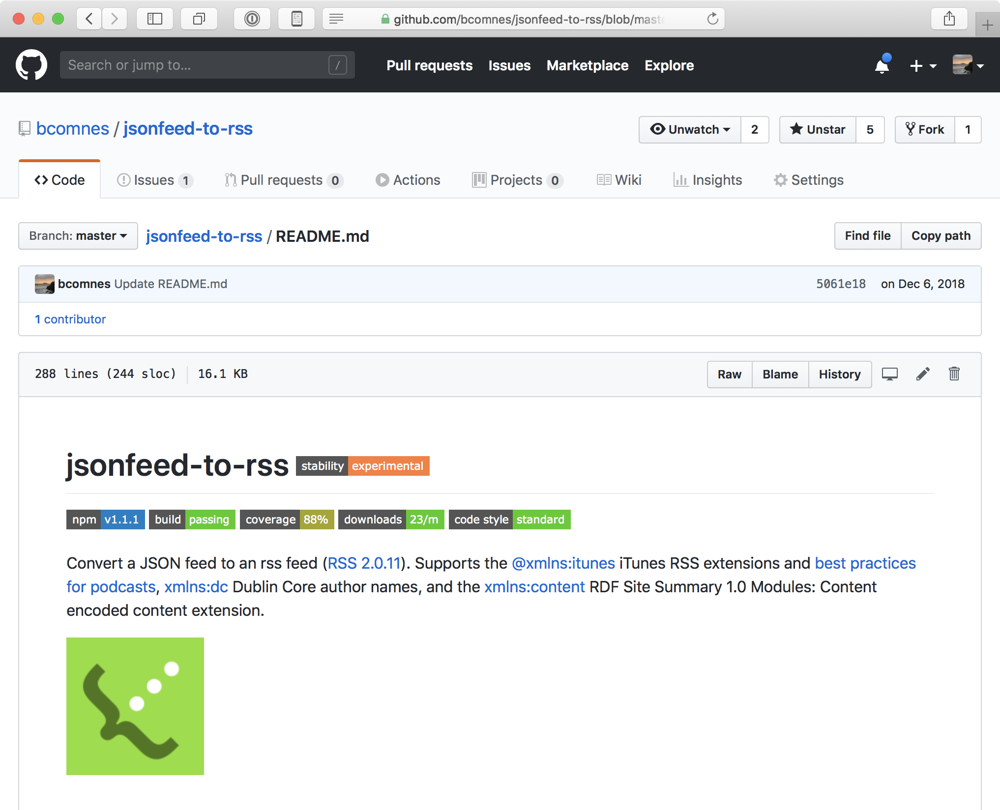</a>
      <figcaption>Simple tools to support a JSON Feed first workflow, while still supporting legacy RSS and Atom for websites and podcasting.</figcaption>
    </figure>
    <ul>
      <li class="lang js"><a href="https://github.com/bcomnes/jsonfeed-to-rss">bcomnes/jsonfeed-to-rss</a></li>
      <li class="lang js"><a href="https://github.com/bcomnes/jsonfeed-to-atom">bcomnes/jsonfeed-to-atom</a></li>
      <li class="lang js"><a href="https://github.com/bcomnes/generate-feed">bcomnes/generate-feed</a></li>
      <li class="lang js"><a href="https://github.com/bcomnes/podcast-categories">bcomnes/podcast-categories</a></li>
      <li class="lang js"><a href="https://github.com/bcomnes/jsonfeed-converter">bcomnes/jsonfeed-converter</a></li>
    </ul>
  

  

    <h2 id="hypermodules"><a href="https://hypermodul.es">Hypermodul.es</a></h2>
    <figure>
      
      <figcaption>Open source <a href="https://github.com/hypermodules/">development studio</a> LLC.</figcaption>
    </figure>
    <ul>
      <li class="lang html"><a href="https://github.com/hypermodules/hypermodul.es">hypermodules/hypermodul.es</a></li>
      <li class="lang js"><a href="https://github.com/hypermodules/changelog-init">hypermodules/changelog-init</a></li>
      <li class="lang html"><a href="https://github.com/hypermodules/irc.hypermodul.es">hypermodules/irc.hypermodul.es</a></li>
    </ul>
  

  

    <h2 id="elenacomnes"><a href="https://elenacomnes.com">elenacomnes.com</a></h2>
    <figure>
      <a href="https://elenacomnes.com">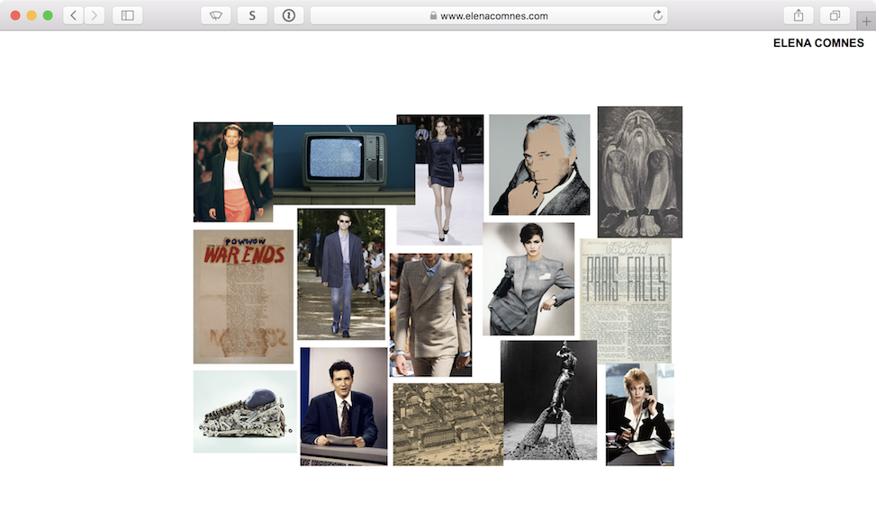</a>
      <figcaption>A minimalist, creative website.</figcaption>
    </figure>
    <ul>
      <li class="lang html"><a href="https://github.com/ecomnes/elenacomnes.com">ecomnes/elenacomnes.com</a></li>
    </ul>
  

  

    <h2 id="css"><a href="https://css-pkg.github.io">css-pkg</a></h2>
    <figure>
      <a href="https://css-pkg.github.io">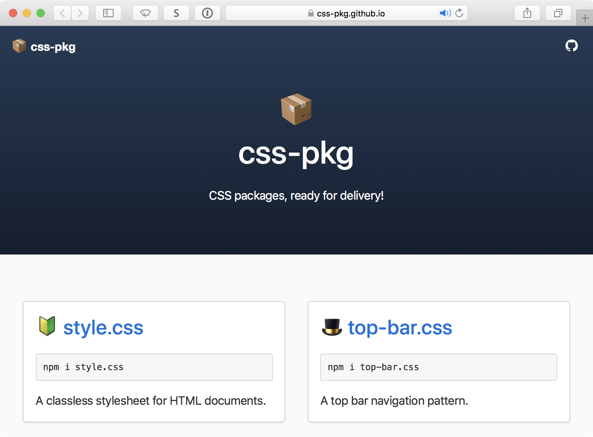</a>
      <figcaption>An <a href="https://github.com/css-pkg/">org</a> supporting CSS as node packaged modules, ready for consumption directly out of <code>node_modules</code> and installed with <code>npm</code> or <code>yarn</code>.</figcaption>
    </figure>
    <ul>
      <li class="lang css"><a href="https://github.com/css-pkg/big-cursors.css">css-pkg/big-cursors.css</a></li>
      <li class="lang css"><a href="https://github.com/css-pkg/fraktur.css">css-pkg/fraktur.css</a></li>
      <li class="lang css"><a href="https://github.com/css-pkg/chicago.css">css-pkg/chicago.css</a></li>
      <li class="lang css"><a href="https://github.com/css-pkg/lunchtype.css">css-pkg/lunchtype.css</a></li>
      <li class="lang html"><a href="https://github.com/css-pkg/css-pkg.github.io">css-pkg/css-pkg.github.io</a></li>
    </ul>
  

  

    <h2 id="choo"><a href="https://choo.io">Choo</a></h2>
    <figure>
      <a href="https://choo.io">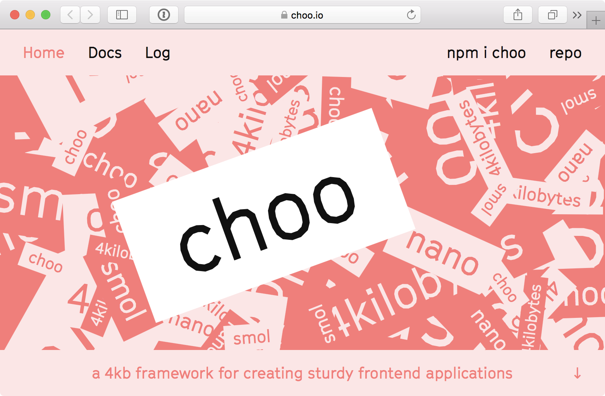</a>
      <figcaption>Maintainer and core contributor to the choo framework and ecosystem, a lightweight and decomposable alternative to frameworks like React.</figcaption>
    </figure>
    <ul>
      <li class="lang js"><a href="https://github.com/choojs/choo">choojs/choo</a></li>
      <li class="lang js"><a href="https://github.com/shama/on-load">shama/on-load</a></li>
      <li class="lang js"><a href="https://github.com/shama/bel">shama/bel</a></li>
    </ul>
  

  

    <h2 id="nanocomponent"><a href="https://github.com/choojs/nanocomponent">Nanocomponent</a></h2>
    <figure>
      
      <figcaption>Primary author of Nanocomponent, a standalone component model that works well with choo. Shoutout <a href="https://github.com/lrlna">lrlna</a> for the algorithm illustration.</figcaption>
    </figure>
    <ul>
      <li class="lang js"><a href="https://github.com/choojs/nanocomponent">choojs/nanocomponent</a></li>
      <li class="lang js"><a href="https://github.com/bcomnes/youtube-component">bcomnes/youtube-component</a></li>
      <li class="lang js"><a href="https://github.com/bcomnes/twitter-component">bcomnes/twitter-component</a></li>
      <li class="lang js"><a href="https://github.com/bcomnes/nanocomponent-cache">bcomnes/nanocomponent-cache</a></li>
      <li class="lang js"><a href="https://github.com/bcomnes/class-cache">bcomnes/class-cache</a></li>
      <li class="lang js"><a href="https://github.com/bcomnes/nanomap">bcomnes/nanomap</a></li>
    </ul>
  

  

    <h2 id="standard" ><a href="https://standardjs.com">Standard JS</a></h2>
    <figure>
      
      <figcaption>Maintainer, contributor and advisor to the <a href="https://github.com/standard/standard">Standard JS</a> linter and formatter project, used by <a href="https://twitter.com/feross/status/740592720230518784/photo/1">Timbl</a> and <a href="https://twitter.com/BrendanEich/status/741277499376603138">B.Eich</a>.</figcaption>
    </figure>
    <ul>
      <li class="lang python"><a href="https://github.com/bcomnes/sublime-standard-format">bcomnes/sublime-standard-format</a></li>
      <li class="lang html"><a href="https://github.com/standard/standard-www">standard/standard-www</a></li>
      <li class="lang js"><a href="https://github.com/standard/standard">standard/standard</a></li>
    </ul>
  

  

    <h2 id="brwoserify"><a href="http://browserify.org">Browserify</a></h2>
    <figure>
      <a href="http://browserify.org">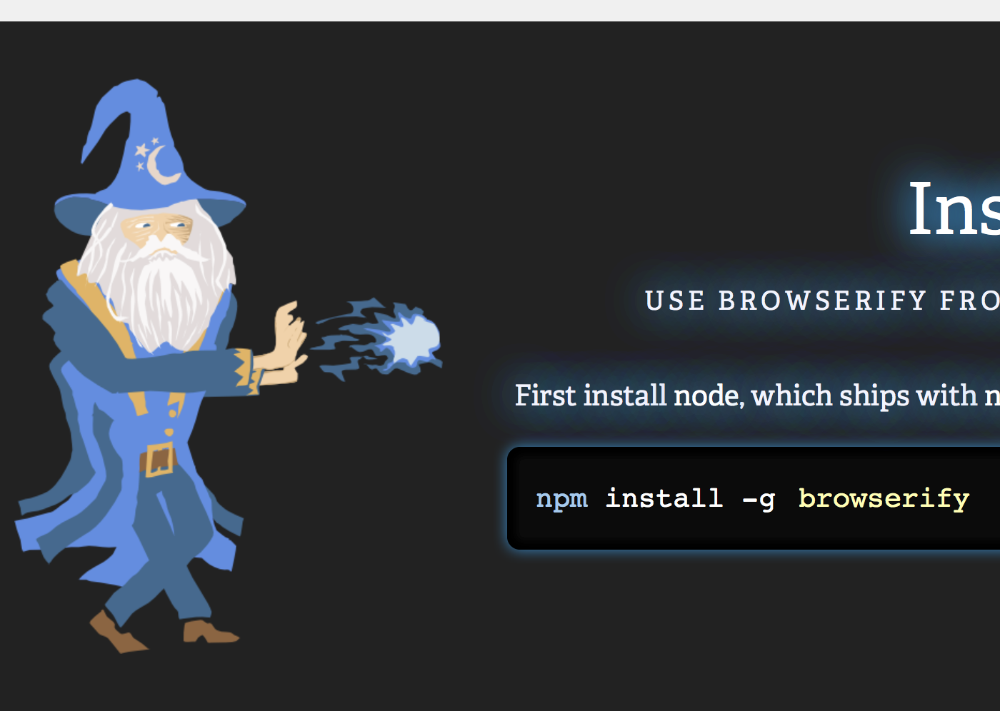</a>
      <figcaption>Maintainer and contributor to Browserify and ecosystem.</figcaption>
    </figure>
    <ul>
      <li class="lang js"><a href="https://github.com/browserify/people">browserify/people</a></li>
      <li class="lang js"><a href="https://github.com/browserify/browserify">browserify/browserify</a></li>
      <li class="lang js"><a href="https://github.com/browserify/browserify-handbook">browserify/browserify-handbook</a></li>
    </ul>
  

  

    <h2 id="node.js"><a href="https://nodejs.org/en/">Node.js</a></h2>
    <figure>
      <a href="https://github.com/bcomnes/node-handbook">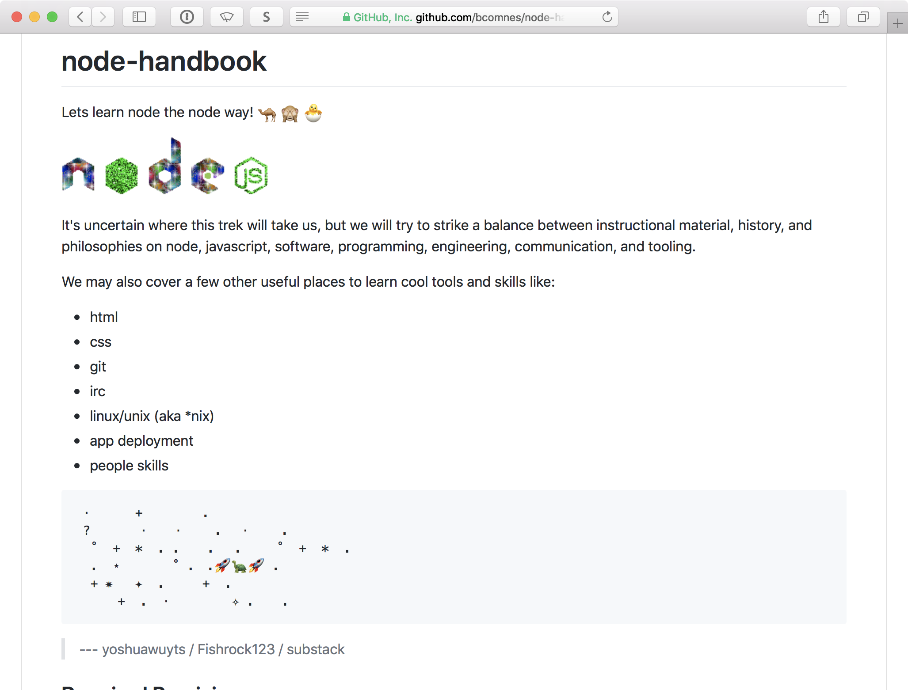</a>
      <figcaption>The <a href="https://github.com/bcomnes/node-handbook">Node.js handbook</a> captures resources and anthropological artifacts relevant to learning Node.js.</figcaption>
    </figure>
    <ul>
      <li class="lang js"><a href="https://github.com/maxogden/mississippi">maxogden/mississippi</a></li>
      <li class="lang js"><a href="https://github.com/bcomnes/node-handbook">bcomnes/node-handbook</a></li>
      <li class="lang js"><a href="https://github.com/bcomnes/hyperserv">bcomnes/hyperserv</a></li>
      <li class="lang js"><a href="https://github.com/bcomnes/hyperblog">bcomnes/hyperblog</a></li>
    </ul>
  

  

    <h2 id="datproject"><a href="https://datproject.org">Dat</a></h2>
    <figure>
      <a href="https://github.com/bcomnes/flattree">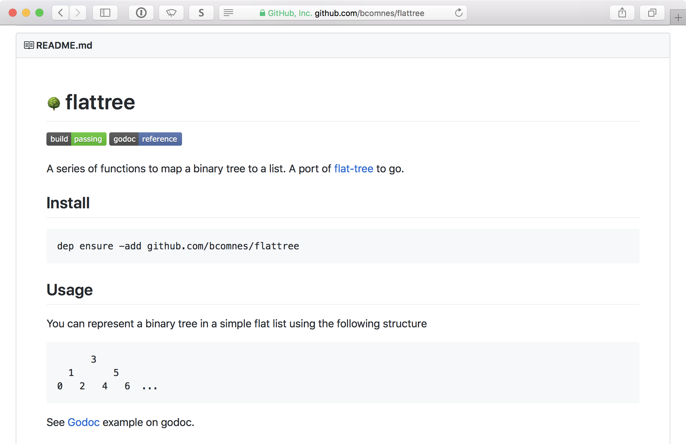</a>
      <figcaption>Contributing to the <a href="https://github.com/random-access-storage">Dat module ecosystem</a> and provided early review of the <a href="https://github.com/datproject/docs/blob/master/papers/dat-paper.md">hypercore protocol spec</a>.</figcaption>
    </figure>
    <ul>
      <li class="lang go"><a href="https://github.com/bcomnes/flattree">bcomnes/flattree</a></li>
      <li class="lang js"><a href="https://github.com/random-access-storage/random-access-http">random-access-storage/random-access-http</a></li>
      <li class="lang js"><a href="https://github.com/bcomnes/xor-stream">bcomnes/xor-stream</a></li>
      <li class="lang js"><a href="https://github.com/mafintosh/hyperirc">mafintosh/hyperirc</a></li>
    </ul>
  

  

    <h2><a href="https://golang.org">Go</a></h2>
    <figure>
      <a href="https://github.com/bcomnes/goref/">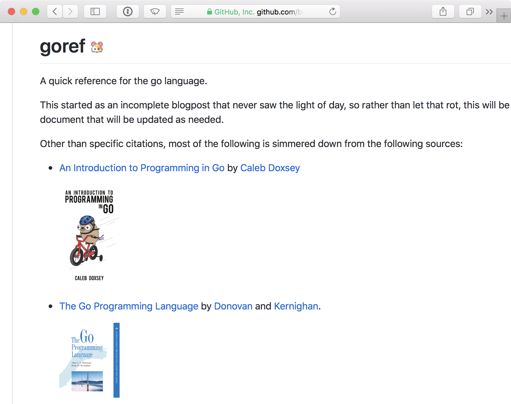</a>
      <figcaption>A Golang concentrate for refreshing your memory on the go programming language.</figcaption>
    </figure>
    <ul>
      <li class="lang go"><a href="https://github.com/bcomnes/goref">bcomnes/goref</a></li>
      <li class="lang css"><a href="https://github.com/bcomnes/go-fonts.css">bcomnes/go-fonts.css</a></li>
    </ul>
  

  

    <h2 id="leveldb"><a href="http://leveldb.org">Leveldb</a></h2>
    <figure>
      <a href="https://github.com/hypermodules/level-auto-index/">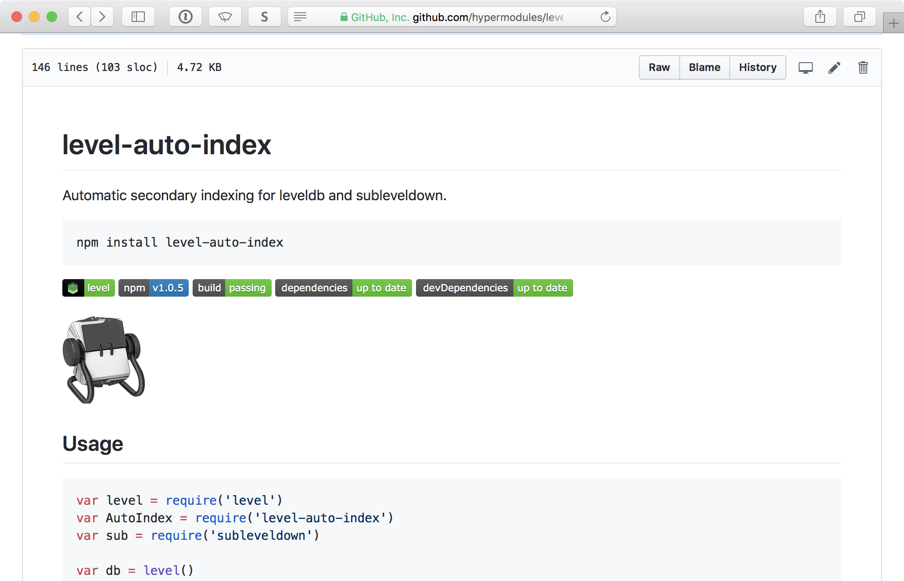</a>
      <figcaption>level-auto-index creates and maintains supplementary <a href="http://leveldb.org">LevelDB</a> indexes automatically.</figcaption>
    </figure>
    <ul>
      <li class="lang js"><a href="https://github.com/hypermodules/level-idx">hypermodules/level-idx</a></li>
      <li class="lang js"><a href="https://github.com/hypermodules/level-auto-index">hypermodules/level-auto-index</a></li>
      <li class="lang js"><a href="https://github.com/hypermodules/level-hookdown">hypermodules/level-hookdown</a></li>
    </ul>
  

  

    <h2 id="electron"><a href="https://electronjs.org">Electron</a></h2>
    <figure>
      
      <figcaption>Creating Electron apps, developer tools and contributing to the Electron prebuild ecosystem to help improve native modules in Electron.</figcaption>
    </figure>
    <ul>
      <li class="lang js"><a href="https://github.com/hypermodules/dti">hypermodules/dti</a></li>
      <li class="lang js"><a href="https://github.com/bcomnes/mooon">bcomnes/mooon</a></li>
      <li class="lang js"><a href="https://zhealthdocumentation.com/etch-suite/">zhealthdocumentation.com/etch-suite</a></li>
      <li class="lang js"><a href="https://github.com/prebuild">Home Prebuilders Association</a></li>
    </ul>
  

  

    <h2 id="dotfiles"><a href="https://github.com/bcomnes/.dotfiles">.dotfiles</a></h2>
    <figure>
      
      <figcaption>These are my .dotfiles, don't wear em out.  I've also written a few notes on how I like to do things.</figcaption>
    </figure>
    <ul>
      <li class="lang sh"><a href="https://github.com/bcomnes/.dotfiles">bcomnes/.dotfiles</a></li>
      <li class="lang"><a href="https://gist.github.com/bcomnes/647477a3a143774069755d672cb395ca">How I GPG</a></li>
      <li class="lang sh"><a href="https://github.com/bcomnes/sbc-bootstrap">bcomnes/sbc-bootstrap</a></li>
    </ul>
  

  

    <h2 id="tron"><a href="https://github.com/bcomnes/sublime-tron-color-scheme">$ edit<a/></h2>
    <figure>
      
      <figcaption>Here are a few themes and plugins I help maintain, as well as my editor settings.</figcaption>
    </figure>
    <ul>
      <li class="lang python"><a href="https://github.com/bcomnes/sublime-text-settings">bcomnes/sublime-text-settings</a></li>
      <li class="lang python"><a href="https://github.com/bcomnes/sublime-tron-color-scheme">bcomnes/sublime-tron-color-scheme</a></li>
      <li class="lang objc"><a href="https://github.com/bcomnes/Tron.tmbundle">bcomnes/Tron.tmbundle</a></li>
      <li class="lang objc"><a href="https://github.com/bcomnes/LaTeX-Font-Settings.tmbundle">bcomnes/LaTeX-Font-Settings.tmbundle</a></li>
      <li class="lang js"><a href="https://github.com/bcomnes/atom-tron-legacy">bcomnes/atom-tron-legacy</a></li>
      <li class="lang js"><a href="https://gist.github.com/bcomnes/fe54a46cb2b7ae916a0d1cdfc56727c3">atom-settings</a></li>
      <li class="lang js"><a href="https://atom.io/users/bcomnes">Atom user page</a></li>
    </ul>
  

  

    <h2 id="2016-reading"><a href="https://gist.github.com/bcomnes/6d76c3ace861d4d0ed57f2cde2346ffe">Late 2016 Reading List</a></h2>
    <figure>
      <a href="https://gist.github.com/bcomnes/6d76c3ace861d4d0ed57f2cde2346ffe">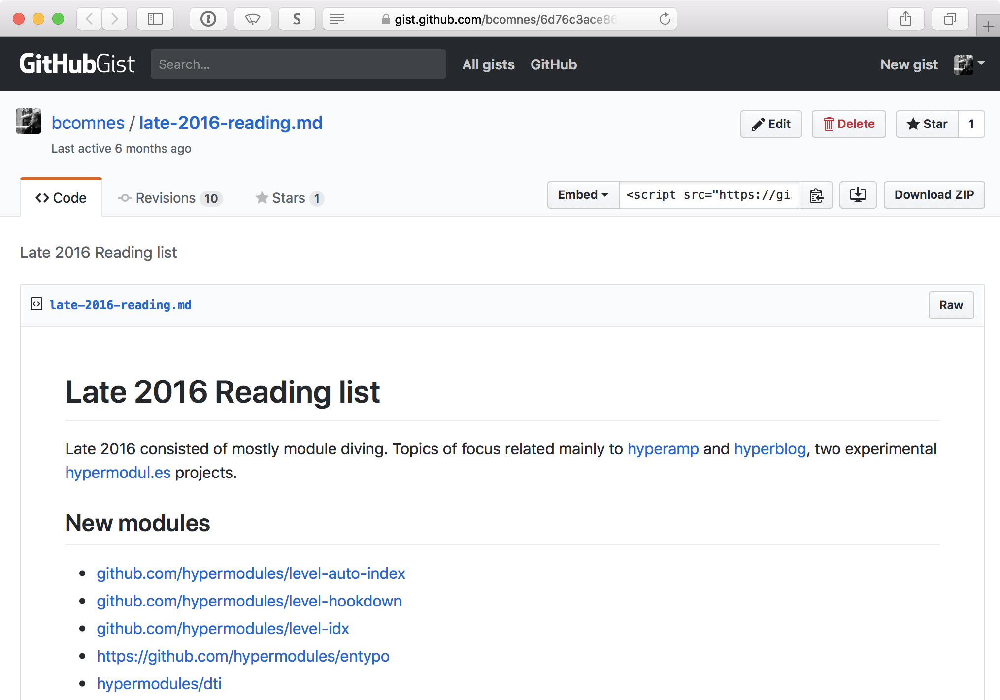</a>
      <figcaption>A list of things I was reading in late 2016.</figcaption>
    </figure>
  

</section>
