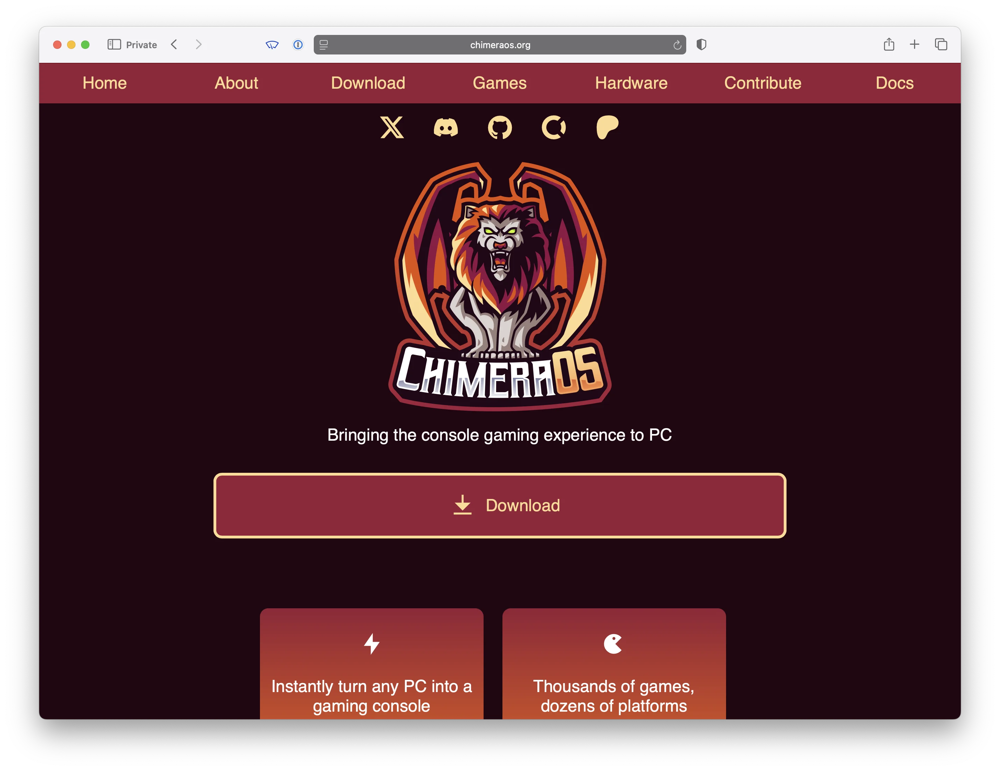

I'm thrilled to see Linux become a more viable platform for PC gaming, and it's awesome to see so many new Linux users come aboard.
Unlike commercial operating systems that pay people to clarify and simplify product details, open source subjects its users to maximum complexity, clarification, and particularities (IT'S GNU/LINUX!!). With a new generation of users, it's helpful to know when apples are apples and oranges are oranges—especially when new points of confusion arise.

SteamOS, being a Linux distro, is no different. There are quite a few things being called "SteamOS" these days on YouTube tutorials, so I figured I could help clear things up.

<pre class="mermaid">
graph TD
  SteamOSDebian["🎮 SteamOS (Debian)"]
  SteamOSArch["🎮 SteamOS (Archlinux)"]

  SteamFork["🛠️ SteamFork"]
  HoloISO["🌈 HoloISO"]
  ChimeraOS["🔥 ChimeraOS"]
  Bazzite["🔧 Bazzite"]

  SteamOSDebian
  SteamOSArch <-->|derived from| SteamFork
  SteamOSArch <-->|derived from| HoloISO

  ChimeraOS <-.->|pulls from| SteamOSArch
  Bazzite <-.->|pulls from| SteamOSArch
</pre>

<figure class="">
    
    <figcaption>Is the PewDiePie-switched-to-Linux video not a clear enough sign we are entering a transitional age of PC gaming on Linux?</figcaption>
</figure>

## Valve's Recovery Image is "SteamOS"

Valve has two flavors of SteamOS:

- Their ancient Debian-based "SteamOS" that came out for the original [Alienware "Steam Machines"](https://en.wikipedia.org/wiki/Steam_Machine_(computer)).

<figure class="borderless">
    
    <figcaption>SteamOS is here? No! This is the old, ancient SteamOS. Don't use this one!</figcaption>
</figure>

- The Arch-based ["Steam Deck Recovery image"](https://help.steampowered.com/en/faqs/view/1b71-edf2-eb6d-2bb3) that ships Gamescope and their latest 10-foot UI.

<figure class="borderless">
    
    <figcaption>Not very intuitive, but this is the SteamOS you want!</figcaption>
</figure>

The modern "Deck Recovery Image" is not quite ready for prime time, but it's totally usable on a lot of hardware (in the preview 3.7 branch).

**If you aren't running one of these, you aren't "running SteamOS"!**

## SteamOS Derivatives

There have been two known SteamOS derivative distributions: [**HoloISO**](https://github.com/HoloISO/releases) and [**SteamFork**](https://github.com/SteamFork).

A derivative distribution directly takes Valve's SteamOS and other sources and builds from those as a starting point.
This guarantees that they track SteamOS as closely as possible while overlaying whatever fixes or hardware compatibilities they offer.

**Both HoloISO and SteamFork are dead** (though you can still run them):

- HoloISO was run out of some Russian Telegram channel and had a lot of questionable build/distribution techniques that made it kind of impossible to verify the project wasn't actually distributing malware. I don't think this was ever the case, but it was never clear how to build or contribute to the project, and the maintainer was a college student who disappeared periodically.

- SteamFork was (US-based, I think?) a project that was open source on GitHub with a much more reproducible toolchain, build infrastructure, and in general was run much more professionally. It managed to produce an extremely high-quality SteamOS derivative that supported desktop hardware as well as a wide selection of popular handheld models.

In the end, I agree with the SteamFork maintainers: the Chinese handheld companies should be footing the bill for developing SteamOS support—not the community, outside of what Valve supports. The decision to close shop, while shocking, makes complete sense. SteamOS 3.7 is basically here—let's use it.

Credit to the SteamFork team ([@uejji](https://github.com/uejji) and [@fewtarius](https://github.com/fewtarius)) for their hard, beautiful build pipeline and for discovering that SteamOS 3.7 was viable enough for a lot of hardware.

<figure class="borderless">
    
    <figcaption>We hardly knew you, SteamFork. Thanks for all the work you put in!</figcaption>
</figure>

**If you are running a SteamOS derivative, you are *nearly* "running SteamOS", but rather a patched version of SteamOS.**

## Gamescope Distros

The two other notable distros I see labeled as "SteamOS" frequently (among others): [ChimeraOS](https://chimeraos.org) and [Bazzite](https://bazzite.gg).

**ChimeraOS and Bazzite are not "SteamOS".**

They’re both very similar, though, and are fantastic options if SteamOS doesn't run on your hardware yet or if you align with the broader scopes of either project. Both provide a reliable gaming-on-Linux, console-like experience, boot into [**Gamescope**](https://github.com/ValveSoftware/gamescope), and run games using [Proton](https://www.protondb.com).

> Gamescope: the micro-compositor formerly known as steamcompmgr

Without getting into the weeds, Gamescope is the thing that the Steam 10-foot UI and games "run in" on Linux. It allows you to do resolution scaling, overlay performance stats, apply FSR upscaling, etc.
It's the thing that provides a lot of the cooler Gaming OS features made popular by the Steam Deck.

**We'll classify non-SteamOS-derivative gaming distros that boot into Gamescope as "Gamescope distros".**

### ChimeraOS

<figure class="borderless">
    
    <figcaption>ChimeraOS: the best logo of them all.</figcaption>
</figure>

Chimera is a great project that predates the modern SteamOS.
It advertises itself as an immutable Linux distribution (meaning it installs and updates more reliably, with reliable rollbacks) intended to provide a Linux-based, console-like experience for a wide variety of devices.

It is also Arch-based, like SteamOS, but ships GNOME for desktop mode (instead of KDE) and maintains its own update cadence with upstream packages, independent of what Valve or the wider ecosystem does.
It even ships its own emulation support, UI web server, and 10-foot UI.

It's a great project and worth a shot if SteamOS 3.7 or SteamFork isn't working on your device right now—or if you find yourself more aligned with the vision of the project.

### Bazzite

<figure class="borderless">
    
    <figcaption>Bazzite has the most "enthusiastic" community, in my experience.</figcaption>
</figure>

I've not used Bazzite personally, but like Chimera, it's its own, non-derivative Linux distro and boots into Gamescope, so it feels and looks a lot like SteamOS.

It's based on Fedora and appears to make heavy use of process containers, making it even more distinct from SteamOS than Chimera.

It's quite popular on Reddit, has a large active community, and appears to have good hardware support.
However, being based on Fedora, you will run into many more differences when tinkering with the system compared to Chimera or SteamOS.
If you enjoy Arch Linux (or want to learn more about it), you may find the Fedora-specific OS details inconvenient.

**If you are running a "Gamescope distro", you are not "running SteamOS". You are running a Linux distro with its own distinct lineage that pulls on components from SteamOS to operate in a similar way.**

## "This doesn't matter, the outcome is the same!"

Directionally, things are similar, but the details matter in open source.
Different starting points lead to different outcomes, even if they all move in the same direction.
I'm not writing this to say x is better than y, but rather: x is not y, and saying you have x when you have y is misleading or mistaken.

This post isn't intended to say SteamOS is better than Project X. The goal here is to point out the differences—and why they matter. In many cases, it may not!

## "Which one are you saying I should run?"

Try them all out! See which one works for your goals.
