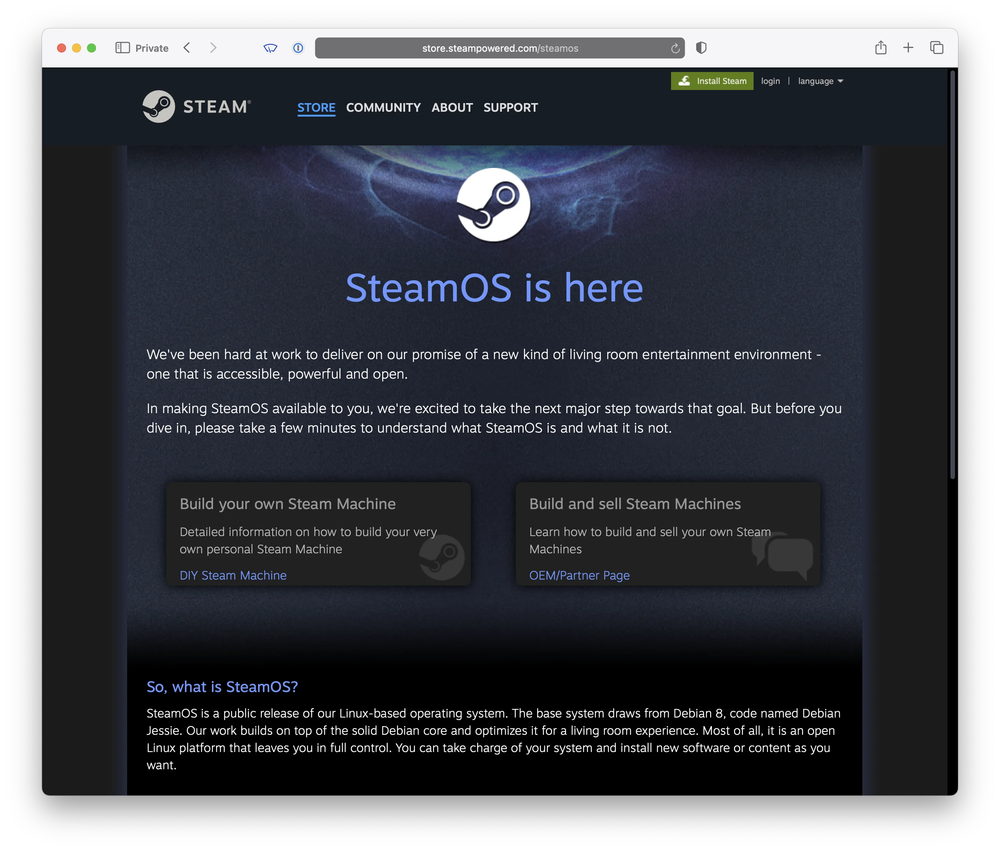
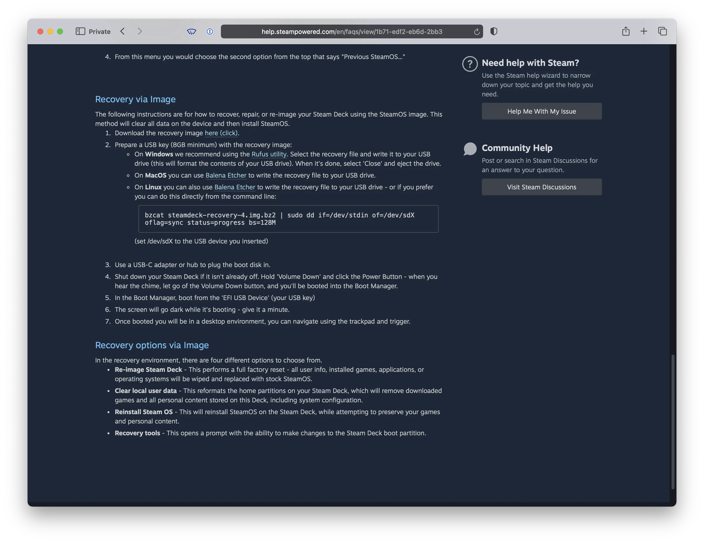
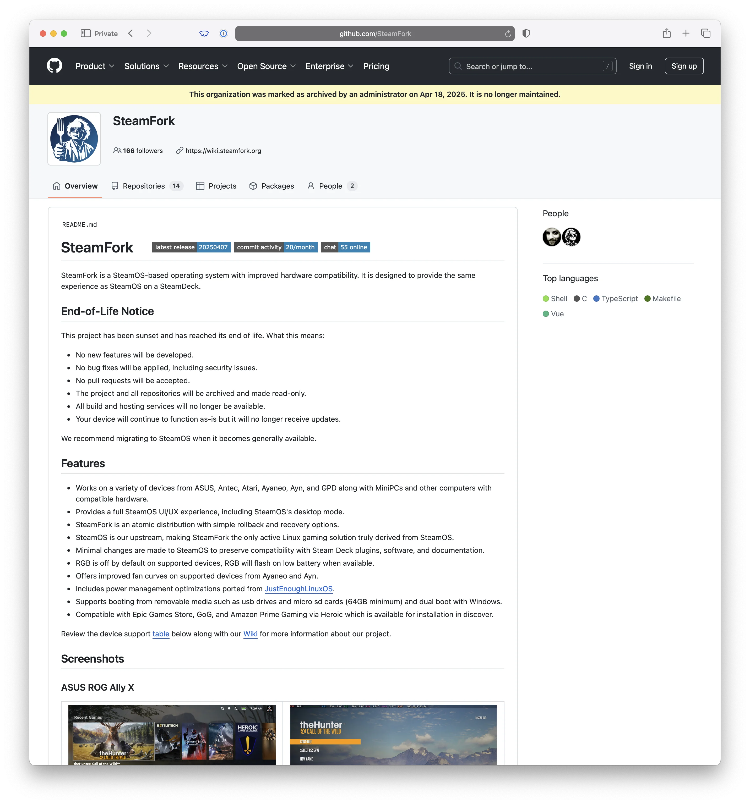
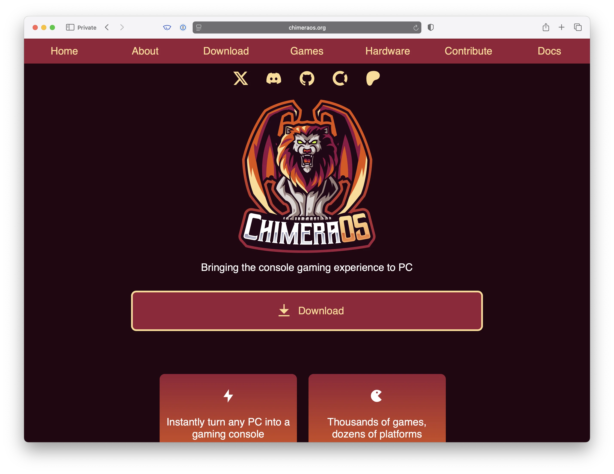
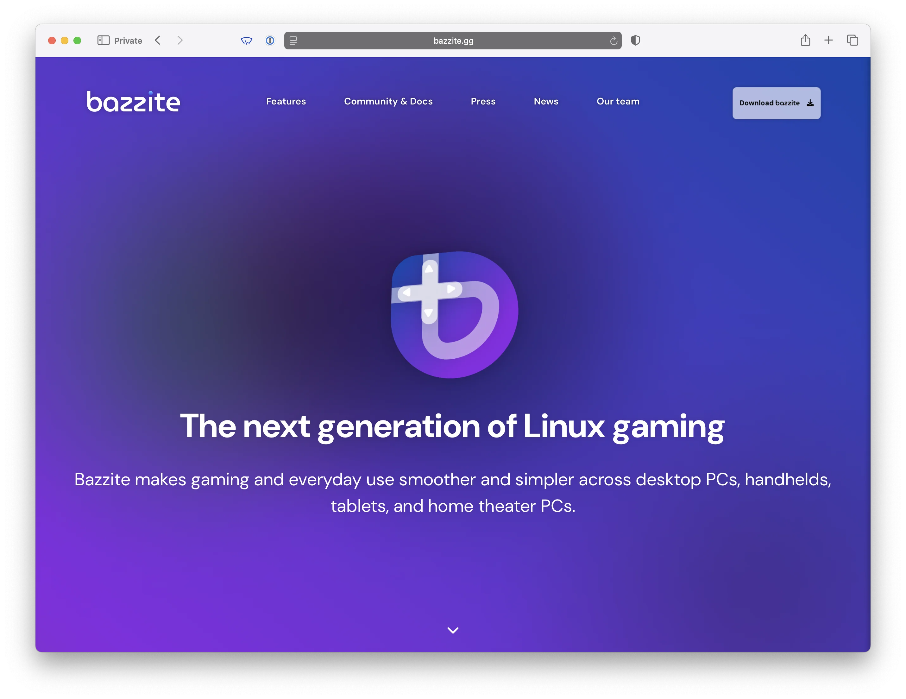

I'm thrilled to see Linux becoming a more viable platform for PC gaming, and it's awesome to see so many new Linux users joining the scene.
Unlike commercial operating systems that pay people to clarify and simplify product details, open source exposes users to maximum complexity, clarification, and particularities (IT'S GNU/LINUX!!).
With a new generation of users, it's helpful to know when apples are apples and oranges are oranges.

SteamOS, being a Linux distro, is no different.
There are quite a few things being called "SteamOS" these days in YouTube tutorials, so I figured I could help clear things up.

<pre class="mermaid">
graph TD
  SteamOSDebian["🎮 SteamOS (Debian)"]
  SteamOSArch["🎮 SteamOS (Arch)"]

  SteamFork["🛠️ SteamFork"]
  HoloISO["🌈 HoloISO"]
  ChimeraOS["🔥 ChimeraOS"]
  Bazzite["🔧 Bazzite"]

  SteamOSDebian
  SteamOSArch <-->|derived from| SteamFork
  SteamOSArch <-->|derived from| HoloISO

  ChimeraOS <-.->|pulls from| SteamOSArch
  Bazzite <-.->|pulls from| SteamOSArch
</pre>

<figure class="">
  
  <figcaption>Is the PewDiePie-switched-to-Linux video not a clear enough sign we are entering a transitional age of PC gaming on Linux?</figcaption>
</figure>

## Valve's Recovery Image is "SteamOS"

SteamOS has been around for a while—so much so that there are two distinct versions of it.

- Valve's original Debian-based "SteamOS" that shipped with the [Alienware Steam Machines](https://en.wikipedia.org/wiki/Steam_Machine_(computer)).

<figure class="borderless">
  
  <figcaption>SteamOS is here? No! This is the old, ancient SteamOS. Don't use this one!</figcaption>
</figure>

- The Arch-based ["Steam Deck Recovery image"](https://help.steampowered.com/en/faqs/view/1b71-edf2-eb6d-2bb3) that ships Gamescope and Valve's latest 10-foot UI.

<figure class="borderless">
  
  <figcaption>Not very intuitive, but this is the SteamOS you want!</figcaption>
</figure>

The modern Deck Recovery Image isn’t quite ready for prime time, but it’s totally usable on a lot of hardware (in the preview 3.7 branch).

**If you aren’t running one of these, you aren’t “running SteamOS”!**

## SteamOS Derivatives

There have been two known SteamOS derivative distributions: [**HoloISO**](https://github.com/HoloISO/releases) and [**SteamFork**](https://github.com/SteamFork).

A derivative distribution directly takes Valve's SteamOS and other sources as a base and builds from there.
This guarantees they track SteamOS as closely as possible while layering on their own fixes or hardware compatibility support.

**Both HoloISO and SteamFork are now discontinued** (though you can still run them):

- HoloISO was run out of a Russian Telegram channel and had questionable build/distribution practices.
  It was hard to verify that it wasn’t distributing malware.
  While I don’t think it ever did, the project wasn’t transparent or easy to contribute to, and the maintainer was a college student who would disappear regularly.

- SteamFork was a US-based project that was fully open source on GitHub.
  It had a reproducible toolchain, real build infrastructure, and was run much more professionally.
  It produced a very high-quality SteamOS derivative that supported both desktop hardware and a wide variety of handhelds.

In the end, I agree with the SteamFork maintainers: the Chinese handheld vendors should be the ones footing the bill for SteamOS support—not the community.
The decision to shut down, while disappointing, makes complete sense.
SteamOS 3.7 is basically here—let’s use it.

Credit to the SteamFork team ([@uejji](https://github.com/uejji) and [@fewtarius](https://github.com/fewtarius)) for their beautiful build pipeline and for sharing their discoveries around SteamOS 3.7.

<figure class="borderless">
  
  <figcaption>We hardly knew you, SteamFork. Thanks for all the work you put in!</figcaption>
</figure>

**If you are running a SteamOS derivative, you’re *nearly* running SteamOS that differs only to the extent the patches change it.**

## Gamescope Distros

The two other notable distros I see frequently labeled as "SteamOS" in the ecosystem are: [ChimeraOS](https://chimeraos.org) and [Bazzite](https://bazzite.gg).

**ChimeraOS and Bazzite are not SteamOS.**

They’re both excellent choices if SteamOS doesn’t run on your hardware, or if you prefer their broader project goals.
They boot into [**Gamescope**](https://github.com/ValveSoftware/gamescope) and use [Proton](https://www.protondb.com) for game compatibility.

> Gamescope: the micro-compositor formerly known as steamcompmgr

Gamescope is the layer that the Steam 10-foot UI and games run inside on Linux.
It handles resolution scaling, performance overlays, FSR upscaling, and other key features made popular by the Steam Deck.

**We’ll call non-SteamOS-derivative distros that boot into Gamescope “Gamescope distros.”**

### ChimeraOS

<figure class="borderless">
  
  <figcaption>ChimeraOS: the best logo of them all.</figcaption>
</figure>

Chimera is a great project that predates modern SteamOS.
It’s an immutable Linux distribution built to provide a console-like experience across many devices.

It’s Arch-based like SteamOS, but it uses GNOME for desktop mode instead of KDE.
It also runs its own update schedule, separate from Valve or the broader SteamOS ecosystem.
It ships its own 10-foot UI, emulation support, and web-based management tools.

If SteamOS 3.7 or SteamFork doesn’t work for your device—or if you prefer Chimera’s vision and community—this is a solid choice.

### Bazzite

<figure class="borderless">
  
  <figcaption>Bazzite has the most "enthusiastic" community, in my experience.</figcaption>
</figure>

I haven’t used Bazzite personally, but like Chimera, it’s not a SteamOS derivative.
It boots into Gamescope and feels a lot like SteamOS.

Bazzite is based on Fedora and makes heavy use of process containers, which makes it even more distinct from SteamOS.

It’s very popular on Reddit, has strong community support, and offers good hardware compatibility.
However, because it’s Fedora-based, you’ll encounter many differences when tinkering under the hood.
If you like Arch Linux (or want to learn more about it), you may find Fedora-specific quirks frustrating.

**If you're using a Gamescope distro, you are not running SteamOS.**
You’re running a separate Linux distro with its own lineage that borrows components from SteamOS to work similarly.

## “This doesn't matter—the outcome is the same!”

Yes and no.
While the direction is similar, details matter in open source.
Different starting points create different outcomes, even if the UX looks the same.
I'm not here to say x is better than y—just that x is not y.
Saying you run x when you actually run y is misleading or mistaken.

Welcome to open source!

The point here is to highlight the differences and help you understand when those details might matter.
In many cases, they won’t.

## “Which one are you saying I should run?”

Try them all!
See what works best for your goals and your hardware.

## Conclusion

If you enjoyed this post, you might also like:

- [You can just build a Steam Machine](../you-can-just-build-a-steam-machine/) — A look at building a “Steam Machine” with SteamOS
- [It's time to install SteamOS 3.7](http://localhost:3000/blog/2025/its-time-to-install-steamos-3.7/) — My notes on installing SteamOS on non–Steam Deck hardware
