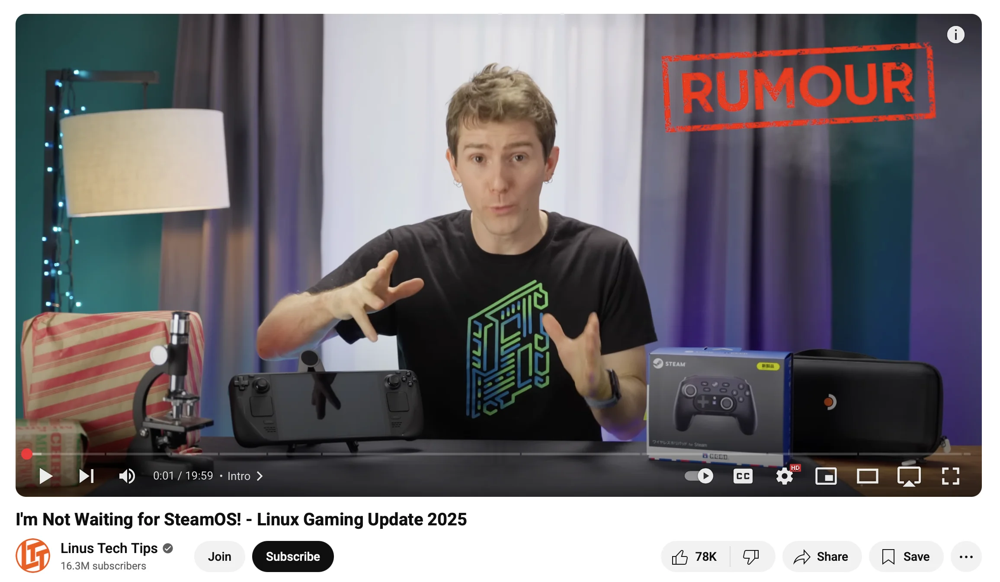

I recently [installed SteamOS 3.7 on my commodity AMD HTPC](../you-can-just-build-a-steam-machine/), and it's working great.
Here’s my procedure and notes.

## Installing SteamOS 3.7

(This will go stale quickly, but as of this writing, it works.)

  - **EDIT 2**: [3.7 Has been released to the stable channel](https://store.steampowered.com/news/app/1675200/view/529845510803031952). Running updates on the stable channel will get you to a working state. 
  - **EDIT 1**: As of writing this, [3.7 has been promoted to **BETA**](https://store.steampowered.com/news/app/1675200/view/529845510803031952), so check the system version you get on the hop to Beta. If you get to 3.7, you are good to go!

### Prep Tips

- The recovery image installs SteamOS 3.5.
- SteamOS 3.5 has limited hardware support. On desktop systems, enable integrated graphics and plug your monitor directly into the integrated HDMI or DisplayPort during installation.
- Some discrete GPUs I tested failed to boot SteamOS 3.5. I don’t recommend trying them. Use iGPUs for the initial install, then switch back to a discrete GPU once you’re on 3.7.

### Procedure

- Download the Steam Deck Recovery Image from: https://help.steampowered.com/en/faqs/view/1b71-edf2-eb6d-2bb3
- Flash the recovery image to a USB drive.
- Boot the USB drive on your "Steam Machine" and "re-flash" your "Deck"—i.e., whatever hardware manages to boot the recovery image.
- It flashes the primary NVMe drive, **deleting everything on it**. Be careful!
- After flashing, reboot, remove the USB drive, and sign in.
- In system settings, run updates on the **stable** channel to update to SteamOS 3.7 or later. You can also test the Beta and Preview channels if you wish.
- Congrats! You’re now running SteamOS 3.7. 
- Head back into your BIOS, disable integrated graphics, and test your discrete GPU. It will probably work now!
- SteamOS 3.7 should now be running on your hardware of choice!

## Why SteamOS Now?

It’s been rumored for a while that SteamOS—the [Arch](https://archlinux.org)-based Linux distro powering the Steam Deck—is moving toward becoming a general-purpose Linux OS for any device.

I tried installing SteamOS on conventional hardware a few months ago without much success:

- It wouldn’t boot without integrated graphics.
- There was lots of Steam Deck jank—rotated console output, ugly boot logs, etc.
- Performance was bad, and games didn’t launch correctly.

But recent [announcements](https://www.gamingonlinux.com/2025/05/steamos-3-7-5-preview-improves-lenovo-legion-go-s-support-and-brings-more-bug-fixes/) have focused on handhelds like the [Lenovo Legion Go S](https://www.bestbuy.com/site/lenovo-legion-go-s-8-120hz-gaming-handheld-amd-ryzen-z1-extreme-steamos-32gb-with-1tb-ssd-nebula/6619188.p?skuId=6619188). Still, it’s clear that the **preview** channel for SteamOS now supports conventional hardware much better than before.

From testing in the [SteamFork](https://github.com/SteamFork) community, it’s clear that running “vanilla” SteamOS is now viable for a lot of hardware—especially AMD desktop builds.
You should definitely give it a shot.

## What If I Can’t Boot the Repair Image?

If the repair image won’t boot, you could try flashing one of the other SteamOS images directly to your boot disk, or experiment with one of the newer, unreleased repair images.
If you do, please share your notes on what worked or didn’t!

- [All SteamOS ISO Images](https://steamdeck-images.steamos.cloud/steamdeck/?C=M&O=D)
- [Steam Repair Image (Current)](https://help.steampowered.com/en/faqs/view/1b71-edf2-eb6d-2bb3)
- [Unstable Repair Image - steamdeck-repair-20250320.1000-3.8.0.img.zip](https://steamdeck-images.steamos.cloud/steamdeck/20250320.1000/?C=M&O=D)

## Come Chat

If you’re running SteamOS on non–Steam Deck hardware, join the [SteamFork (RIP) Discord](https://discord.gg/5KmBn5ttCa) to chat about your setup and share notes!
