I built a ["Steam Machine"](https://en.wikipedia.org/wiki/Steam_Machine_(computer)) in 2024. I've run it for 8 months and I'm really happy with it!

<figure class="borderless">
  <a
    class="imageSwipe"
    href="./img/steam-machine.webp"
    data-pswp-width="4032"
    data-pswp-height="3024"
    target="_blank"
  >
    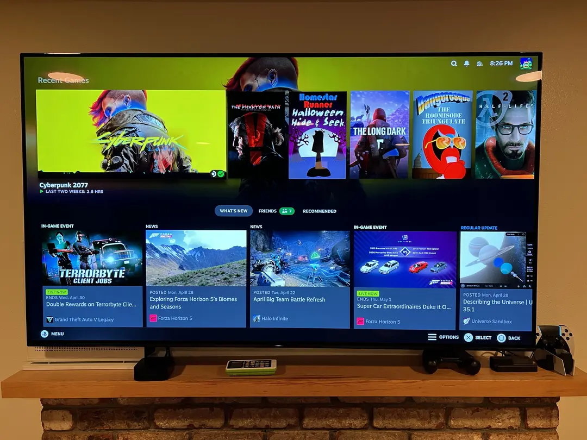
  </a>
  <figcaption>Why yes, that is a 65&quot;, HDR OLED Steam Deck in my living room.</figcaption>
</figure>

No, not quite the 2015 Linux Console set top boxes Valve collaborated with Alienware on running the [10-foot user interface](https://en.wikipedia.org/wiki/10-foot_user_interface) ["Big Picture"](https://help.steampowered.com/en/faqs/view/3725-76D3-3F31-FB63) mode that ran with ~10% performance peanaly compared to Windows (at the time).

No, not [Chimera OS](https://chimeraos.org) or [Bazzite](https://bazzite.gg) either! (Though they are great [gamescope distros](../bazzite-isnt-steamos), but not the goal here!)

No, I'm running the latest Steam OS 3.7 (the OS running on the [Steam Deck](https://en.wikipedia.org/wiki/Steam_Deck)) on conventional AMD desktop hardware, running at equal or improved performance over Windows.
We're here! You can just build a Steam Machine now, and get a console like experience running PC games in your living room, on linux, with great controllers on your 4K OLED TV (and surround sound if you have it) running in parity with your Steam Deck.

## The OS (SteamOS 3.7)

The OS to install is SteamOS 3.7.
It's available in Valve's "preview" update channel for the Steam Deck, but you can download the recovery image and try installing it on anything.

There isn't much more to say about this other than yes, the rumors that Valve is expanding hardware support is true. It works on a lot more devices now, including conventional AMD desktop hardware.

If you are interested in the details on installing not quite released software read:

- [It's time to install SteamOS 3.7](../its-time-to-install-steamos-3.7/)

If SteamOS isn't quite working for your hardware yet, read about other similar projects that are helping bridge the compatabiliy gaps:

- ["Bazzite isn't SteamOS (and that's okay!)"](../bazzite-isnt-steamos)

## The Hardware

I targeted a budget of $1500 for the core hardware. Final cost came to $1799.71.
Part lists go stale REALLY quickly, but if you want to build exactly what I have, here is the list.
I wrote up the build on [PCpartpicker](https://pcpartpicker.com/b/h7QD4D) but hey, feel free to use my referral links if you found this useful:

- CPU: [AMD Ryzen 7 7800X3D](https://amzn.to/3RGxNPe)
- Cooler: [Noctua NH-L12S](https://amzn.to/3GuMaDL) (Run this CPU fan in this case unless you have a good reason not to)
- Motherbaord: [ASUS ROG Strix B650E-I](https://amzn.to/3EJXueG)
- RAM: [G.SKILL Flare X5 Series (AMD Expo) DDR5 32GB](https://amzn.to/4lUsIR6) (Use RAM matching tools)
- nVME: [WD_BLACK 2TB SN850X](https://amzn.to/3GyccGa) (Avoid low end Samsung Gen5s)
- GPU: [GIGABYTE Radeon RX 7700 XT](https://amzn.to/44Kq8XG) (Go better here if you increase on anything)
- Case: [Fractal Design Ridge](https://amzn.to/42zzyUt)
- PSU: [CORSAIR SF750](https://amzn.to/3RFKsSl) (Avoid bulky, cheaper SFXL PSUs in this case)
- Case Fans: 4 x [Noctua NF-A6x25](https://amzn.to/4iCUK0o)
- Top Fans: 3 x [ARCTIC P8 Slim PWM](https://amzn.to/4jvN0i2)
- Fan Hub: [Noctua NA-FH1, 8 Channel Fan Hub](https://amzn.to/4cT1A0R)
- [WiFi Antennas](https://amzn.to/4lUtu0s) (I don't have Ethernet near my TV)

    <figure class="borderless">
      <a class="imageSwipe"
         href="./img/side-close.webp"
         data-pswp-width="3024"
         data-pswp-height="4032"
         target="_blank">
        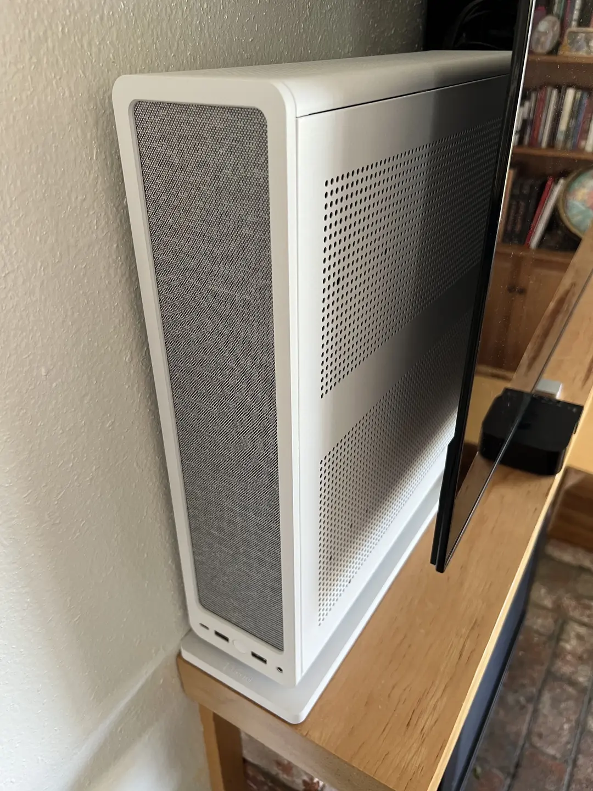
      </a>
      <figcaption>The Fractal Ridge case is about the size of a deep PS5 and fits nicely behind TVs and on mantles.</figcaption>
    </figure>
    <figure class="borderless">
      <a class="imageSwipe"
         href="./img/side-off.webp"
         data-pswp-width="3024"
         data-pswp-height="4032"
         target="_blank">
        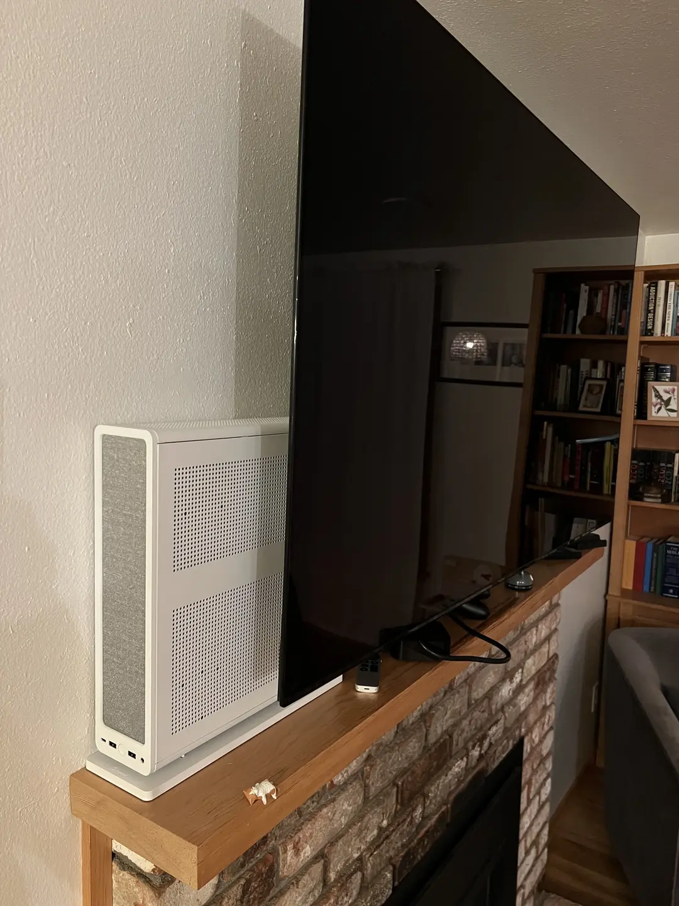
      </a>
      <figcaption>Air flow around the case hasn't been an issue.</figcaption>
    </figure>
    <figure class="borderless">
      
      <figcaption>When running heat producing games, I pull the TV off the wall to give more space between the panel and the heat exhaust. </figcaption>
    </figure>

### The controllers

Finding good controllers has been a challenge.
It need's to be on par with the Steam Deck controller, but unfortunately, nothing on the market matches that.
Skipping a lot of nuance and details, the Steam controller, DualSense Edge and a HTPC keyboard has covers all my needs.
Finding decent controllers that work well enough for PC games on the couch has been difficult and I intend to write more about each one I've tried.

It is super unfortunate that the only controller that comes close to what is offered by the Steam Deck controls is the DualSense Edge.
It's a great controller, with Gyro, Paddles, and a trackpad, and has high end OEM quality, but it costs $199 and is Bluetooth only.

Speaking of Bluetooth, I recommend getting an extended range dongle and ensuring your controller has line of sight to it.
Latency sensitive controls like Gyro needs a solid connection and I found without line of sight, signal drops off around 6 feet.
With line of sight, controllers work great, even at 10ft.

The Steam Controller is a nice to have.
Probably not worth paying scalper prices for it these days, but if you still have yours lying around, get that thing going again, they work better than you remember and have a 2.4Ghz dongle!

Any HTPC keyboard mouse combo works. You mainly use it for one off tasks where the on screen keyboard is to cuombersome and it mostly lives in the closet.
I recommend the Logitech K400 Plus over the no-name chinese amazon ones, having tried both.

- [PlayStation DualSense Edge Wireless Controller](https://amzn.to/4lXTjgd)
- [Playstation DualSense Charging Station](https://amzn.to/42NIqWQ)
- [PlayStation DualSense Edge Stick Module](https://amzn.to/4cYI6Ys) - Pick some up before they go deadstock pricing.
- [TP-Link USB Bluetooth Adapter for PC, Bluetooth 5.3 Long Range Receiver](https://amzn.to/4333IOS)
- [Logitech K400 Plus Wireless Touch TV Keyboard](https://www.amazon.com/Logitech-Wireless-Keyboard-Touchpad-PC-connected/dp/B014EUQOGK)
- [Steam Controller](https://store.steampowered.com/app/353370/Steam_Controller/) (RIP)

    <figure class="borderless">
      <a class="imageSwipe"
         href="./img/inputs-front.webp"
         data-pswp-width="3024"
         data-pswp-height="4032"
         target="_blank">
        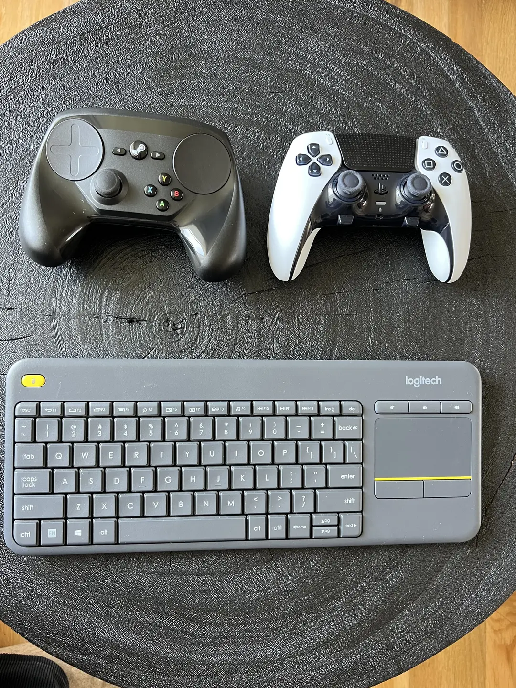
      </a>
      <figcaption>Steam Controller for mouse pointer games. DualSense Edge for FPS and character movement games. Logitech keyboard for typing and nooding around in the console.</figcaption>
    </figure>
    <figure class="borderless">
      <a class="imageSwipe"
         href="./img/controllers-back.webp"
         data-pswp-width="4032"
         data-pswp-height="3024"
         target="_blank">
        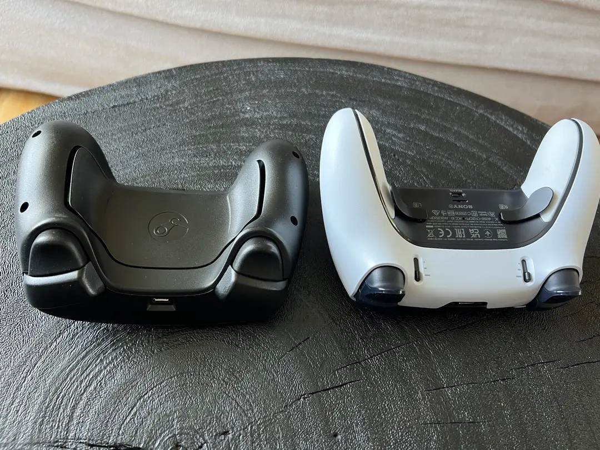
      </a>
      <figcaption>Controllers with Gyro and Paddles are critical. Gyro gives you "mouse like" input, paddles let you work sticks and buttons without letting off the analog sticks.</figcaption>
    </figure>
    <figure class="borderless">
      <a class="imageSwipe"
         href="./img/dual-sense-steam-controller-cradle.webp"
         data-pswp-width="3024"
         data-pswp-height="4032"
         target="_blank">
        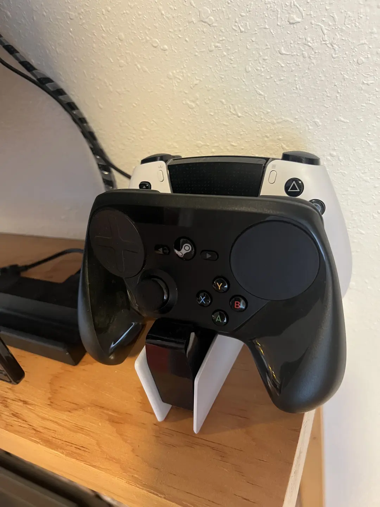
      </a>
      <figcaption>The DualSense Edge runs out of battery after a few hours so keeping it charged is important. The Steam Controller happens to live nicely on the dock as well, though no charging.</figcaption>
    </figure>
    <figure class="borderless">
      <a class="imageSwipe"
         href="./img/cradle-dongle.webp"
         data-pswp-width="3024"
         data-pswp-height="4032"
         target="_blank">
        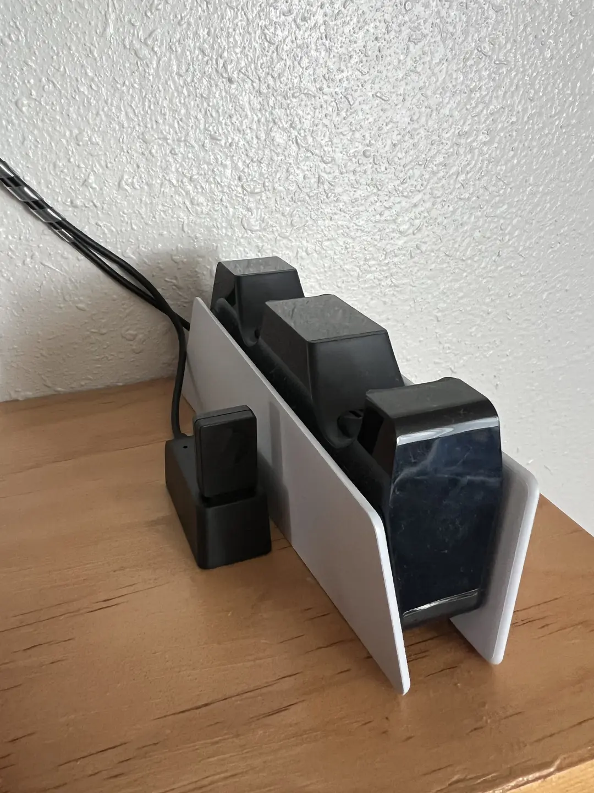
      </a>
      <figcaption>Controllers with 2.5Ghz dongles have better range and reliability than Bluetooth. Either way, line of sight is super important so getting the dongles out from behid any obstructions is important. The steam controller included a dock for It's dongle.</figcaption>
    </figure>
    <figure class="borderless">
      <a class="imageSwipe"
         href="./img/bt-close.webp"
         data-pswp-width="4032"
         data-pswp-height="3024"
         target="_blank">
        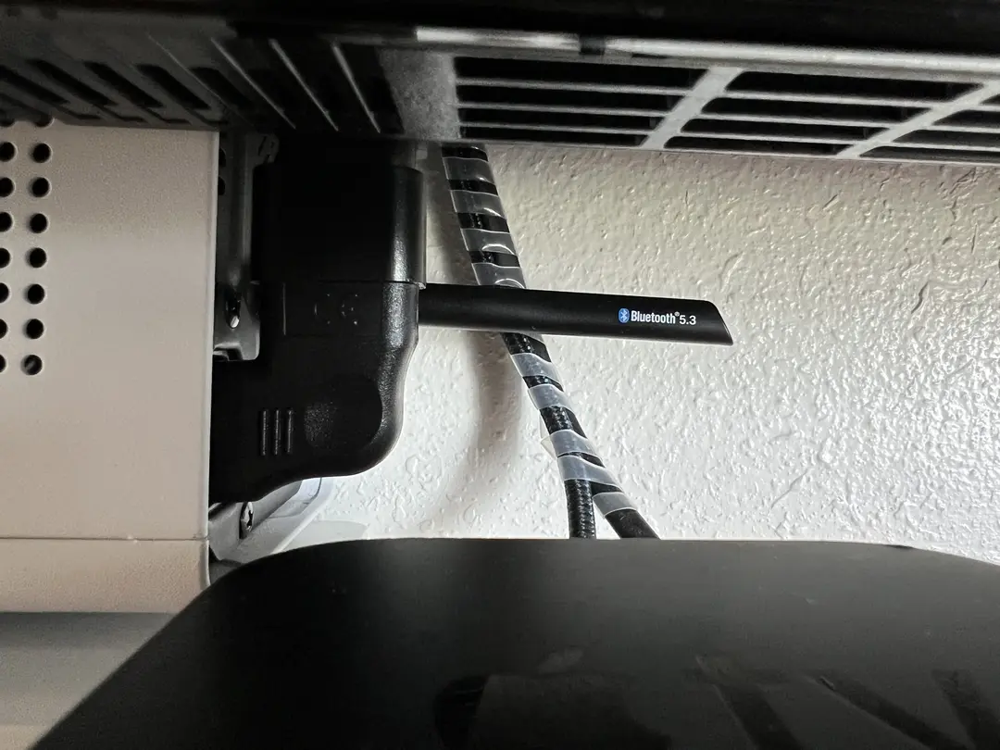
      </a>
      <figcaption>Bluetooth has the worst range and is slowest to connect. An extended Bluetooth antenna that has line of sight has helped allow the DualSense Edge work at 10ft.</figcaption>
    </figure>
    <figure class="borderless">
      <a class="imageSwipe"
         href="./img/bt-far.webp"
         data-pswp-width="4032"
         data-pswp-height="3024"
         target="_blank">
        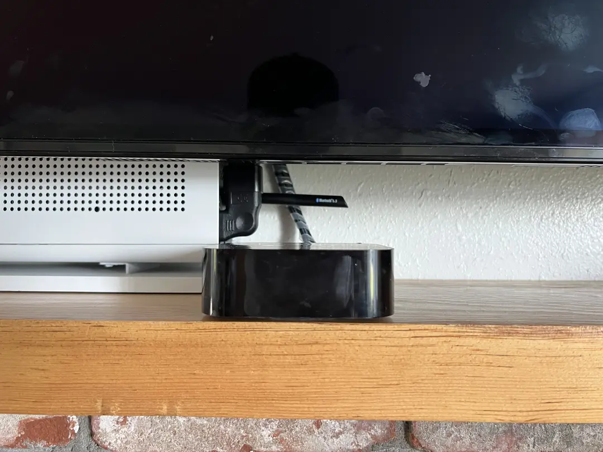
      </a>
      <figcaption>If you're controller can "see" the receiver, then everything works better. The perpendicular power cables probably aren't helping.</figcaption>
    </figure>

### The Screen

<figure class="borderless">
  <a class="imageSwipe" href="./img/home-day.webp" data-pswp-width="4032" data-pswp-height="3024" target="_blank">
    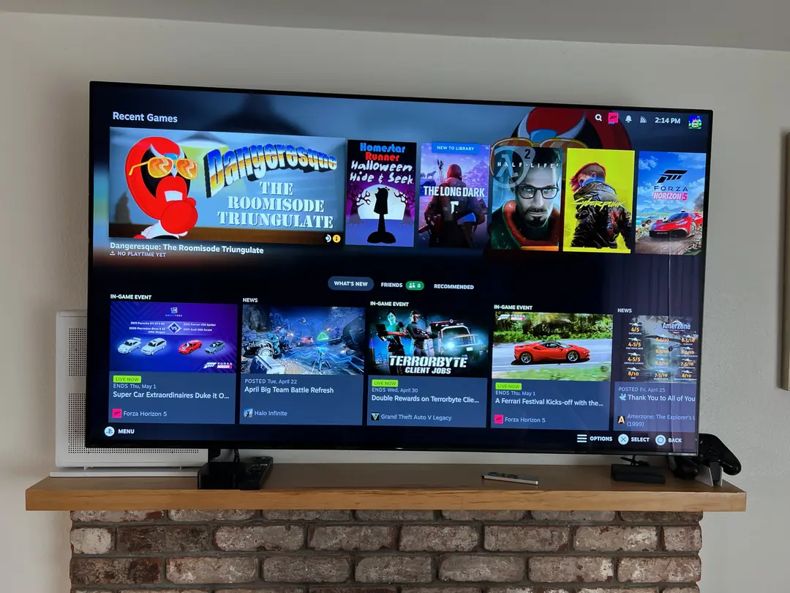
  </a>
  <figcaption>Seeing games on large 4k HDR formats is something else. Truly a joy.</figcaption>
</figure>

Whatever TV you have will work.
Playing on a large 4k HDR OLED tv has been a real joy though, and it's easy to forget how many pixels are in these things.
Just don't forget to put it into game mode.
I would also note, if you can, avoid AndroidTV and definitely disconnect the smart features from any network connection.

### The Audio

I can't run surround in my current living room, so in the meantime, I run AirPod Max's, mainly because it has the best audio sharing feature on the Apple TV. They work well with the Steam Machine though.

## Build notes

Building in the Fractal Ridge was super easy, but seeing how other builds tackled little issues in the small case was helpful.
Here are the builds I found most useful as a reference:

- [Fractal Design Ridge full of Noctua fans feat. delided 7800X3D and deshrouded RTX 4080](https://pcpartpicker.com/b/btTJ7P)
- [ITX laptop destroyer](https://pcpartpicker.com/b/fTcTwP)
- [All Fractal Ridge Completed Builds](https://pcpartpicker.com/builds/#e=3907)

<figure class="borderless">
  <a
    class="imageSwipe"
    href="./img/case-back-assembled.webp"
    data-pswp-width="3024"
    data-pswp-height="4032"
    target="_blank"
  >
    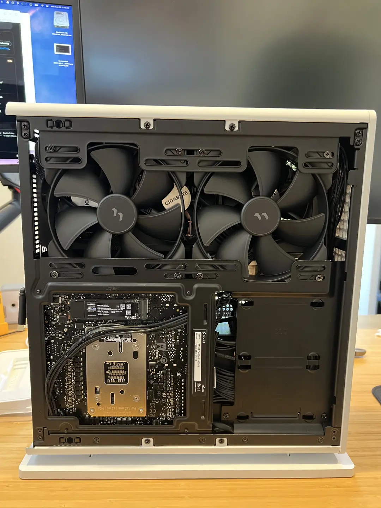
  </a>
  <figcaption>I ran the ITX power cable behind the motherboard similar to other Ridge builds. Worked well!</figcaption>
</figure>
<figure class="borderless">
  <a class="imageSwipe" href="./img/case-back-io.webp" data-pswp-width="3024" data-pswp-height="4032" target="_blank">
    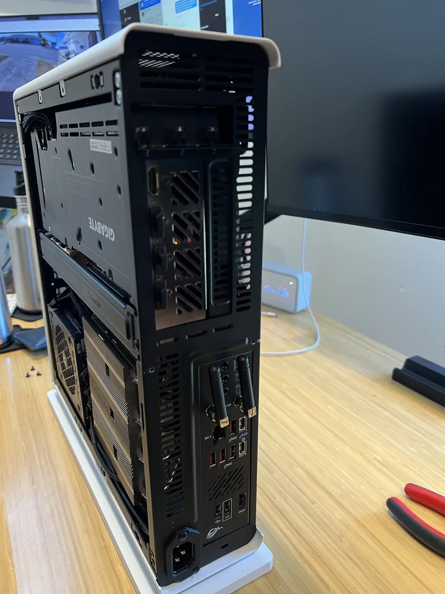
  </a>
  <figcaption>Rear IO with the stubby Wifi Antennas. I ended up getting larger antennas than these.</figcaption>
</figure>
<figure class="borderless">
  <a class="imageSwipe" href="./img/case-bottom-assembled.webp" data-pswp-width="4032" data-pswp-height="3024" target="_blank">
    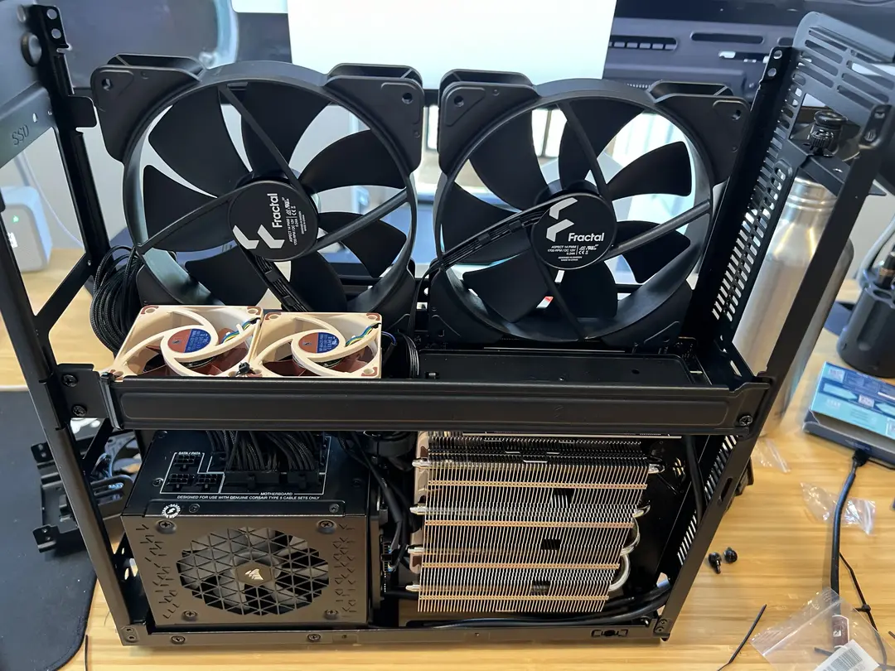
  </a>
  <figcaption>With the stock GPU shroud, I could only fit 2 Noctua NF-A6x25 fans directly below the GPU chamber.</figcaption>
</figure>
<figure class="borderless">
  <a class="imageSwipe" href="./img/case-bottom-audio-routing.webp" data-pswp-width="3024" data-pswp-height="4032" target="_blank">
    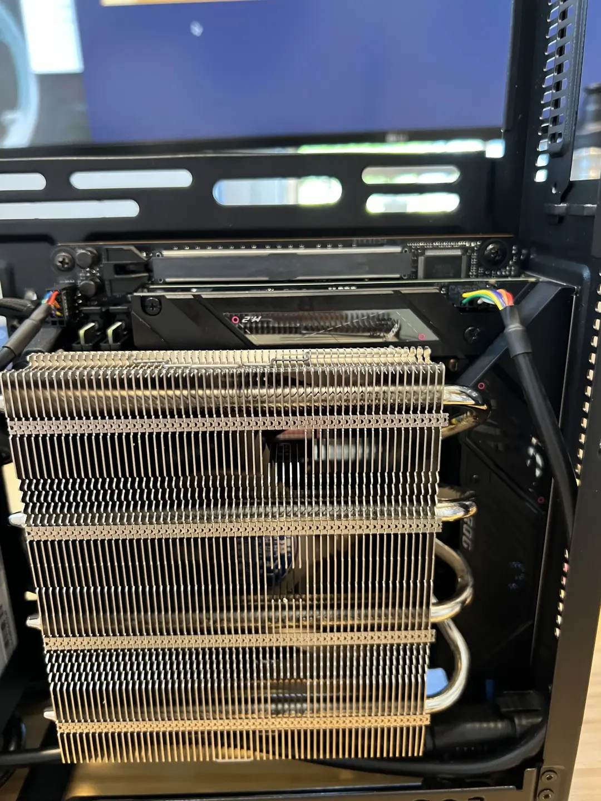
  </a>
  <figcaption>The Noctua NH-L12S cooler orientation works great, and the audio cable routes along the side and bottom easily.</figcaption>
</figure>
<figure class="borderless">
  <a class="imageSwipe" href="./img/case-bottom-center-routing.webp" data-pswp-width="3024" data-pswp-height="4032" target="_blank">
    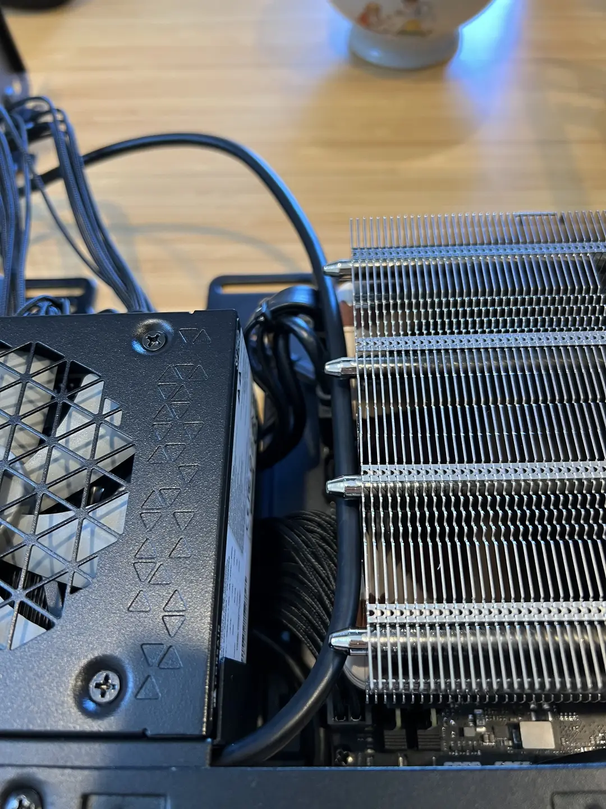
  </a>
  <figcaption>Zip ties are helpful for routing the IO and power bundle cables behind the PSU, keeping open space around the CPU cooler.</figcaption>
</figure>
<figure class="borderless">
  
  <figcaption>By routing only the power cable below the CPU cooler, you have room for 2 additional Noctua NF-A6x25 fans to intake cool air below the CPU cooler intake.</figcaption>
</figure>
<figure class="borderless">
  <a class="imageSwipe" href="./img/case-bottom-fan-shave.webp" data-pswp-width="4032" data-pswp-height="3024" target="_blank">
    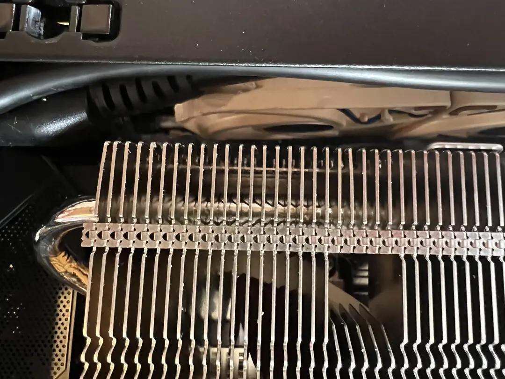
  </a>
  <figcaption>One of the fan tabs interfeared with the power cable, so I used a dremmel to shave it down to reduce contact and pressure. Other people use 3D printed extenders found on etsy.</figcaption>
</figure>
<figure class="borderless">
  <a class="imageSwipe" href="./img/case-bottom-psu-routing.webp" data-pswp-width="4032" data-pswp-height="3024" target="_blank">
    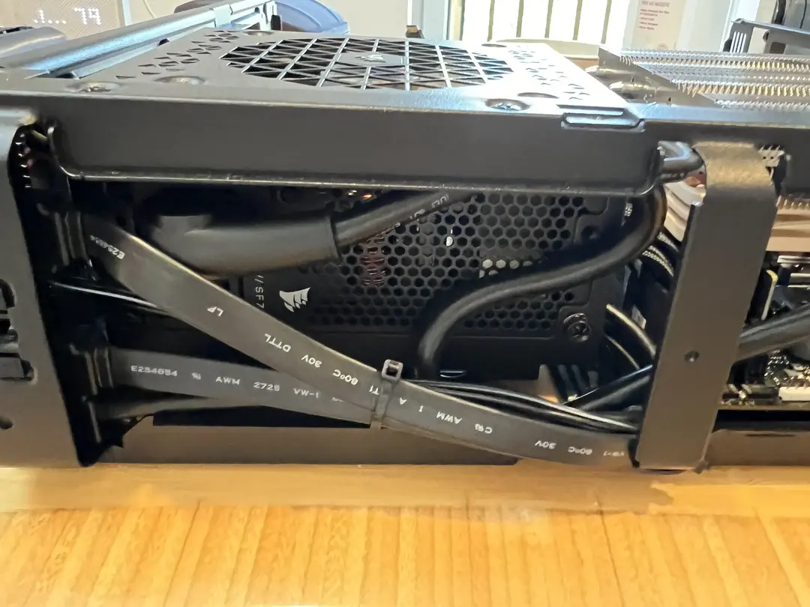
  </a>
  <figcaption>Cable routing below the PSU. This is an odd place to exhaust the PSU I considered doing a PSU fan reverse but decided against it for now.</figcaption>
</figure>
<figure class="borderless">
  <a class="imageSwipe" href="./img/case-bottom-fans-assembled.webp" data-pswp-width="4032" data-pswp-height="3024" target="_blank">
      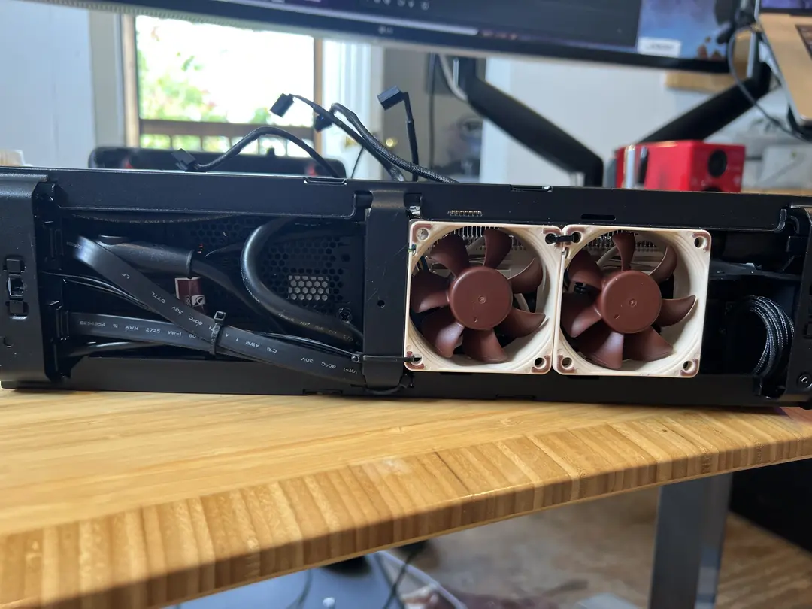
  </a>
  <figcaption>Bottom of the case with intake fans installed.</figcaption>
</figure>
<figure class="borderless">
  <a class="imageSwipe" href="./img/case-front-assembled.webp" data-pswp-width="3024" data-pswp-height="4032" target="_blank">
    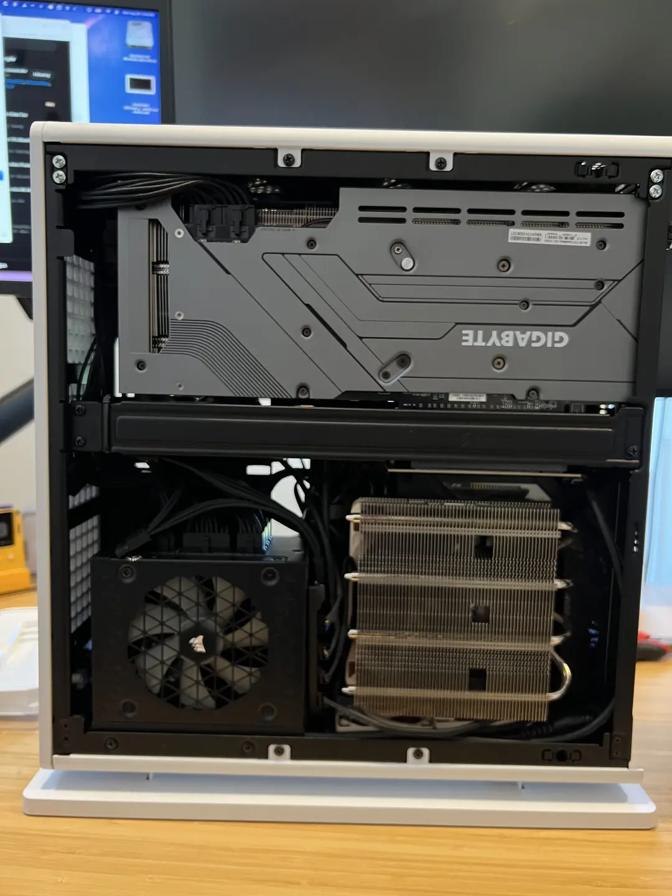
  </a>
  <figcaption>The front side of the case with the GPU installed.</figcaption>
</figure>
<figure class="borderless">
  <a class="imageSwipe" href="./img/case-top-fans.webp" data-pswp-width="3024" data-pswp-height="4032" target="_blank">
    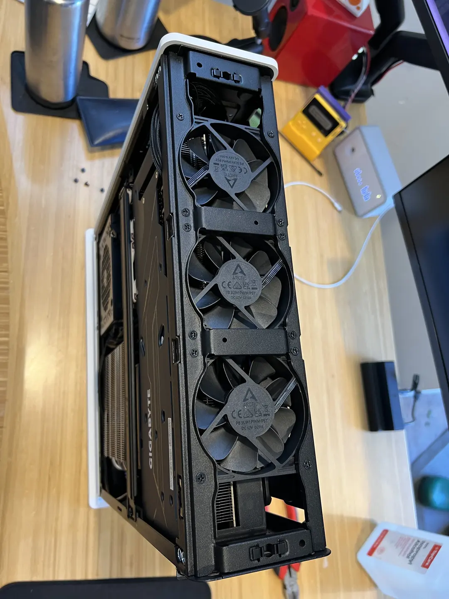
  </a>
  <figcaption>The ARCTIC P8 Slim PWM fans fit about a full size GPU and stock shround despite what the Ridge manual says.</figcaption>
</figure>
<figure class="borderless">
  <a class="imageSwipe" href="./img/mobo-assembled-side-1.webp" data-pswp-width="4032" data-pswp-height="3024" target="_blank">
    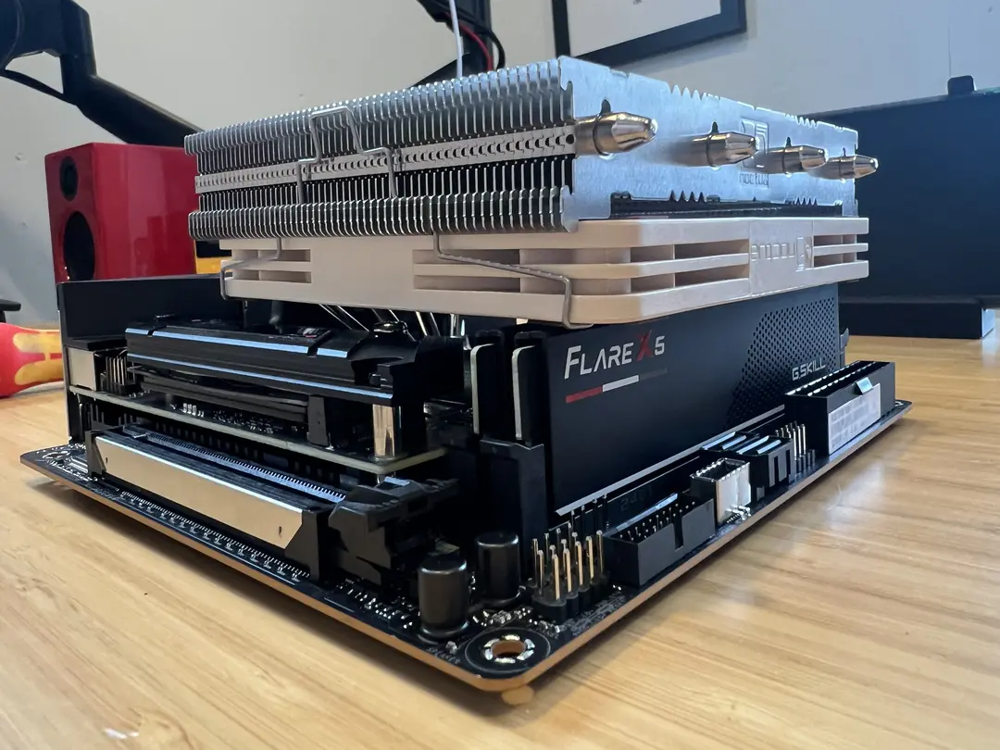
  </a>
  <figcaption>The assembled mini ITX motherboard and comically large CPU cooler.</figcaption>
</figure>
<figure class="borderless">
  <a class="imageSwipe" href="./img/mobo-assembled-side-2.webp" data-pswp-width="4032" data-pswp-height="3024" target="_blank">
    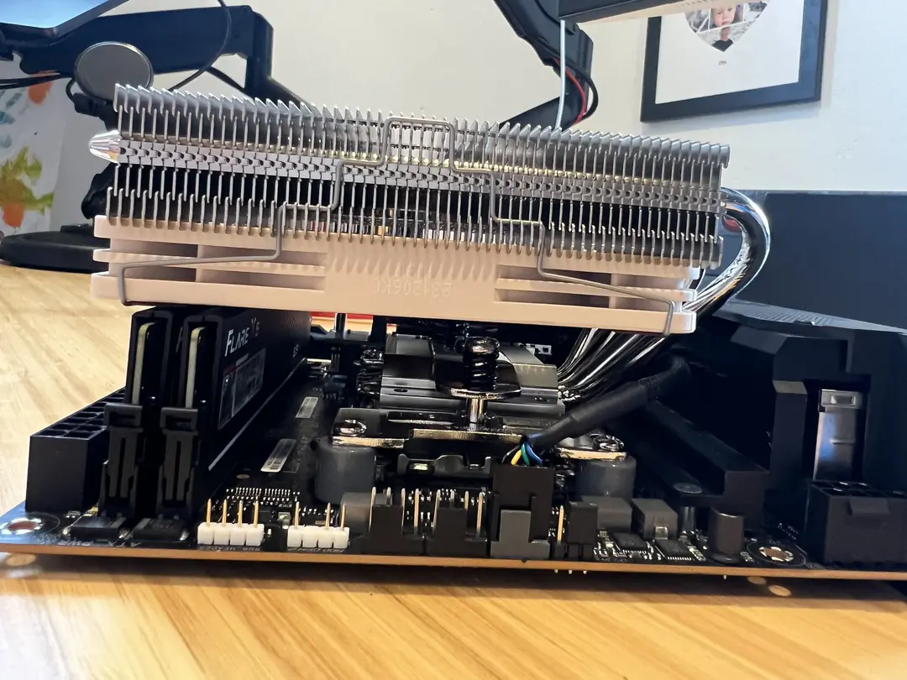
  </a>
  <figcaption>The top down view below the CPU cooler.</figcaption>
</figure>
<figure class="borderless">
  <a class="imageSwipe" href="./img/mobo-assembled-top.webp" data-pswp-width="3024" data-pswp-height="4032" target="_blank">
    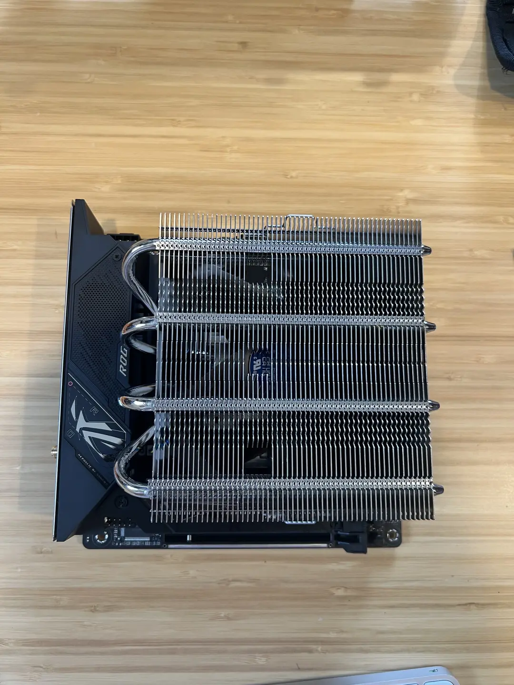
  </a>
  <figcaption>The top view of the motherboard and cooler. The thing really is the size of the entire motherboard.</figcaption>
</figure>

