I built a ["Steam Machine"](https://en.wikipedia.org/wiki/Steam_Machine_(computer)) in 2024.
I've run it for 8 months, and I'm really happy with it!
I hope that after reading this, you’ll be encouraged to build one too!

<figure class="borderless">
  <a
    class="imageSwipe"
    href="./img/steam-machine.webp"
    data-pswp-width="4032"
    data-pswp-height="3024"
    target="_blank"
  >
    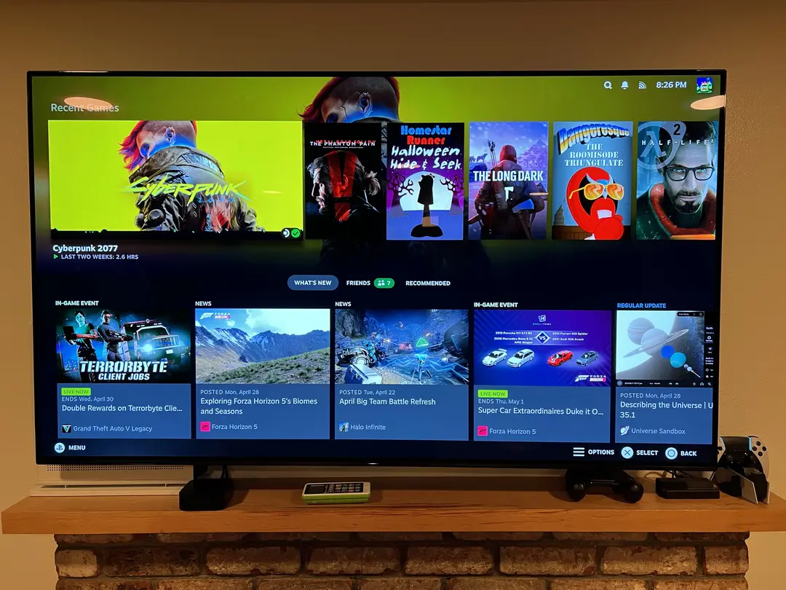
  </a>
  <figcaption>Why yes, that is a 65&quot;, HDR OLED Steam Deck in my living room.</figcaption>
</figure>

I'm running the latest [Steam OS 3.7](its-time-to-install-steamos-3.7) (the OS running on the [Steam Deck](https://en.wikipedia.org/wiki/Steam_Deck)) on conventional AMD desktop hardware, running at equal or improved performance over Windows.

We're here! You can just build a Steam Machine now, and get a console-like experience running PC games in your living room, on Linux, with great controllers, on your 4K OLED TV (and surround sound if you have it), running in parity with your Steam Deck.

## The OS (SteamOS 3.7)

The OS to install is SteamOS 3.7.
It's available in Valve's "preview" update channel for the Steam Deck, but you can download the recovery image and try installing it on anything.

There isn't much more to say about this, other than yes, the rumors that Valve is expanding hardware support are true. It works on a lot more devices now, including conventional AMD desktop hardware.

If you are interested in the details on installing not-quite-released software, read:

- [It's time to install SteamOS 3.7](../its-time-to-install-steamos-3.7/)

Prior to updating to SteamOS 3.7, I ran [SteamFork](https://github.com/SteamFork), and before that, [Chimera OS](https://chimeraos.org/).
SteamFork (the project) has thrown in the towel, and Chimera OS remains a great option.
If SteamOS 3.7 isn't quite working for your hardware yet, read about other similar projects that are helping bridge the compatibility gaps:

- ["Bazzite isn't SteamOS (and that's okay!)"](../bazzite-isnt-steamos)

## The Hardware

I targeted a budget of $1500 for the core hardware. Final cost came to $1799.71.
Part lists go stale REALLY quickly, but if you want to build exactly what I have, here is the list.
I wrote up the build on [PCPartPicker](https://pcpartpicker.com/b/h7QD4D) too, but hey—feel free to use my referral links if you found this useful:

- CPU: [AMD Ryzen 7 7800X3D](https://amzn.to/3RGxNPe)
- Cooler: [Noctua NH-L12S](https://amzn.to/3GuMaDL) (Run this CPU fan in this case unless you have a good reason not to)
- Motherboard: [ASUS ROG Strix B650E-I](https://amzn.to/3EJXueG)
- RAM: [G.SKILL Flare X5 Series (AMD Expo) DDR5 32GB](https://amzn.to/4lUsIR6) (Use RAM matching tools)
- NVMe: [WD_BLACK 2TB SN850X](https://amzn.to/3GyccGa) (Avoid low-end Samsung Gen5s)
- GPU: [GIGABYTE Radeon RX 7700 XT](https://amzn.to/44Kq8XG) (Go better here if you increase on anything)
- Case: [Fractal Design Ridge](https://amzn.to/42zzyUt)
- PSU: [CORSAIR SF750](https://amzn.to/3RFKsSl) (Avoid bulky, cheaper SFX-L PSUs in this case)
- Case Fans: 4 × [Noctua NF-A6x25](https://amzn.to/4iCUK0o)
- Top Fans: 3 × [ARCTIC P8 Slim PWM](https://amzn.to/4jvN0i2)
- Fan Hub: [Noctua NA-FH1, 8 Channel Fan Hub](https://amzn.to/4cT1A0R)
- [WiFi Antennas](https://amzn.to/4lUtu0s) (I don't have Ethernet near my TV)

  <figure class="borderless">
    <a class="imageSwipe"
       href="./img/side-close.webp"
       data-pswp-width="3024"
       data-pswp-height="4032"
       target="_blank">
      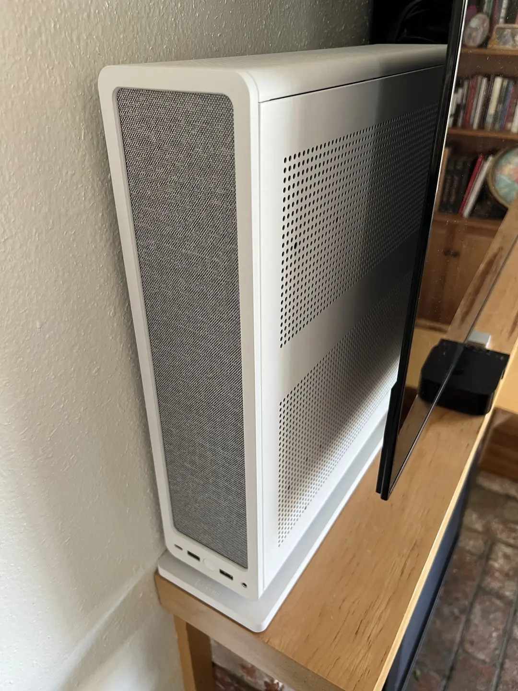
    </a>
    <figcaption>The Fractal Ridge case is about the size of a deep PS5 and fits nicely behind TVs and on mantles.</figcaption>
  </figure>
  <figure class="borderless">
    <a class="imageSwipe"
       href="./img/side-off.webp"
       data-pswp-width="3024"
       data-pswp-height="4032"
       target="_blank">
      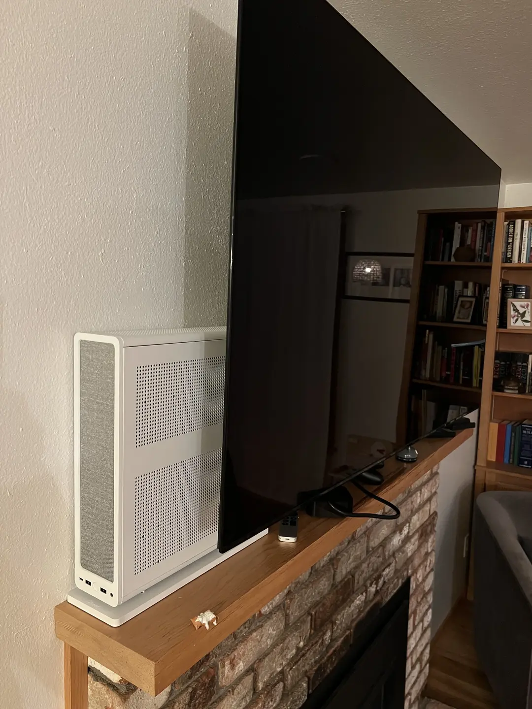
    </a>
    <figcaption>Airflow around the case hasn't been an issue.</figcaption>
  </figure>
  <figure class="borderless">
    <a class="imageSwipe"
       href="./img/side-on.webp"
       data-pswp-width="4032"
       data-pswp-height="3024"
       target="_blank">
      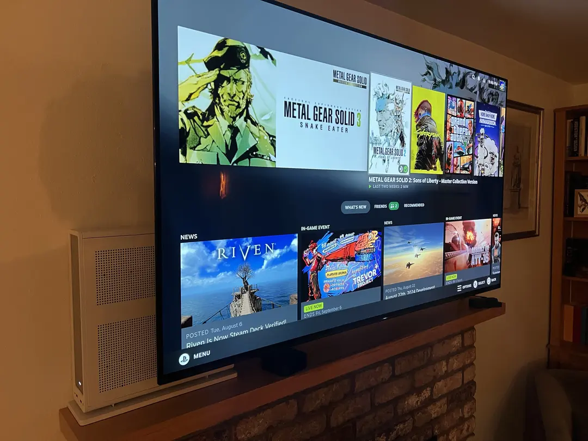
    </a>
    <figcaption>When running heat-producing games, I pull the TV off the wall to give more space between the panel and the heat exhaust.</figcaption>
  </figure>

### The controllers

Finding good controllers has been a challenge.
It needs to be on par with the Steam Deck controller, but unfortunately, nothing on the market matches that.
Skipping a lot of nuance and details, the Steam Controller, DualSense Edge, and an HTPC keyboard have covered all my needs.
Finding decent controllers that work well enough for PC games on the couch has been difficult, and I intend to write more about each one I've tried.

<figure class="borderless">
  <a class="imageSwipe"
     href="./img/steam-deck-reference.webp"
     data-pswp-width="3520"
     data-pswp-height="2871"
     target="_blank">
    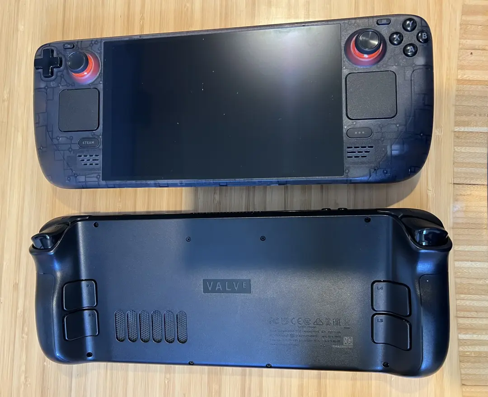
  </a>
  <figcaption>Steam Deck controls for reference. Why isn't there any PC controller on the market with these inputs?</figcaption>
</figure>

It's surprising and hard to explain to people unfamiliar with the issue just how important of a development Gyro Aim is.
This thesis is required watching if you haven't had hands-on time with a Gyro input:

<figure class="borderless">
  

    <iframe width="560" height="315" src="https://www.youtube-nocookie.com/embed/binPB4YbWmM?si=YZsQxKNbD9u3GwqV" title="YouTube video player" frameborder="0" allow="accelerometer; autoplay; clipboard-write; encrypted-media; gyroscope; picture-in-picture; web-share" referrerpolicy="strict-origin-when-cross-origin" allowfullscreen></iframe>
  

  <figcaption>People have been discussing the importance of motion control for over 6 years now!</figcaption>
</figure>

The only controller that comes close to what is offered by the Steam Deck controls is the DualSense Edge (unfortunately!).
It's a great controller, with Gyro, paddles, and a trackpad, and has high-end OEM quality, but it's the most expensive controller on the market—and Bluetooth only (among other flaws).

Speaking of Bluetooth, I recommend getting an extended range dongle and ensuring your controller has line of sight to it.
Latency-sensitive controls like Gyro need a solid connection, and I found that without line of sight, signal drops off around 6 feet.
With line of sight, controllers work great—even at 10 feet.

The Steam Controller is nice to have.
Probably not worth paying scalper prices for it these days, but if you still have yours lying around, get that thing going again.
They work better than you remember and have a 2.4GHz dongle!

Any HTPC keyboard-mouse combo works.
You mainly use it for one-off tasks where the on-screen keyboard is too cumbersome, and it mostly lives in the closet.
I recommend the Logitech K400 Plus over the no-name Chinese Amazon ones, having tried both.

- [PlayStation DualSense Edge Wireless Controller](https://amzn.to/4lXTjgd)
- [PlayStation DualSense Charging Station](https://amzn.to/42NIqWQ)
- [PlayStation DualSense Edge Stick Module](https://amzn.to/4cYI6Ys) – Pick some up before they go dead-stock pricing.
- [TP-Link USB Bluetooth Adapter for PC, Bluetooth 5.3 Long Range Receiver](https://amzn.to/4333IOS)
- [Logitech K400 Plus Wireless Touch TV Keyboard](https://www.amazon.com/Logitech-Wireless-Keyboard-Touchpad-PC-connected/dp/B014EUQOGK)
- [Steam Controller](https://store.steampowered.com/app/353370/Steam_Controller/) (RIP)

  <figure class="borderless">
    <a class="imageSwipe"
       href="./img/inputs-front.webp"
       data-pswp-width="3024"
       data-pswp-height="4032"
       target="_blank">
      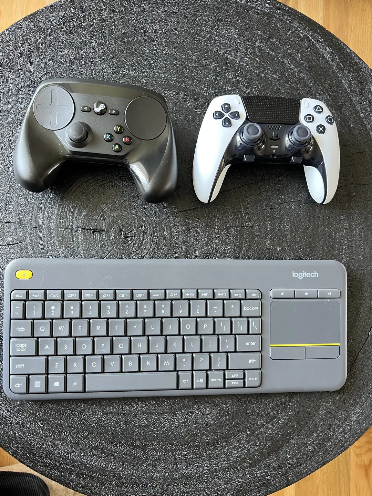
    </a>
    <figcaption>Steam Controller is good for mouse pointer games. DualSense Edge is good for FPS games. The Logitech keyboard is helpful for typing and noodling around in the console.</figcaption>
  </figure>
  <figure class="borderless">
    <a class="imageSwipe"
       href="./img/controllers-back.webp"
       data-pswp-width="4032"
       data-pswp-height="3024"
       target="_blank">
      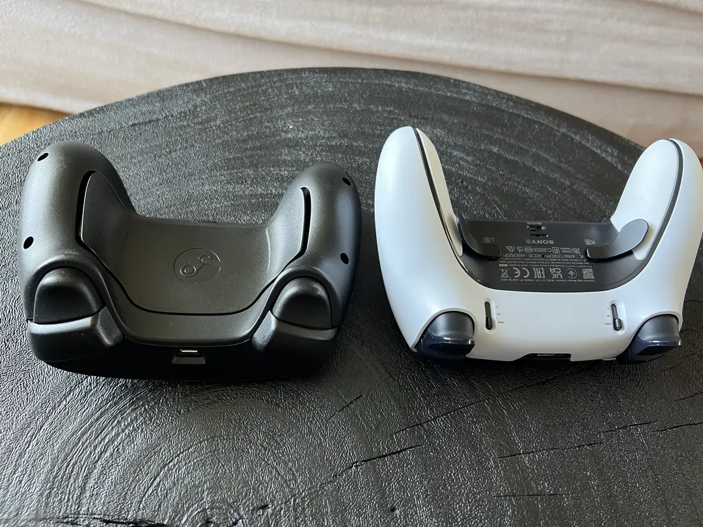
    </a>
    <figcaption>Controllers with Gyro and paddles are critical. Gyro gives you "mouse-like" input; paddles let you work sticks and buttons without letting off the analog sticks. It's this combo that allows for input that matches keyboard and mouse on your couch.</figcaption>
  </figure>
  <figure class="borderless">
    <a class="imageSwipe"
       href="./img/dual-sense-steam-controller-cradle.webp"
       data-pswp-width="3024"
       data-pswp-height="4032"
       target="_blank">
      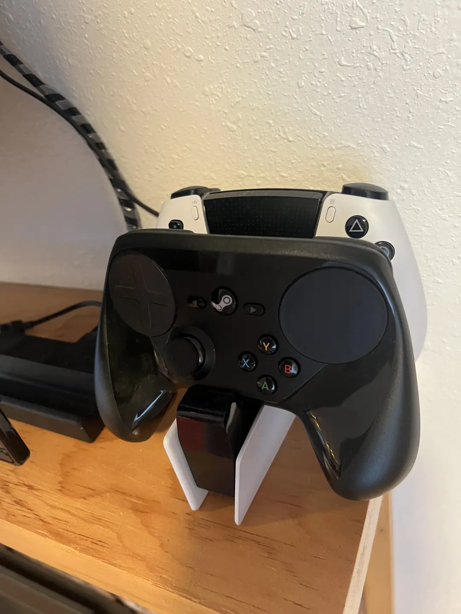
    </a>
    <figcaption>The DualSense Edge runs out of battery after a few hours (thanks rumble), so keeping it charged is important. The Steam Controller happens to live nicely on the dock as well, though no charging.</figcaption>
  </figure>
  <figure class="borderless">
    
    <figcaption>Controllers with 2.4GHz dongles have better range and reliability than Bluetooth. Either way, line of sight is super important, so getting the dongles out from behind any obstructions is key. The Steam Controller included a dock for its dongle. Use it!</figcaption>
  </figure>
  <figure class="borderless">
    <a class="imageSwipe"
       href="./img/bt-close.webp"
       data-pswp-width="4032"
       data-pswp-height="3024"
       target="_blank">
      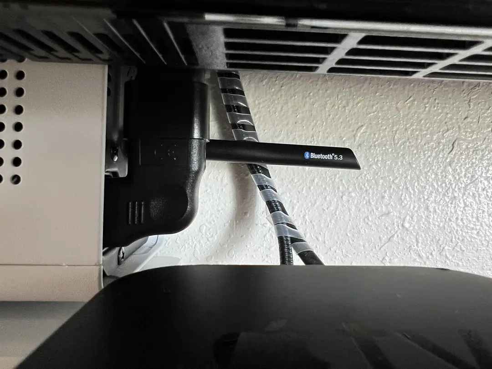
    </a>
    <figcaption>Bluetooth has the worst range and is the slowest to connect. An extended Bluetooth antenna with line of sight has helped allow the DualSense Edge to work at 10 feet.</figcaption>
  </figure>
  <figure class="borderless">
    <a class="imageSwipe"
       href="./img/bt-far.webp"
       data-pswp-width="4032"
       data-pswp-height="3024"
       target="_blank">
      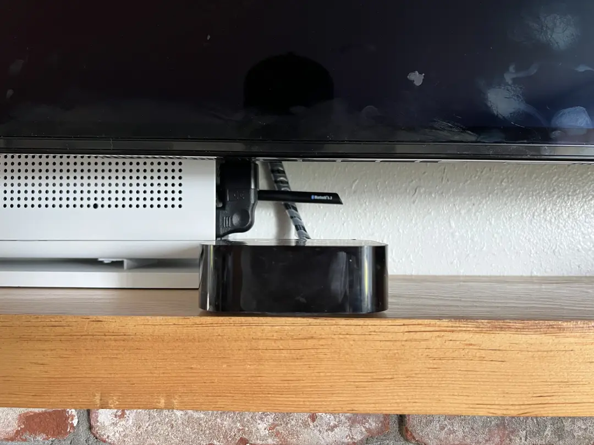
    </a>
    <figcaption>If your controller can "see" the receiver, everything works better. The perpendicular power cables probably aren't helping, though.</figcaption>
  </figure>

### The Screen

<figure class="borderless">
  <a class="imageSwipe" href="./img/home-day.webp" data-pswp-width="4032" data-pswp-height="3024" target="_blank">
    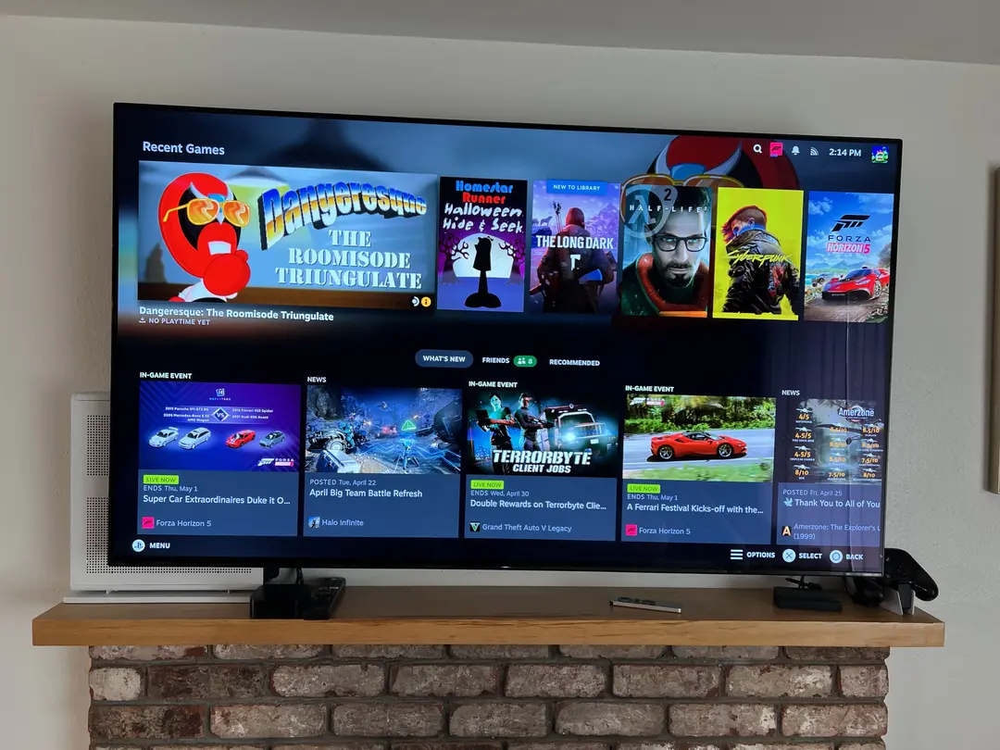
  </a>
  <figcaption>Seeing games on large 4K HDR formats is something else.</figcaption>
</figure>

Whatever TV you have will work.
Playing on a large 4K HDR OLED TV has been a real joy, and it's easy to forget how many pixels are in these things.
Just don't forget to put it into game mode.
I would also note—if you can, avoid Android TV, and definitely disconnect the smart features from any network connection.

### The Audio

I can't run surround in my current living room, so in the meantime, I run AirPods Max—mainly because they have the best audio sharing feature on the Apple TV.
They work well with the Steam Machine though.

## Build notes

Building in the Fractal Ridge was super easy, but seeing how other builds tackled little issues in the small case was helpful.
Here are the builds I found most useful as a reference:

- [Fractal Design Ridge full of Noctua fans feat. delidded 7800X3D and deshrouded RTX 4080](https://pcpartpicker.com/b/btTJ7P)
- [ITX laptop destroyer](https://pcpartpicker.com/b/fTcTwP)
- [All Fractal Ridge Completed Builds](https://pcpartpicker.com/builds/#e=3907)

  <figure class="borderless">
    <a class="imageSwipe"
       href="./img/case-back-assembled.webp"
       data-pswp-width="3024"
       data-pswp-height="4032"
       target="_blank">
      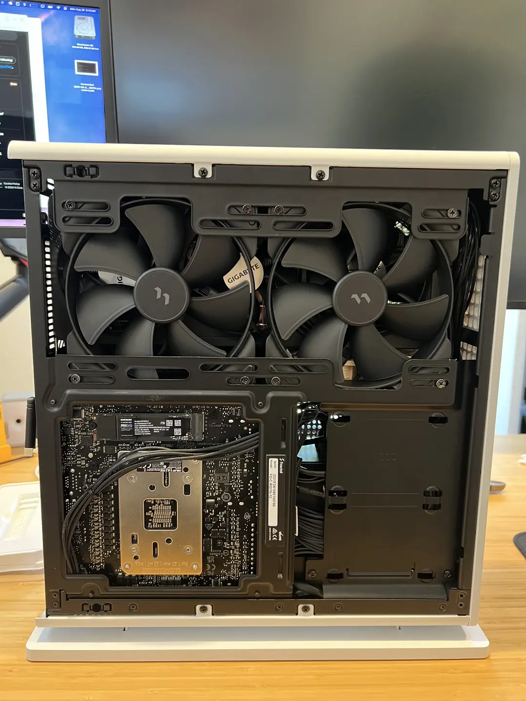
    </a>
    <figcaption>I ran the ITX power cable behind the motherboard, similar to other Ridge builds. Worked well!</figcaption>
  </figure>
  <figure class="borderless">
    <a class="imageSwipe" href="./img/case-back-io.webp" data-pswp-width="3024" data-pswp-height="4032" target="_blank">
      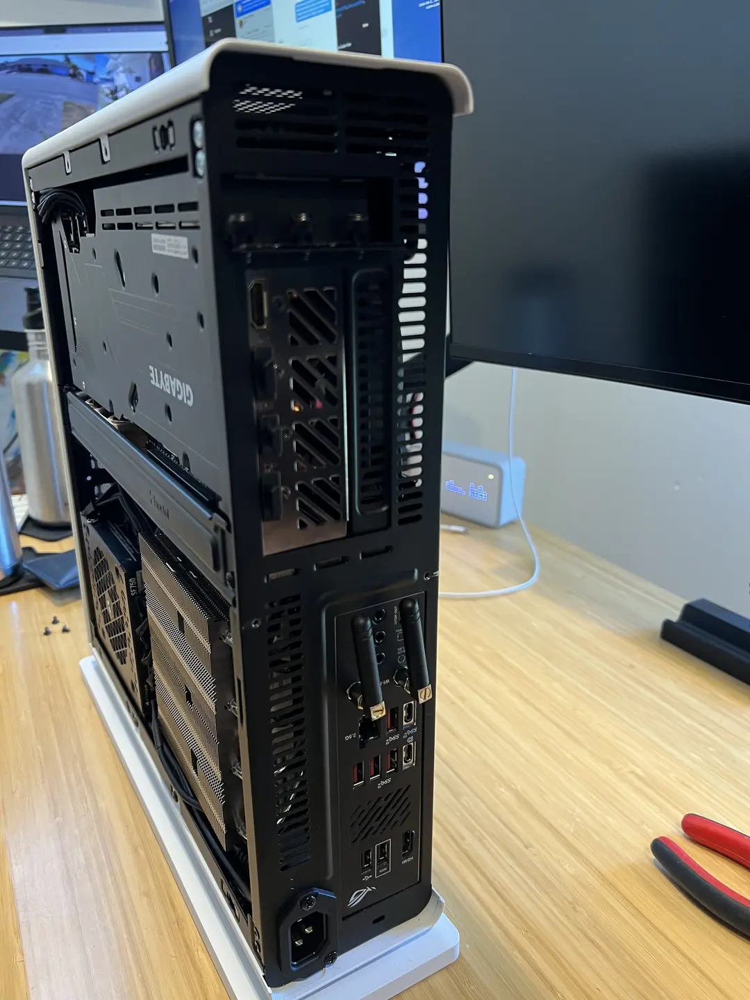
    </a>
    <figcaption>Rear I/O with the stubby Wi-Fi antennas. I ended up getting larger antennas than these.</figcaption>
  </figure>
  <figure class="borderless">
    <a class="imageSwipe" href="./img/case-bottom-assembled.webp" data-pswp-width="4032" data-pswp-height="3024" target="_blank">
      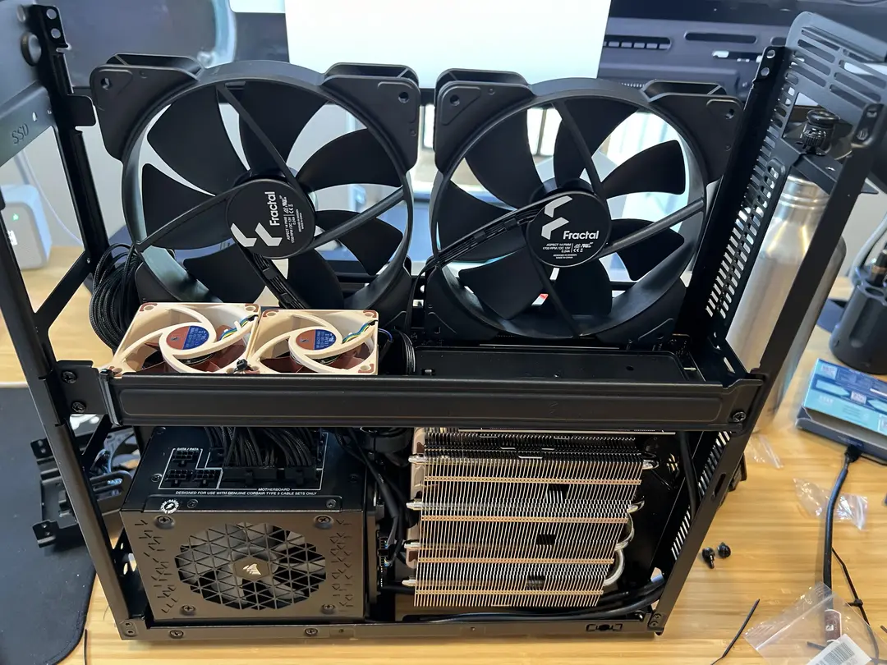
    </a>
    <figcaption>With the stock GPU shroud, I could only fit 2 Noctua NF-A6x25 fans directly below the GPU chamber.</figcaption>
  </figure>
  <figure class="borderless">
    
    <figcaption>The Noctua NH-L12S cooler orientation works great, and the audio cable routes along the side and bottom easily.</figcaption>
  </figure>
  <figure class="borderless">
    
    <figcaption>Zip ties are helpful for routing the I/O and power bundle cables behind the PSU, keeping open space around the CPU cooler.</figcaption>
  </figure>
  <figure class="borderless">
    <a class="imageSwipe" href="./img/case-bottom-fan-empty.webp" data-pswp-width="4032" data-pswp-height="3024" target="_blank">
      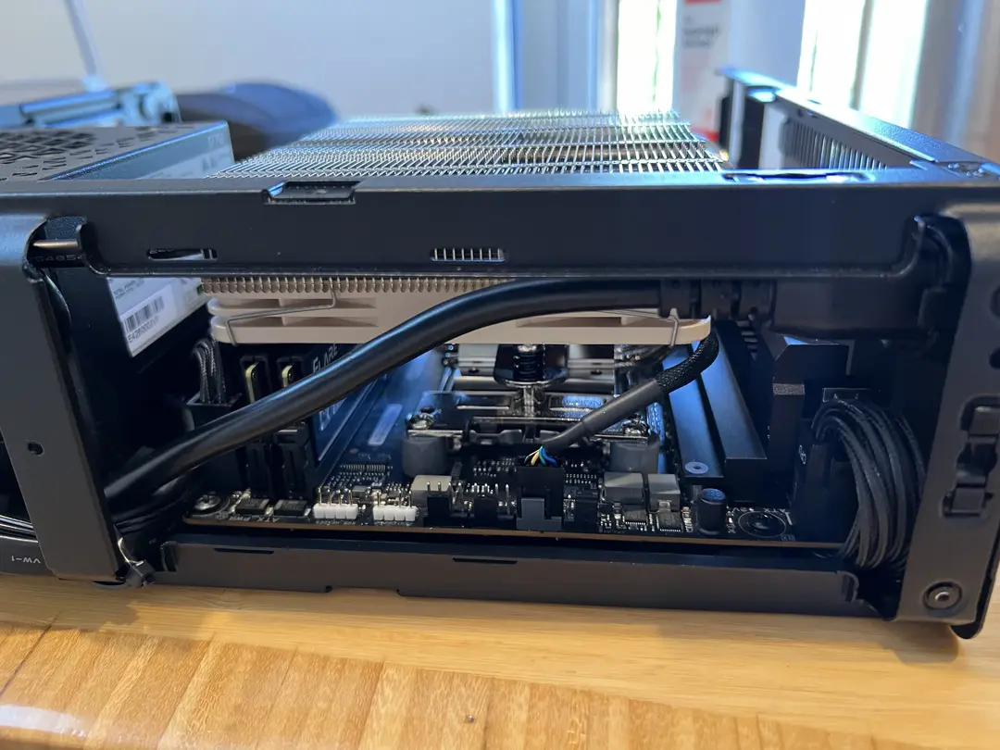
    </a>
    <figcaption>By routing only the power cable below the CPU cooler, you have room for 2 additional Noctua NF-A6x25 fans to intake cool air below the CPU cooler intake.</figcaption>
  </figure>
  <figure class="borderless">
    <a class="imageSwipe" href="./img/case-bottom-fan-shave.webp" data-pswp-width="4032" data-pswp-height="3024" target="_blank">
      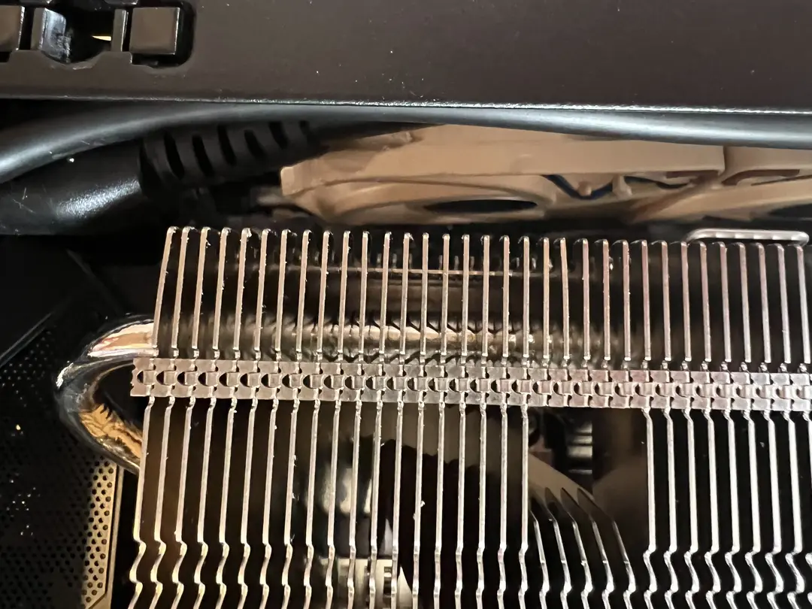
    </a>
    <figcaption>One of the fan tabs interfered with the power cable, so I used a Dremel to shave it down to reduce contact and pressure. Other people use 3D-printed extenders found on Etsy.</figcaption>
  </figure>
  <figure class="borderless">
    <a class="imageSwipe" href="./img/case-bottom-psu-routing.webp" data-pswp-width="4032" data-pswp-height="3024" target="_blank">
      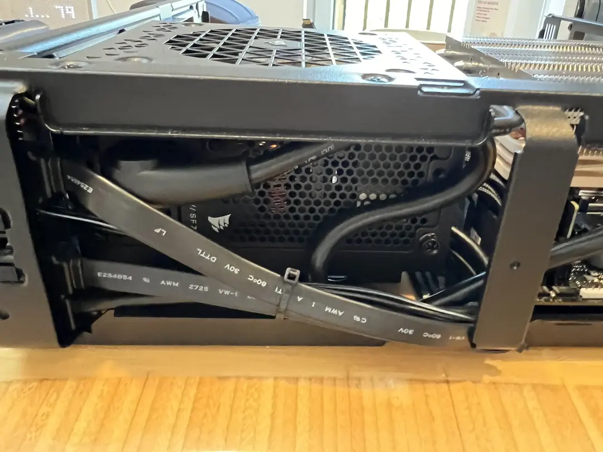
    </a>
    <figcaption>Cable routing below the PSU. This is an odd place to exhaust the PSU—I considered doing a PSU fan reverse but decided against it for now.</figcaption>
  </figure>
  <figure class="borderless">
    <a class="imageSwipe" href="./img/case-bottom-fans-assembled.webp" data-pswp-width="4032" data-pswp-height="3024" target="_blank">
      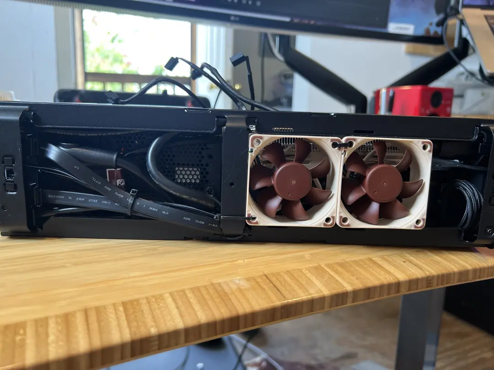
    </a>
    <figcaption>Bottom of the case with intake fans installed.</figcaption>
  </figure>
  <figure class="borderless">
    <a class="imageSwipe" href="./img/case-front-assembled.webp" data-pswp-width="3024" data-pswp-height="4032" target="_blank">
      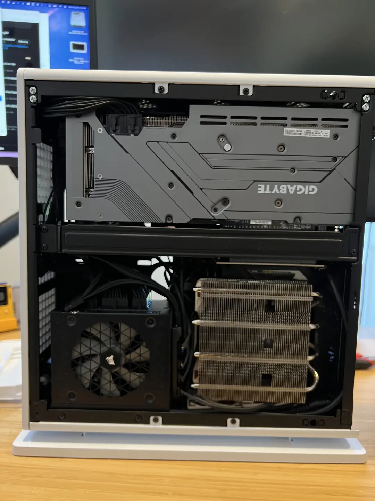
    </a>
    <figcaption>The front side of the case with the GPU installed.</figcaption>
  </figure>
  <figure class="borderless">
    <a class="imageSwipe" href="./img/case-top-fans.webp" data-pswp-width="3024" data-pswp-height="4032" target="_blank">
      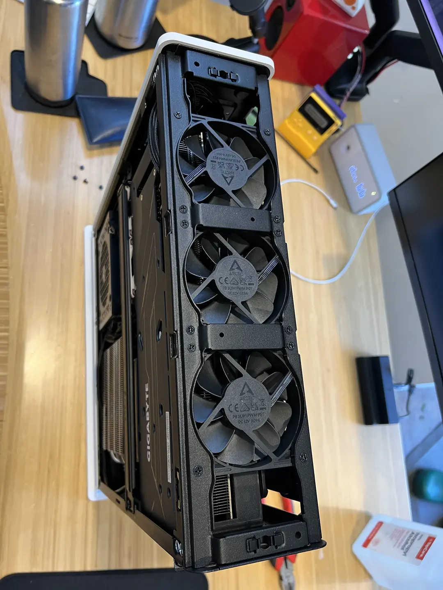
    </a>
    <figcaption>The ARCTIC P8 Slim PWM fans fit above a full-size GPU and stock shroud, despite what the Ridge manual says.</figcaption>
  </figure>
  <figure class="borderless">
    <a class="imageSwipe" href="./img/mobo-assembled-side-1.webp" data-pswp-width="4032" data-pswp-height="3024" target="_blank">
      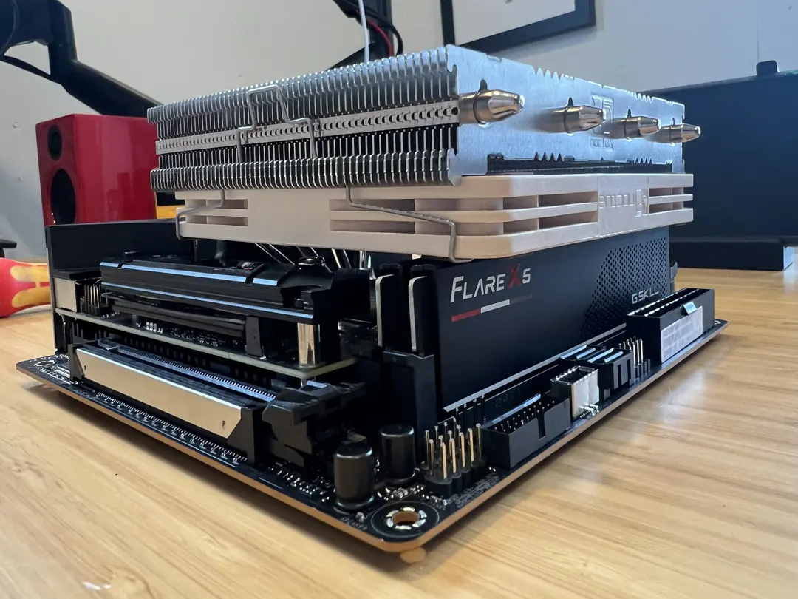
    </a>
    <figcaption>The assembled mini ITX motherboard and comically large CPU cooler.</figcaption>
  </figure>
  <figure class="borderless">
    <a class="imageSwipe" href="./img/mobo-assembled-side-2.webp" data-pswp-width="4032" data-pswp-height="3024" target="_blank">
      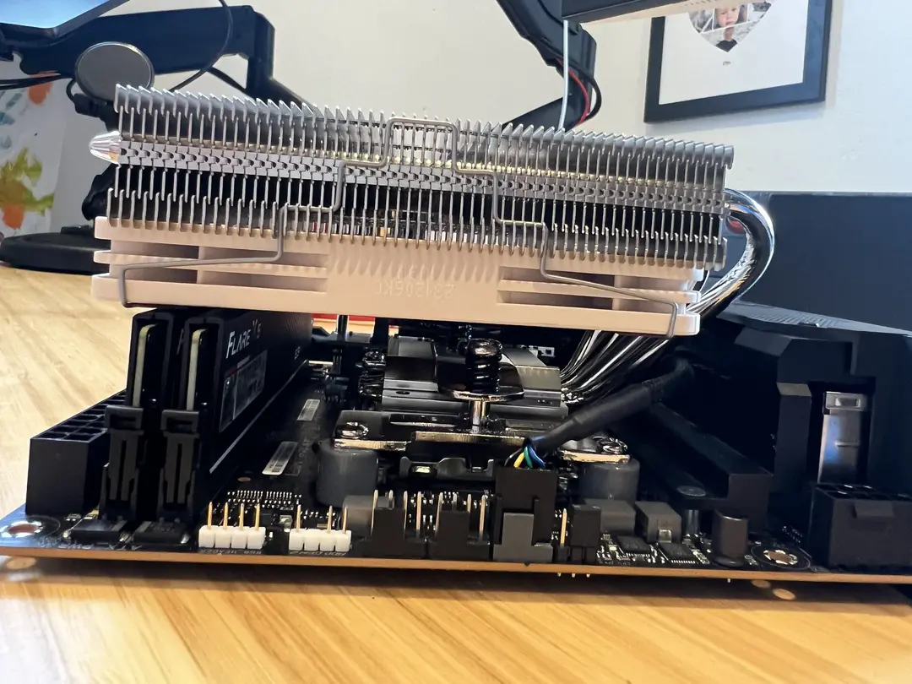
    </a>
    <figcaption>The top-down view below the CPU cooler.</figcaption>
  </figure>
  <figure class="borderless">
    <a class="imageSwipe" href="./img/mobo-assembled-top.webp" data-pswp-width="3024" data-pswp-height="4032" target="_blank">
      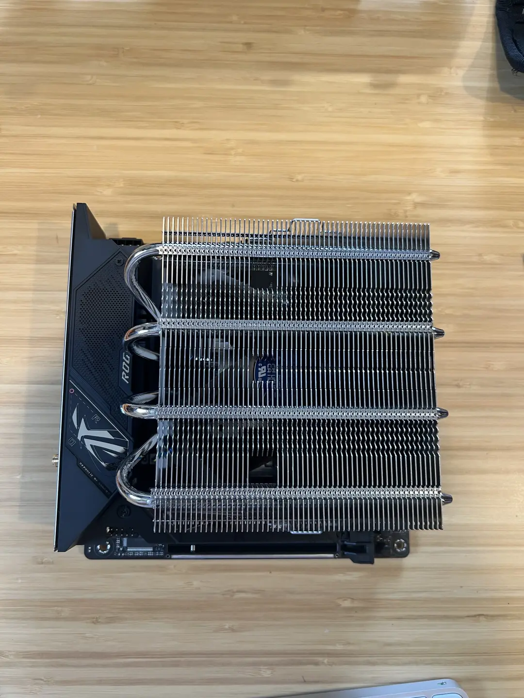
    </a>
    <figcaption>The top view of the motherboard and cooler. The thing really is the size of the entire motherboard.</figcaption>
  </figure>

## Other notes

If you are familiar with the Steam Deck, you will feel comfortable with a Steam Machine.
They are basically the same!

The following are helpful resources when trying to run games on it:

- [ProtonDB](https://www.protondb.com/) – Compatibility reports for games running on Linux in Proton. Any Deck Verified game will also run great.
- [Are We Anti-Cheat Yet?](https://areweanticheatyet.com/) – If you must play multiplayer with cheating competitors who require kernel modules to stop them, you will run into some compatibility issues versus Windows. This site tracks those.
- [GamingOnLinux](https://www.gamingonlinux.com/) – This has consistently been the best news site focusing on gaming on Linux.
- [SteamDB](https://steamdb.info/) – General player and game price tracking on Steam.
- [/r/GyroGaming/](https://www.reddit.com/r/GyroGaming/) – The GyroGaming subreddit can often be helpful when figuring out gyro on games with poor mouse and controller inputs.

If you end up building a Steam Machine or something similar, please share your results!
If you want to chat or ask more questions about the process, you can [join the former SteamFork Discord](https://discord.gg/5KmBn5ttCa), where there are still a bunch of users of SteamFork migrating to SteamOS and facing similar issues and questions.
