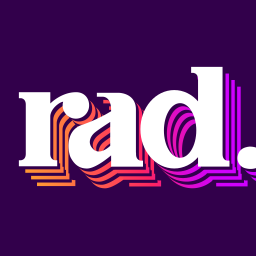
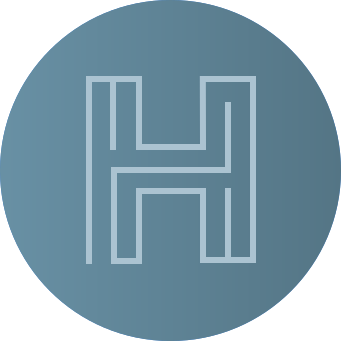

# Bret Comnes

**Not responding to recruiters at the moment, sorry :(**

Software engineer specializing in DevOps and modular open source Javascript, Go, with an interest in product development and development team building, P2P and cryptography.

- portfolio: [bret.io](https://bret.io)
- email: [bcomnes at gmail dot com](mailto:bcomnes+website@gmail.com)
- location: 🌎 US Remote 🤳
- github: [github.com/bcomnes](https://github.com/bcomnes)
- npm: [npmjs.com/~bret](https://www.npmjs.com/~bret)

<h2>
  
  <a href="https://socket.dev">Socket</a>
  <small>Software Engineer • 2021 - Present</small>
</h2>

- Developing the platform to secure npm supply chains.

<h2>
  
  <a href="https://rainbow.me">Rainbow</a>
  <small>Software Engineer • 2021</small>
</h2>

- Working on Rainbow, the #1 Etherium wallet of all time.

<h2>
  
  <a href="https://littlstar.info">Littlstar</a>
  +
  
  <a href="https://rad.live">Rad.live</a>
</h2>

<h3>
  <small>Principal Engineer • 2021</small>
</h3>

- Design and implment NFT minting and auction platform in \~10 weeks.
- See [Littlstar portfilio](https://bret.io/jobs/littlstar/) for more info.

<h3>
  <small>Senior Software Engineer • 2019 - 2021</small>
</h3>

- Developing next gen IAC and delivery pipelines with Terraform and Github Actions deployed to AWS.
- Develop [Little Core Labs](https://github.com/little-core-labs) peer to peer content delivery system.
- Implement a rebrand of Littlstar to [Rad.live](https://rad.live).
- Design and reboot product website using [next.js](https://nextjs.org) and [swr](https://swr.vercel.app).
- Designed and implemented an organizational microservice pattern.
- Develop centralized JWT authorization strategy for all services.

<h2>
  
  <a href="https://archive.ph/m8Igr">Hyperdivision</a>
  <small>Software Engineer • 2019 🇩🇰</small>
</h2>

- Leading development on Heimdall, a cryptographically secure, p2p ledger and proposal system used to securely manage cryptographic assets used for cryptocurrency exchange asset management and other financial technologies.
- Electron application development using a [custom frontend framework](https://github.com/hyperdivision/hui).
- [VHS-Tape](https://github.com/hyperdivision/vhs-tape): frontend component unit testing with async/await.
- Cryptographic focused native Node.js module development ([prebuildify](https://github.com/prebuild/prebuildify), [libsodium](https://github.com/sodium-friends/sodium-native)).
- Webassembly module development ([wat2js](http://ghub.io/wat2js))

<h2>
  
  <a href="https://www.netlify.com">Netlify</a>
</h2>

<h3>
  <small>Platform Engineering • 2018 - 2019</small>
</h3>

- Joined Netlify's DevOps focused platform team.
- Maintain and develop [Netlify's CI build environment](https://www.netlify.com/docs/continuous-deployment/), built with [Docker](https://www.docker.com), [Go](https://golang.org), [Jenkins](https://jenkins.io) and [Kubernetes](https://kubernetes.io).
- Launch Netlify's selectable build-image infrastructure and interface.
- Develop and maintain [Netlify's Open-api](http://github.com/netlify/open-api) Go client, and architect and rewrite the [Javascript client](http://github.com/netlify/js-client).
- 24h on-call duties
- Monitor and maintain the health of Netlify's multi-cloud infrastructure using [Humio](http://humio.com) and [Datadog](http://datadoghq.com).
- Scale and deploy infrastructure with GitOps via [Ansible](https://www.ansible.com), bash and [Terraform](http://terraform.io).
- See [Netlify portfolio](/jobs/netlify/#platform) for more examples.

<h3>
  <small>Product Engineering • 2017 - 2018</small>
</h3>

- Plan, design, implement, test and iterate on new features for [Netlify's React based webapp](https://app.netlify.com).
- Support, maintain, test and release Netlify's [open source JS and Go libraries](https://github.com/netlify).
- Architect and build Netlify's next generation, extensible [CLI](https://github.com/netlify/cli).
- See [Netlify portfolio](/jobs/netlify/#product) for more examples.

<h2>
  
  <a href="http://www.zhealthconsulting.com">ZHealth</a>
  <small>Electron Developer • 2016 - 2017</small>
</h2>

- Developing next generation structured documentation [EtchCV](https://zhealthdocumentation.com/etch-suite/) suite for Cardiac Surgeons and Hospitals.
- API and microservice design + implementation.
- Cross Platform Desktop software using Electron, HTML, CSS and SVG powered by React + Redux.
- Modular development using github, npm and continuous delivery using TravisCI, Appveyor and S3/AWS.

<h2>
  
  <a href="https://www.jaguarlandrover.com">Jaguar Land Rover</a>
  <small>OS & Application Engineering • 2015 - 2016</small>
</h2>

- Mobile app, infotainment and OS development using JS + Node.js, HTML and CSS.
- Targed in-vehicle embeded systems fully utlizing the onboard can bus.
- Architected a single sign-on service and documentation server for internal documents and project planning using Express.js.

<h2>
  
  <a href="https://www.airship.com">Airship</a>
  <small>Technical Support Engineer • 2015</small>
</h2>

- Support developers implementing with Urban Airships SDK.
- Developed a specialized customer analytic and messaging system.

<h2>
  
  <a href="https://www.pdx.edu/">Portland State University</a>
</h2>

<h3>
  <a href="https://www.pdx.edu/oit/research-computing">Office of Information Technology ARC</a>
  <small>HPC Operations & Python Development • 2013 - 2015</small>
</h3>

- Web applications and systems programming with Python and Django.
- Developed custom database monitoring tools that tracked MySQL and Postgres usage metrics
- Responsible for building, automating and monitoring PSU’s research servers and HPC Linux Clusters.
- Initiated efforts to automate cluster deployment and management using Ansible.
- Trained and introduced new users to ARC's resources and shared unix computing environments.

<h3>
  <a class="job-logo" href="http://www.pdx.edu/nano-development-lab">Sánchez Nano Development Lab</a>
  <small>Research Assistant • 2013 - 2015</small>
</h3>

- Wrote custom control software and a web application that enabled remote viewing and operation of a Scanning Electron Microscope over the Internet using React, Web Sockets and WebRTC.

<h3>
  <a href="http://www.pdx.edu/physics/">PSU Physics Department</a>
  <small>Lab Instructor & TA • 2012 - 2014</small>
</h3>

- Instructed PSU’s General Physics Labs and assisted in the upper division Experimental Physics Labs.
- Developed two novel labs on the use of micro-controllers and FPGAs covering basic concepts to
advanced topics like PID control theory.
- Teaching introductory electronics and debugging skills to students.

<h2>
  
  <a href="https://www.wiley.com/en-us">Wiley</a>
  <small>Textbook Development Consultant • 2012</small>
</h2>

- Developed interactive figures and demos for an interactive Calculus textbook published by Wiley Publishing.

<h2>
  
  <a href="http://www2.humboldt.edu/physics/gravitational-lab.html">HSU Gravitational Research Laboratory</a>
  <small>Research Assistant • 2009 - 2011</small>
</h2>

- Designed and machined custom experimental instruments and developed the lab’s data collection, automation and analysis software to study the gravitational inverse-square law at sub-millimeter distance scales.

<h2>
  
  <a href="http://egg.astro.cornell.edu/index.php/">National Astronomy and Ionosphere Center</a>
  <small>Arecibo Guest Researcher • 2009</small>
</h2>

- Trained and operated the worlds largest radio telescope and analyzed the collected data searching for previously undiscovered galaxies.

## Education

- [Humboldt State University](http://www2.humboldt.edu/physics/) <small class="subdue">B.S. Physics 2011 </small>
- [Portland State University](http://www.pdx.edu/physics/) <small class="subdue">M.S. Applied Physics 2015 (Completed coursework, no diploma)</small>

## Media

- [Socket - Github App Improvements](https://socket.dev/blog/github-app-improvements) 2022-07-26
- [JS Party – Episode #227: JS logging & error handling](https://changelog.com/jsparty/219) 2022-05-27
- [JS Party – Episode #219: Making moves on supply chain security](https://changelog.com/jsparty/219) 2022-03-24
- [Netlify Blog: A more flexible build architecture with updated Linux](https://www.netlify.com/blog/2019/03/14/a-more-flexible-build-architecture-with-updated-linux/) 2019-03-14
- [Netlify Blog: Fearless deploys for your lingering processes](https://www.netlify.com/blog/2018/11/28/fearless-deploys-for-your-lingering-processes/) 2018-11-28
- [Netlify Blog: Netlify CLI 2.0 now in Beta 🎉](https://www.netlify.com/blog/2018/09/10/netlify-cli-2.0-now-in-beta/) 2018-09-10
- [Netlify Blog: Buy and secure a custom domain through Netlify](https://www.netlify.com/blog/2018/06/19/buy-and-secure-a-custom-domain-through-netlify/) 2018-06-19
- [Netlify Blog: Netlify now shows your deploy status on its favicon](https://www.netlify.com/blog/2018/05/22/netlify-now-shows-your-deploy-status-on-its-favicon/) 2018-05-22
- [Netlify Blog: Introducing Site Dashboards](https://www.netlify.com/blog/2017/08/22/introducing-site-dashboards/) 2017-08-22
- [Netlify Blog: Introducing Audit Log](https://www.netlify.com/blog/2017/07/27/introducing-audit-log/) 2017-07-27

## Community

- [Datcast](https://dat-cast.hashbase.io) <small class="subdue">Podcast (2018 - 2019)</small>
- [PDX Node](https://www.meetup.com/pdxnode/) <small class="subdue">Organizer Meetup (2015 - 2017)</small>
- [Node School](https://nodeschool.io) <small class="subdue">Organizer & Mentor (2016)</small>
- [Code for Portland](http://www.codeforportland.org) <small class="subdue">Organizer & Mentor • Open Civic Data Initiative (2014 - 2015)</small>
- [Small Modules Talk](http://bcomnes.github.io/slides/small-modules/) <small class="subdue">Internal Presentation (2014)</small>
- [WebRTC Camp](https://twitter.com/WebRTCCamp) <small class="subdue">Speaker (2013)</small>
- [Indieweb Camp](https://indieweb.org) <small class="subdue">Organizer & Mentor (2012 - 2014)</small>

<!-- [Intro to Choo](https://github.com/bcomnes/choo-6-talk/) <small class="subdue">Speaker (2017)</small> -->

*[HPC]: High Performance Computing
*[PSU]: Portland State University
*[ARC]: Academic Research Computing
*[IAC]: Infrastructure as code
