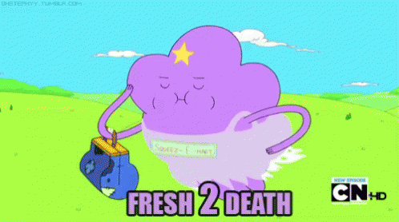

# [Littlstar][ls] Portfolio

After a short sabbatical in Denmark at [Hyperdivision](https://hyperdivision.dk), I joined [Littlstar][ls].
Here is a quick overview of some of the more interesting projects I worked on.
I joined Littlstar during a transitional period of the company and help them transition from a VR video platform to a video on demand and live streaming platform, and now an NFT sales and auction platform.

## NYCPF VR Platform

<figure class="borderless">
  
  <figcaption>NYCPF used a local process talking over websocket RPC to a webapp running in a local browser.</figcaption>
</figure>

My first project was picking up on an agency style project developing a novel VR reality training platform for [NYCPF](https://www.nycpolicefoundation.org), powered by a custom [hypercore](https://ghub.io/hypercore) p2p file sharing network, delivering in-house developed unity VR scenarios.
These scenarios could then be brought to various locations like schools or events where NYCPF could guide participants through various law enforcement scenarios with different outcomes based on participant choices within the simulation.

By utilizing a p2p and offline first design approach, we were able to deliver an incredibly flexible and robust delivery platform that had all sorts of difficult features to develop for traditional file distribution platforms such as:

- Automated offline re-distribution of simulation data to a fleet of devices.
- Bittorrent style inverted bandwidth characteristics (more demand = more availability).
- Extremely high performance content distribution speeds on commodity hardware.
- WAN and LAN peering between devices.
- Centrally controlled editorial over available content, with eventual-consistency properties to offline or air-gaped clients.
- Cross platform codebase targeting Windows, MacOS and Linux. The dev team utilized all 3 platforms during development, interchangeably.

While the project was built on the backs of giants like the [Hypercore protocol](https://hypercore-protocol.org), as well as the amazing work of my [colleague](https://github.com/orgs/little-core-labs/people), I contributed in a number of areas to move the project forward during my time contracting on it.

- Take ownership of the preexisting React application.
- Simplify and maintain a mix of internal open source and closed source packages.
- Simplify React app state layer by eliminating the need for Redux in favor of built in React state solutions.
- Implement offline mode via Service workers in conjunction with Hypercore.
- Packaging and delivery tasks.
- Improved progress UI/UX.
- Contribute to native packaging tools build with [pkg](https://ghub.io/pkg) and [tiny-module-compiler](https://github.com/little-core-labs/tiny-module-compiler).

Some of the discrete software packages that resulted from this project are described below.

### [`secure-rpc-protocol`](https://github.com/little-core-labs/secure-rpc-protocol)

Secure [rpc-protocol](https://github.com/little-core-labs/rpc-protocol) over any duplex socket using [noise-protocol](https://github.com/emilbayes/noise-peer).
This was a refactor of an existing RPC over websocket solution the project was using.
It improved upon the previous secure RPC already used by switching to using the [noise protocol](http://noiseprotocol.org) which implements well understood handshake patterns that can be shared and audited between projects, rather than relying on a novel implementation at the RPC layer.
It also decoupled the RPC protocol from the underlying socket being used, so that the RPC system could be used over any other channels we might want in the future.

<figure class="borderless">
  
  <figcaption><a href="https://github.com/little-core-labs/secure-rpc-protocol">Secure RPC protocol</a> uses the noise protocol for encryption, and works over any duplex socket.</figcaption>
</figure>

### [`async-folder-walker`](https://github.com/bcomnes/async-folder-walker)

An async generator that walks files.
This project was a refactor of an existing project called [folder-walker](https://ghub.io/folder-walker) implementing a high performance folder walk algorithm using a more modern async generator API.

<figure>
  
  <figcaption><a href="https://github.com/bcomnes/async-folder-walker">Async folder walker</a> provides a modern api to folder and filer walking of a directory.</figcaption>
</figure>

### [`unpacker-with-progress`](https://github.com/little-core-labs/unpacker-with-progress)

`unpacker-with-progress` is a specialized package that unpacks archives, and provides a progress api in order to provide UI feedback.
One of the deficiencies with the NYCPF project when I started was lack of UI feedback during the extraction process.

VR files are very large, and are delivered compressed to the clients.
After the download is complete, the next step to processing the data is unpacking the content.
This step did not provide any sort of progress feedback to the user because the underlying unpacking libraries did not expose this information, or only exposed some of the information needed to display a progress bar.

This library implemented support for unpacking the various archive formats the project required, and also added an API providing uniform unpacking progress info that could be used in the UI during unpacking tasks.

<figure class="borderless">
  
  <figcaption><a href="https://github.com/little-core-labs/unpacker-with-progress">unpacker-with-progress</a> is a consistency layer on top of a few unpacking libraries, with an emphasis on progress reporting for use in UI applications.</figcaption>
</figure>

### [`hchacha20`](https://github.com/little-core-labs/hchacha20)

One of the more interesting side projects I worked on was porting over some of the [libsodium](https://doc.libsodium.org) primitives to [sodium-javascript](https://github.com/sodium-friends/sodium-javascript).
I utilized a technique I learned about at Hyperdivision where one can write web assembly by hand in the [WAT format](https://developer.mozilla.org/en-US/docs/WebAssembly/Understanding_the_text_format), providing a much wider set of data types, providing the type guarantees needed to write effective crypto.

While the WAT was written for HChaCha20, the effort was quite laborious and it kicked off a debate as to whether it would be better to just wrap [libsodium-js](https://github.com/jedisct1/libsodium.js) (the official libsodium js port) in a wrapper that provided the [sodium-universal](https://github.com/sodium-friends/sodium-universal) API.  This was achieved by another group in [geut/sodium-javascript-plus](https://github.com/geut/sodium-javascript-plus) which successfully ran hypercores in the browser using that wrapper.

Ultimately, this effort was scrapped, determining that noise peer connections in the browser are redundant to webRTC encryption and https sockets.
It was a fun and interesting project none the less.

<figure class="borderless">
  
  <figcaption>A peek into the world of WASM via WAT.</figcaption>
</figure>

### Reconnecting sockets

We were having some state transition bugs between the webapp and the local server process, where the app could get into strange indeterminate states.
Both had independent reconnect logic wrapped up with application code, and it added a lot of chaos to understanding how each process was behaving when things went wrong (especially around sleep cycles on machines).

I implemented a generic reconnecting state machine that could accept any type of socket, and we were able to reduce the number of state transition bugs we had.

- [`little-core-labs/reconnecting-socket`](https://github.com/little-core-labs/reconnecting-socket)
- [`little-core-labs/reconnecting-simple-websocket`](https://github.com/little-core-labs/reconnecting-simple-websocket)

<figure class="borderless">
  
</figure>

## Little Core Labs

After working on various agency projects at Littlstar, we formed a separate organization to start a fresh rewrite of the technology stack.

My high level contributions:

- Terraform running in Github actions
- Provisioning AWS infrastructure.
- Helping come up with how all of this stuff will work.

This was an amazing founders-style opportunity to help rethink and re-implement years of work that had developed at Littlstar prior to  joining.
Effectively starting from 0, we rethought the entire technology pipeline, from operations, to infrastructure, to deployment, resulting in something really nice, modern, minimal, low maintenance and malleable.

- [Little Core Labs Github](https://github.com/little-core-labs)
- [Little Core Labs Twitter](https://twitter.com/littlecorelabs)

<figure>
  
  <figcaption>
    A screencap of our cloudformation diagram.
  </figcaption>
</figure>

## Terraform ops

A culmination of ingesting the ["Terraform: Up & Running"](https://amzn.to/3er6lBB) and ["AWS Certified Solutions Architect"](https://amzn.to/3rbNakx) books, as well as building off existing organizational experience with AWS, I helped research and design an operations plan using [Terraform](https://www.terraform.io) and [GitHub Actions](https://github.com/features/actions).

  

    
  

  

    
  

This arrangement has proven powerful and flexible.
While it isn't perfect, it has been effective and reliable and cheap, despite its imperfections in relation to some of the more esoteric edge cases of Terraform.

A quick overview of how its arrange:

- We have a global terraform repository with segmented terraform files for various services.
- The `ops` global repo runs terraform in a bootstrapped GitHub actions environment.
- We can create service level repos from the `ops` terraform repo, that in turn contain their own Terraform files specific to that service.
- One of the benefits was that the GitHub environment worked along side a local environment, due to the use of AWS secrets manager and GitHub actions secrets (all managed in Terraform), so debugging was easy and flexible.

## Github actions

One of the drawbacks of rolling our own Terraform CI infrastructure was that we had to tackle many small edge cases inside the GitHub actions environment.

It was nice to learn about the various types of custom GitHub actions one can write, as well as expand that knowlege to the rest of the org, but it also ate up a number of days focusing on DevOps problems specific to our CI environment.

Here are some of the problems I helped solve in the actions environment.

- [install-terraform](https://github.com/little-core-labs/install-terraform) - Install terraform at a specific version.
- [netrc-creds](https://github.com/little-core-labs/netrc-creds) - Set up [netrc](https://www.gnu.org/software/inetutils/manual/html_node/The-_002enetrc-file.html) credentials.
- [get-git-tag](https://github.com/little-core-labs/get-git-tag) - Easily get a git tag.

## sdk-js

I helped lay the framework for the initial version of `sdk-js`, the Little Core Labs unified library used to talk to the various back-end services at Little Core Labs.

One of underlying design goals was to solve for the [newly introduced native ESM features in node](https://nodejs.org/api/esm.html), in such a way that the package could be consumed directly in the browser, natively as ESM in node, but also work in dual CJS/ESM environments like Next.js.
While this did add some extra overhead to the project, it serves as a design patter we can pull from in the future, as well as a provide a highly compatible but modern API client.

I also extracted out this dual package pattern into a reusable template.

- [bcomnes/esm-template](https://github.com/bcomnes/esm-template)

## [rad.live](https://rad.live)

I was the principal engineer on the new [Rad.live](https://rad.live) website.
I established and implemented the tech stack, aiming to take a relatively conservative take on a code base that would maximize the readability and clarity for a Dev team that would eventually grow in size.

A high level, the application is simply an app written with:

- [Next.js](https://nextjs.org) - React with a framework to provide standard bundling, SSR and routing features.
- [SWR](https://swr.vercel.app) - Declarative data ['hooks'](https://reactjs.org/docs/hooks-intro.html), minimizing/eliminating complex state management throughout the app.
- [GQLR](https://github.com/little-core-labs/gqlr) - A simple GraphQL client tuned to 'just work'.
- [styled-jsx](https://github.com/vercel/styled-jsx) - A simple and understandable CSS-In-JS framework that minimizes orthogonal layout CSS.

From a development perspective, it was important to have testing and automation from the beginning.
For this we used:

- GitHub actions to run CI on every interaction.
- Organizational standard linting that supported the unique needs of React.
- [Storybook](https://storybook.js.org) for data/state independent component testing (Using the new and improved storybook API)
- Automated component testing, with a minimum of 'does it render' testing utilizing the storybook stories.
- Release automation.

Overall, the codebase has had two other seasoned developers (one familiar and one new at React) jump in and found it productive.
Additionally, it has been a relatively malleable code base that is easy to add MVP features to and is in a great position to grow.

### `vision.css`

I implemented a custom design system working closely with our design team.
This project has worked out well, and has so far avoided 'css lockout', where only one developer can effectively make dramatic changes to an app layout due to an undefined and overly general orthogonal 'global style sheet'.

The way this was achieved was by focusing on a simple global CSS style sheet that implements the base HTML elements in accordance with the design system created by the design team.
While this does result in a few element variants that are based on a global style class name, they remain in the theme of only styling 'built in' html elements, so there is little question what might be found in the global style sheet, and what needs to be a scoped css style.

Some of the features we used for vision.css

- Standard CSS syntax with a selection of a few 'yet-to-be-released' css syntax features.
- A [postcss](https://postcss.org) build pipeline.
- Heavy use of [CSS variables](https://developer.mozilla.org/en-US/docs/Web/CSS/Using_CSS_custom_properties).
- A [website](https://little-core-labs.github.io/vision.css/) that contains a style-guide and preview of the various styled elements.

### [`eslint-config-12core`](https://github.com/little-core-labs/eslint-config-12core)

Linting is the "spell check" of code, but its hard to agree on what rules to follow.
Like most things, having a standard set of rules that is good-enough is always better than no rules, and usually better than an unpredictable and unmaintainable collection of project-unique rules.

I put together a shared ESLint config that was flexible enough for most projects so far at Little Core Labs based on the 'StandardJS' ruleset, but remained flexible enough to modify unique org requirements.
Additionally, I've implemented it across many of the projects in the Github Org.

- [`eslint-config-12core`](https://github.com/little-core-labs/eslint-config-12core)

### [`gqlr`](https://github.com/little-core-labs/gqlr)

`gqlr` is a simplified fork of [graphql-request](https://github.com/prisma-labs/graphql-request).

This relatively simple wrapper around the JS fetch API has a gaggle of upstream maintainers with various needs that don't really match our needs.

The fork simplified and reduced code redundancy, improved maintainability through automation, fixed bugs and weird edge cases and dramatically improved errors and error handling at the correct level of the tech stack.
These changes would have unlikely been accepted upstream, so by forking we are able to gain the value out of open source resources, while still being able to finely tune them for our needs, as well as offer those changes back to the world.

- [`gqlr`](https://github.com/little-core-labs/gqlr)

### [`local-storage-proxy`](https://github.com/bcomnes/local-storage-proxy)

A configuration solution that allows for persistent overrides stored in [local storage](https://developer.mozilla.org/en-US/docs/Web/API/Window/localStorage), including cache busting capabilities.  Implemented with a recursive [JS proxy](https://developer.mozilla.org/en-US/docs/Web/JavaScript/Reference/Global_Objects/Proxy) to simulate native object interactions over a window.localstorage interface.

- [`local-storage-proxy`](https://github.com/bcomnes/local-storage-proxy)

### Community maintenance

We ended up taking on maintainence of a few other packages, providing fixes and improvements where the original authors seem to have left off.

- [little-core-labs/date-input-polyfill](https://github.com/little-core-labs/date-input-polyfill) - Polyfill for HTML5 date input element.
- [little-core-labs/chromafi](https://github.com/little-core-labs/chromafi)

### Video platform

Here are some snapshots of the video platform we launched.

### NFT Auction Platform

Here are some screenshots of the NFT auction platform I helped build.
The UI was fully responsive and updated on the fly to new results, thanks to the powers of SWR.

### Marketing pages

I did a few marketing pages as well.

## Conclusion

While this isn't everything I did at Littlstar, it captures many of the projects I enjoyed working on, and can hopefully provide some insights into my skills, interests and experiences from the past year.

[ls]: https://littlstar.info
