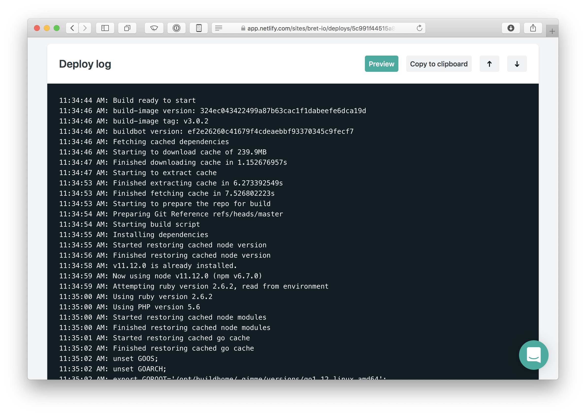
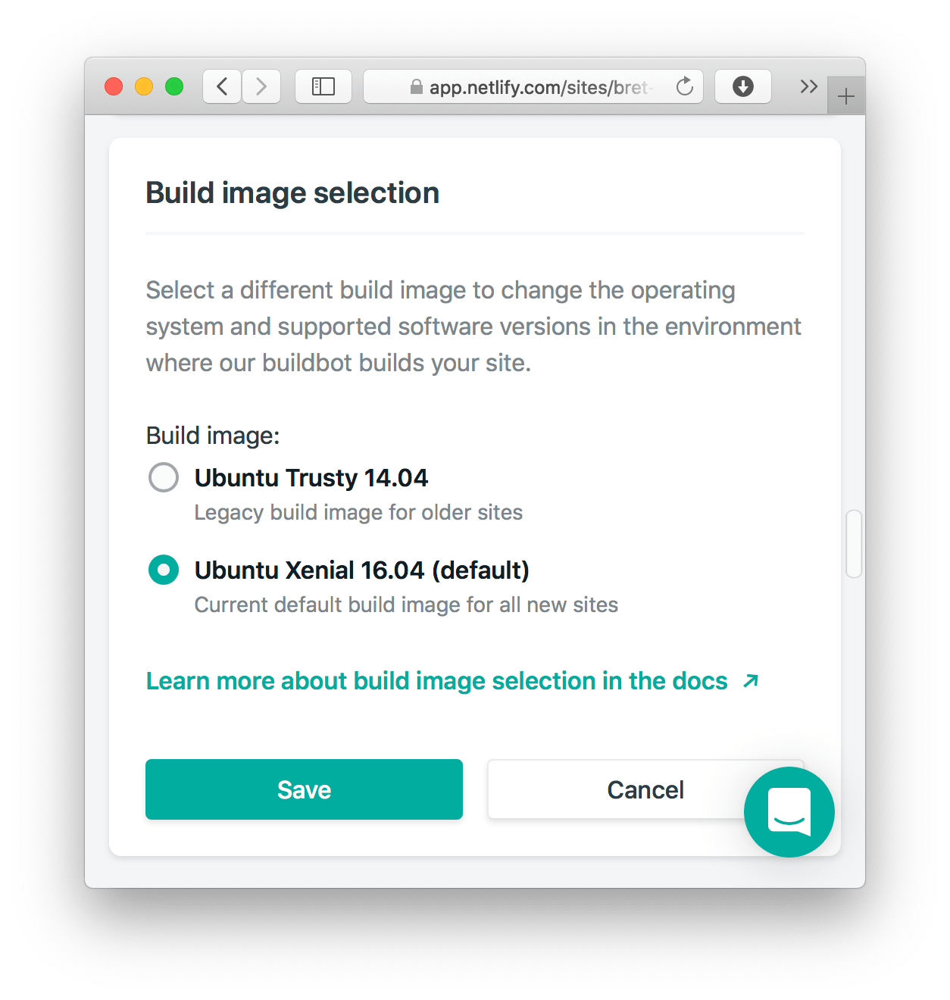
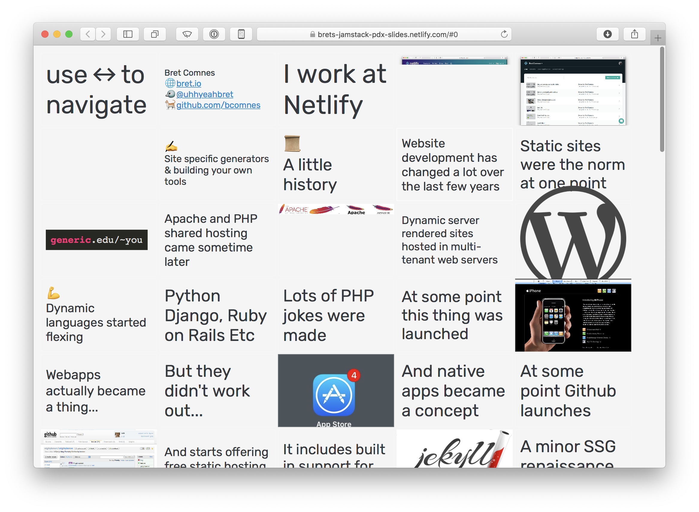
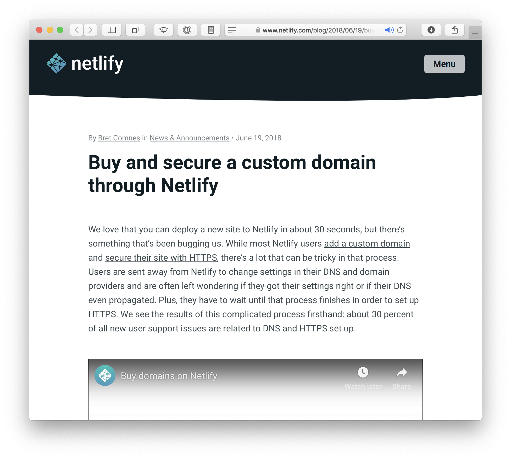
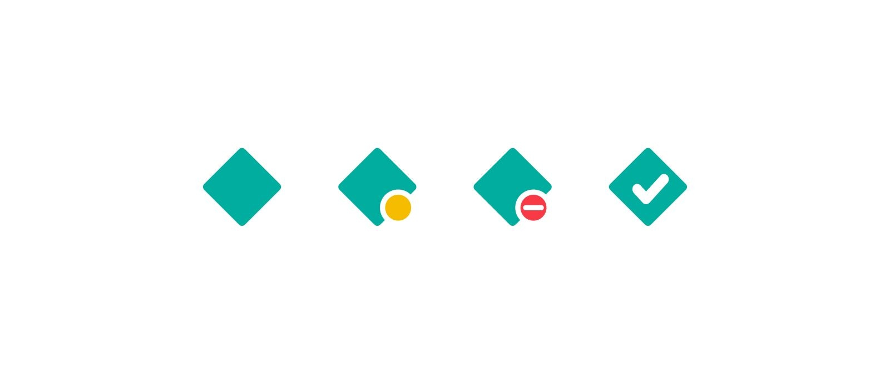
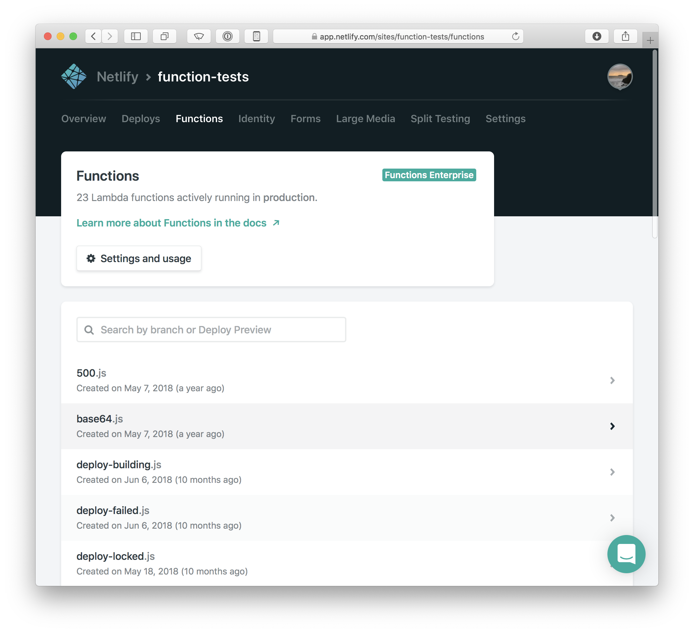
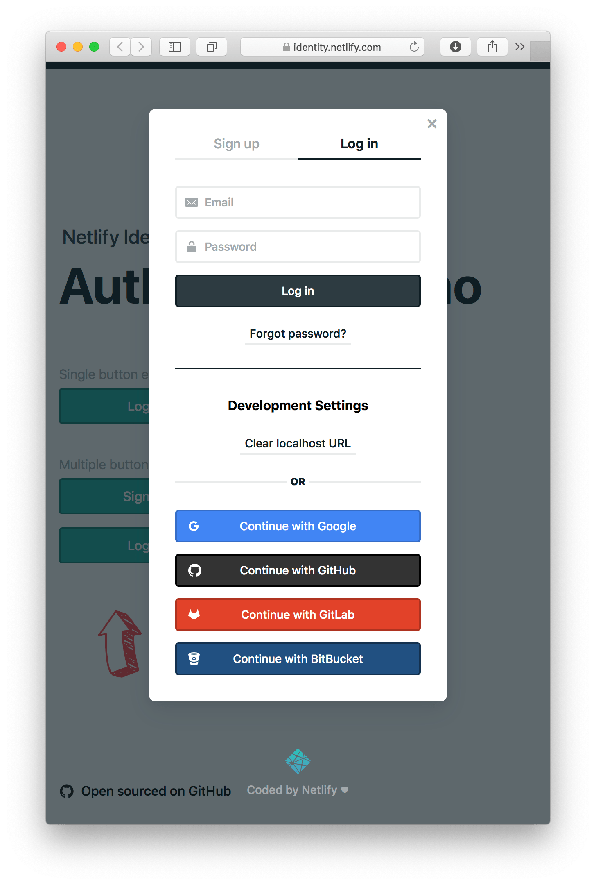
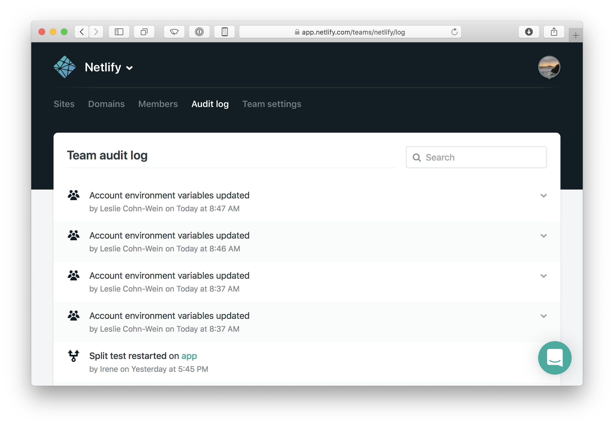

# [Netlify](http://www.netlify.com) Portfolio

I am lucky to be able to contribute to many features and experiences that affect Netlify's massive user base.  Here are some examples of things that I worked on.

## Platform

After working on the Product team for slightly over a year, I switched to working on Netlify's platform team.  The team has a strong DevOps focus and maintains a redundant, highly available multi-cloud infrastructure on which Netlify and and all of its services run.  My focus on the team is to maintain, develop, scale and improve various critical services and libraries.  Below are some examples of larger projects I worked on.

### Buildbot

One of my primary responsibilities upon joining the team is to maintain the Buildbot that all customer site builds run on.  It is partially open-source so customers can explore the container in a more freeform matter locally.

<ul>
  <li class="lang docker"><a href="https://github.com/netlify/build-image">netlify/build-image</a> - Docker file which defines the container builds run in.</li>
  <li class="lang go"><a href="https://godoc.org/github.com/netlify/open-api/go">netlify/open-api/go</a> - Go open-api client used in the bot.</li>
</ul>

#### [Selectable build images](https://www.netlify.com/blog/2019/03/14/a-more-flexible-build-architecture-with-updated-linux/)

One of the first feature additions I launched for the Buidlbot was selectable build images.  This project required adding the concept of additional build images to the API and UI and to develop an upgrade path allowing users to migrate their websites to the new build image image wile also allowing them to roll back to the old image if they needed more time to accommodate the update.

Additionally, I performed intake on a number of user contributed build-image additions and merged other various potential breaking changes within a development window before releasing.  I also helped develop the changes to the Ruby on Rails API, additions to the React UI, as well as write the user documentation.  It was widely cross cutting project.

### [Open API](https://open-api.netlify.com)

I help maintain and further develop Netlify's Open-API (aka Swagger) API definition, website and surrounding client ecosystem.  While open-api can be cumbersome, it has been a decent way to synchronize projects written in different language ecosystems in a unified way.

<ul>
  <li class="lang go"><a href="https://github.com/netlify/open-api">netlify/open-api</a> - API definition and Go client</li>
  <li class="lang js"><a href="https://github.com/netlify/js-client">netlify/js-client</a> - Node.JS and Browser JS client</li>
</ul>

### Other platform projects I work on

<ul>
  <li class="lang go"><a href="http://github.com/netlify/gotrue">netlify/gotrue</a> - Netlify's Identity service</li>
  <li class="lang go"><a href="http://github.com/netlify/gocommerce">netlify/gocommerce</a> - Netlify's Commerce service</li>
  <li class="lang js"><a href="https://github.com/netlify/zip-it-and-ship-it">netlify/zip-it-and-ship-it</a> - Netlify's Lambda function packaging algorithm</li>
</ul>

## Product

I worked on Neltify's Product team for a bit over a year and completed many successful user facing projects.  Here are just a few examples:

### [CLI](https://cli.netlify.com)

I was primary author on Netlify's current CLI codebase.

<ul>
  <li class="lang js"><a href="http://github.com/netlify/cli">netlify/cli</a> - Netlify's extensible CLI</li>
  <li class="lang js"><a href="https://github.com/netlify/js-client">netlify/js-client</a> - The API client used to make all API calls in the CLI</li>
  <li class="lang js"><a href="https://github.com/netlify/cli-utils">netlify/cli-utils</a> - A common utility class for loading and saving configuration from a CLI command</li>
</ul>

<figure>
  <video controls width="100%">
    <source src="./netlify-cli.mp4" type="video/mp4">
  </video>
  <figcaption>Build image selection UI.</figcaption>
</figure>

### [JAMStack slides](https://brets-jamstack-pdx-slides.netlify.com/#0)

I gave a talk on some ideas and concepts I came across working with Netlify's platform and general JAMStack architecture at a local Portland JAMStack meetup.

<ul>
  <li class="lang html"><a href="https://github.com/bcomnes/jamstack-pdx-slides">bcomnes/jamstack-pdx-slides</a></li>
</ul>

### [Domains](https://www.netlify.com/blog/2018/06/19/buy-and-secure-a-custom-domain-through-netlify/)

I led the Netlify Domains project which allowed users to to add an existing live domain during site setup, or buy the domain if it is available.  This feature enabled users to deploy a website from a git repo to a real live domain name with automatic https in a matter of minutes and has resulted in a nice stream of ever increasing AAR for the company.

### [Build Status Favicons](https://www.netlify.com/blog/2018/05/22/netlify-now-shows-your-deploy-status-on-its-favicon/)

I helped lead and implement build status favicons, so you can put a build log into a tab, and monitor status from the tab bar.

### [Lambda Functions](https://www.netlify.com/blog/2018/03/20/netlifys-aws-lambda-functions-bring-the-backend-to-your-frontend-workflow/)

I implemented the application UI for Netlify's Lambda functions and logging infrastructure, and have continued to help design and improve the developer ergonomics of there Lambda functions feature set.

### [Identity Widget](https://identity.netlify.com)

I helped architect and implement Netlify's Identity widget.

### [Dashboard](https://www.netlify.com/blog/2017/08/22/introducing-site-dashboards/)

I helped implement the UI for our site dashboard redesign.

### [Security Audit Log](https://www.netlify.com/blog/2017/07/27/introducing-audit-log/)

I led the project to specify and implement the Audit Log for teams and identity instances.

### [Split Testing](https://www.netlify.com/blog/2017/06/28/introducing-teams-new-features-and-an-update-to-our-plans/)

I implemented the UI for Netlify's split testing feature.

<video controls width="100%">
  <source src="./split-testing.mp4" type="video/mp4">
</video>
