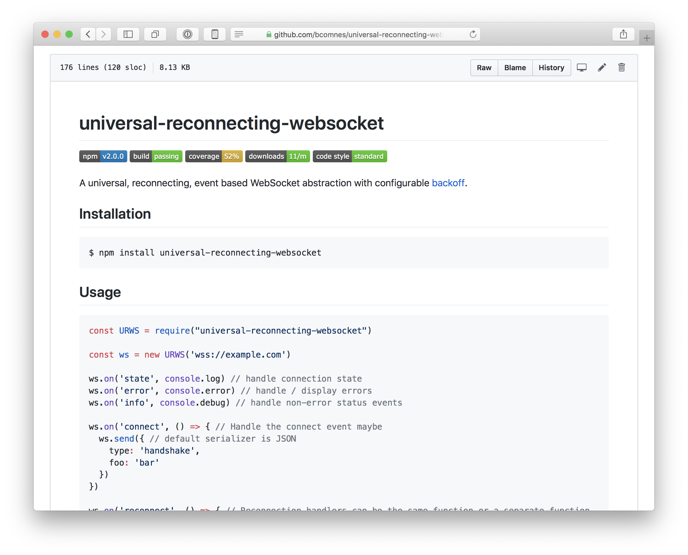

Websockets are a fantastic and underutilized API.  Here are some tools and experiments I built to make working with websockets a bit nicer.

## [`universal-reconnecting-websocket`](https://github.com/bcomnes/universal-reconnecting-websocket)

[](https://github.com/bcomnes/universal-reconnecting-websocket/)

Universal reconnecting websocket is a thin websocket client wrapper on top of DOM [`WebSocket`](https://developer.mozilla.org/en-US/docs/Web/API/WebSocket)'s and Node.js's [ws](https://github.com/websockets/ws).  It provides the following features:

- Automatic serializing of messages
- Automatic reconnect, with customizable strategies
- Binary support
- Fully defined state machine
- Useful connection state events
- Message and error handling
- Unified Node.js and Browser API

The idea behind this library was to bring the wrapper API that I desired for websockets to both Node.js and Browsers in a unified way.  It turns out, that there are a bunch of subtle but incompatible API differences between the `ws` client and the one found in the browser, so ultimately, I was a bit disappointed with how this experiment turned out.

I was very happy with the browser side of the API.  I think this part turned out great, and was what the surface API was designed against.

The Node.js API was essentially mixed on top of the API that was implemented against the DOM api.  The `ws` client has a lot more options than Browser websockts, and a number of key differences around protocol and binary options, which would require one to write two sepearate clients for Node and Browsers which kind of defeated the purpose of a universal client.  I did not realize this until after I wrote it.

The next step for this project would be to implement two specific `abstract` reconnecting sockets with the same API, but implemented and documented specifically to the socket type it is written around.

### Key Takeway

Don't try to write a "universal" module when wrapping `io` primitives.  Instead, implement an `abstract` version of the api specific to the `io` primitives it uses.  If, down the road, it is determined to be beneficial to have a single module that automatically chooses which underlying `abstract` implementation to use based on the environment, you can use the singular `abstract` implementations to achieve that.  Universal modules should usually only be for algorithmic modules.

## [`websocket-chat`](https://github.com/bcomnes/websocket-chat)

[](https://github.com/bcomnes/websocket-chat)

Websocket chat is a prototype grade chat server using [`ws`](https://github.com/websockets/ws).  It implements a few demonstration features:

- Keepalive Heartbeat
- Message broadcast
- Echo server
- Chat room messages
- Nickname support
- Websocket server testing

It's not much but it acts as a handy reference on how to implement a naive chat server with limited features.  It is hosted on Heroku and is completely separate from the client, other than the protocol assumptions.

## [`websocket-chat-client`](https://github.com/bcomnes/websocket-chat-client)

[](https://websocket-chat-client.netlify.com)

- 🌎[Live Demo](https://websocket-chat-client.netlify.com)
- 🛠[Code](https://github.com/bcomnes/websocket-chat-client)

This is a prototype grade example of a real time chat app that uses `universal-reconnecting-websocket` and connects to the `websocket-chat` server.  The application is completely static, and can connect to any arbitrary `websocket-chat` server, demonstrating a [JAMStack](https://jamstack.org) architecture.  Keeping the client and server decoupled ensures you have to take care of all protocol assumptions up front which would help ensure you could implement other clients against the same server (for example, a native mobile app client).

## [`dom-event-handler`](https://github.com/bcomnes/dom-event-handler)

[](https://github.com/bcomnes/dom-event-handler)

This is module of a [WebReflection article](https://webreflection.medium.com/dom-handleevent-a-cross-platform-standard-since-year-2000-5bf17287fd38) discussing the ancient and often forgotten detail of the [EventLister](https://developer.mozilla.org/en-US/docs/Web/API/EventTarget/addEventListener) api.  Unfortunately the author of that article would probably disapprove of this module due to lack of semicolons.  C'est la vie.  (I still have mad respect for your work Andrea!)

Essentially: it lets you write class methods and use them as event handler functions, without binding.  This has some performance implications if you have many event handler functions, and arguably some ergonomic gains.

These are two functionally equivalent implementations:

```js
const DOMEventHandler = require("dom-event-handler")

class MyWSController extends SomeOtherClass {
  constructor () {
    this.ws = new WebSocket('ws://localhost:8080')
    this.handler = new DOMEventHandler(this, this.ws)
  }

  // These methods handle the websocket events
  onmessage (ev) {}
  onopen (ev) {}
  onerror (ev) {}
  onclose (ev) {}
}
```

vs...

```js
const ws = new WebSocket('ws://localhost:8080')

class VerboseWSController {
  constructor () {
    this.foo = 'bar'
    this.onmessage = this.onmessage.bind(this)
    this.onopen = this.onopen.bind(this)s
    this.onerror = this.onerror.bind(this)
    this.onclose = this.onclose.bind(this)
  }

  onmessage (ev) {}
  onopen (ev) {}
  onerror (ev) {}
  onclose (ev) {}
}

const c = new VerboseWSController()

ws.addEventListener('message', c.onmessage)
ws.addEventListener('open', c.onopen)
ws.addEventListener('error', c.onerror)
ws.addEventListener('close', c.onclose)
```

Isn't that nice?

## [`node-event-handler`](https://github.com/bcomnes/node-event-handler)

[](https://github.com/bcomnes/node-event-handler)

When implementing `universal-reconnecting-websocket`, it was assumed that the [EventLister](https://developer.mozilla.org/en-US/docs/Web/API/EventTarget/addEventListener) api could be mocked for the `ws` client events.  It turns out, this wasn't easy.

Node.js and DOM event systems are just too different.  Here some some challenges in making them overlap:

- Node.js events don't support the `handleEvent` method, like DOM events.
- The shape of the event data objects are totally different in both systems.
- DOM events are a large API and difficult to simulate in Node.js.

These differences broguht me to the following conclusions.

- When Node.js was the hot new thing, it was in vogue to implement Node compatible API layers for the browser.  It was usually straight forward, but inevitably a userspace solution.  This had a lot of advantages (like nice and simple APIs that worked effectively) and little drawbacks other than a bit of extra bundle size and lack of a standards authority dictating how things should work.  [`browserify`](http://browserify.org) used this strategey to great effect, and it still works great today.
- As Node.js aged, and its opponents slowly regained power to push back against its influence, and as Node.js's innovations slowly sublimated into implemented, yet incompatible "standards", it became fashionable to implement DOM apis compatible for node.  The sudden interest in [node-fetch](https://github.com/node-fetch/node-fetch) is testament to this trend, despite many [bugs](https://github.com/search?q=repo%3Anode-fetch%2Fnode-fetch+clone+&type=issues), and awkward differences between it and the real DOM API.
- Porting Node.js APIs to the browser is easy, since they are fundamentally simple, userspace derived APIs.
- Porting Browser APIs to Node in userspace is not easy, complex and error prone.  Avoid doing it.  See the key takeaways from `urws` above for the proper way to handle IO abstractions.
- Node events are simpler to understand, but lack the handle event API found in the DOM.  Maybe a userspace event system could accommodate this a bit better, and still remain simple and compatible with Node.js events.
- DOM events are [complex](https://developer.mozilla.org/en-US/docs/Web/API/Event) and way more difficult to comprehend, especially for newbies.  The handle event method is a neat idea to avoid binding, but re-introducing the complexity of DOM events to node is not a good idea.
