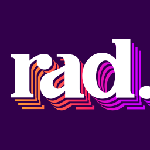
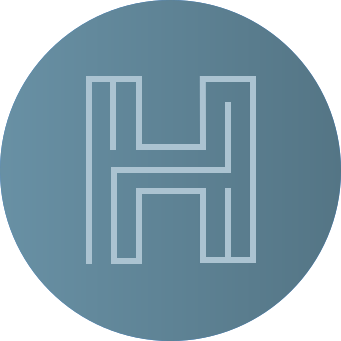

<!-- The root layout uses the front-matter title as metadata, not a visible heading. -->
<!-- markdownlint-configure-file { "MD025": { "front_matter_title": "" } } -->

# Bret Comnes

Professional software engineer experienced in full-stack product development, infrastructure, operations, platform engineering, and cloud architecture.
Specialized in open-source tooling in JavaScript, TypeScript, and Go.

<ul class="resume-contact" role="list">
  <li>portfolio: <a href="https://bret.io">bret.io</a></li>
  <li>email: <a href="mailto:bcomnes+website@gmail.com">bcomnes@gmail.com</a></li>
  <li>location: <a href="https://www.openstreetmap.org/relation/11049834">Sutter Creek, CA</a></li>
  <li>github: <a href="https://github.com/bcomnes">github.com/bcomnes</a></li>
  <li>npm: <a href="https://www.npmjs.com/~bret">npmjs.com/~bret</a></li>
  <li>linkedin: <a href="https://www.linkedin.com/in/bcomnes/">linkedin.com/in/bcomnes</a></li>
</ul>

<h2 class="job-heading">
  
    
    <a href="https://socket.dev">Socket Inc.</a>
  
  <small class="job-dates">2021–Present</small>
</h2>

<h3 class="job-role">
  Member of Technical Staff
  <small class="job-dates">2026–Present</small>
</h3>

<h4>
  <small>Tech Lead for the Developer Surfaces team.</small>
</h4>

- Led technical direction through approximately 3,600% traffic growth and 415% fleet expansion.
- Re-architected Socket’s TypeScript/Node.js GitHub App around worker services, durable queues, concurrency controls, and rate-limit backpressure.
- Built and scaled Socket’s public API and scanning platform across PostgreSQL, Redis, Kafka, Kubernetes, and Grafana.
- Established observability, integration testing, and operational practices for reliable high-volume processing.

<h3 class="job-role">
  Senior Software Engineer
  <small class="job-dates">2021–2026</small>
</h3>

<h4>
  <small>Joined Socket as employee #5.</small>
</h4>

- Built Socket’s initial GitHub App, including authentication, installation flows, webhook handling, repository scanning, and automated pull-request reports.
- Automated background scanning during customer onboarding and repository or permission changes, improving time to first result.
- Expanded Socket’s public API and scanning capabilities, improving product coverage and reliability.

<small class="subdue"><strong>Technologies:</strong> TypeScript, Go, Node.js, React, Next.js, PostgreSQL, Redis, Kafka, Kubernetes, GCP, Grafana, GitHub API</small>

<h2 class="job-heading">
  
    
    <a href="https://littlstar.info">Littlstar</a>
    →
    
    <a href="https://rad.live">Rad.live</a>
  
  <small class="job-dates">2019–2021</small>
</h2>

<h3 class="job-role">
  Principal Engineer
  <small class="job-dates">2021</small>
</h3>

- Designed and implemented an NFT minting and auction platform in approximately 10 weeks (Next.js/GraphQL).
- See [Littlstar portfolio](https://bret.io/blog/2021/littlstar/) for more information.

<h3 class="job-role">
  Senior Software Engineer
  <small class="job-dates">2019–2021</small>
</h3>

- Developed full IAC provisioning and deployment pipelines with Terraform and GitHub Actions targeting AWS.
- Developed [Little Core Labs](https://github.com/little-core-labs)’ peer-to-peer content delivery system.
- Implemented a rebrand of Littlstar to [Rad.live](https://rad.live).
- Redesigned and relaunched the product website using [Next.js](https://nextjs.org) and [SWR](https://swr.vercel.app).
- Designed and implemented an organizational microservice pattern.
- Developed an organizational strategy for JWT authorization across microservices.

<h2 class="job-heading">
  
    
    <a href="https://archive.ph/m8Igr">Hyperdivision</a>
  
  <small class="job-dates">2019</small>
</h2>

<h3 class="job-role">
  Software Engineer
  <small class="job-dates">2019</small>
</h3>

<h4>
  <small>Denmark 🇩🇰</small>
</h4>

- Led development of Heimdall, a cryptographically secure, peer-to-peer ledger and proposal system for managing cryptographic assets in cryptocurrency exchanges and other financial technologies (Electron, Node.js, JavaScript).
- Developed security-critical native and WebAssembly Node.js cryptography bindings ([prebuildify](https://github.com/prebuild/prebuildify), [libsodium](https://github.com/sodium-friends/sodium-native), [wat2js](https://github.com/mafintosh/wat2js)).

<h2 class="job-heading">
  
    
    <a href="https://www.netlify.com">Netlify</a>
  
  <small class="job-dates">2017–2019</small>
</h2>

<h3 class="job-role">
  Platform Engineering
  <small class="job-dates">2018–2019</small>
</h3>

- Joined Netlify's DevOps-focused platform team.
- Maintained and developed [Netlify's CI build environment](https://www.netlify.com/docs/continuous-deployment/), built with [Docker](https://www.docker.com), [Go](https://golang.org), [Jenkins](https://jenkins.io), and [Kubernetes](https://kubernetes.io).
- Launched Netlify's selectable build-image infrastructure and interface.
- Developed and maintained [Netlify's OpenAPI](https://github.com/netlify/open-api) Go client, and architected and rewrote the [JavaScript client](https://github.com/netlify/js-client).
- Performed 24-hour on-call duties.
- Monitored and maintained the health of Netlify's multi-cloud infrastructure using [Humio](http://humio.com) and [Datadog](https://www.datadoghq.com).
- Scaled and deployed infrastructure with GitOps via [Ansible](https://www.ansible.com), Bash, and [Terraform](http://terraform.io).
- See [Netlify portfolio](/blog/2020/netlify/#platform) for more examples.

<h3 class="job-role">
  Product Engineering
  <small class="job-dates">2017–2018</small>
</h3>

- Planned, designed, implemented, tested, and iterated on new features for [Netlify's React-based web app](https://app.netlify.com).
- Supported, maintained, tested, and released Netlify's [open-source JS and Go libraries](https://github.com/netlify).
- Architected and built Netlify's next-generation, extensible [CLI](https://github.com/netlify/cli).
- See [Netlify portfolio](/blog/2020/netlify/#product) for more examples.

<h2 class="job-heading">
  
    
    <a href="http://www.zhealthconsulting.com">ZHealth</a>
  
  <small class="job-dates">2016–2017</small>
</h2>

<h3 class="job-role">
  Software Engineer
  <small class="job-dates">2016–2017</small>
</h3>

- Developed EtchCV, a structured documentation suite for cardiac surgeons and hospitals.
- Designed and implemented APIs and microservices.
- Developed cross-platform desktop software using Electron, HTML, CSS, and SVG, powered by React and Redux.
- Implemented continuous Electron app delivery using Travis CI, AppVeyor, and S3/AWS.

<h2 class="job-heading">
  
    
    <a href="https://www.jaguarlandrover.com">Jaguar Land Rover</a>
  
  <small class="job-dates">2015–2016</small>
</h2>

<h3 class="job-role">
  OS & Application Engineering
  <small class="job-dates">2015–2016</small>
</h3>

- Developed mobile apps, infotainment systems, and OS software using JavaScript, Node.js, HTML, and CSS.
- Targeted in-vehicle embedded systems, fully utilizing the onboard CAN bus.
- Architected a single sign-on service and documentation server for internal documents and project planning using Express.js.

<h2 class="job-heading">
  
    
    <a href="https://www.pdx.edu/">Portland State University</a>
  
  <small class="job-dates">2012–2015</small>
</h2>

<h3 class="job-role">
  HPC Operations & Python Development
  <small class="job-dates">2013–2015</small>
</h3>

<h4>
  <small><a href="https://www.pdx.edu/oit/research-computing">Office of Information Technology ARC</a></small>
</h4>

- Developed web applications and performed systems programming with Python and Django.
- Developed custom database monitoring tools that tracked MySQL and Postgres usage metrics.
- Built, automated, and monitored PSU’s research servers, HPC Linux clusters, and colocated infrastructure.
- Initiated efforts to automate cluster deployment and management using Ansible.
- Introduced new users to ARC's resources and shared Unix computing environments and trained them in their use.

<h3 class="job-role">
  Lab Instructor & TA+RA
  <small class="job-dates">2012–2014</small>
</h3>

<h4>
  <small><a href="http://www.pdx.edu/physics/">PSU Physics Department</a></small>
</h4>

- Wrote custom control software and a web application that enabled remote viewing and operation of a scanning electron microscope over the internet using React, WebSockets, and WebRTC.
- Taught PSU’s general physics labs and assisted in the upper-division experimental physics labs.
- Developed two novel labs on microcontrollers and FPGAs, covering topics ranging from basic concepts to advanced subjects such as PID control theory.
- Taught introductory electronics and debugging skills to students.

<h2 class="job-heading">
  
    
    <a href="https://www.wiley.com/en-us">Wiley</a>
  
  <small class="job-dates">2012</small>
</h2>

<h3 class="job-role">
  Textbook Development Consultant
  <small class="job-dates">2012</small>
</h3>

- Developed interactive figures and demos for an interactive calculus textbook published by Wiley Publishing.

<h2 class="job-heading">
  
    
    <a href="https://www.humboldt.edu/physics-astronomy">HSU Gravitational Research Laboratory</a>
  
  <small class="job-dates">2009–2011</small>
</h2>

<h3 class="job-role">
  Research Assistant
  <small class="job-dates">2009–2011</small>
</h3>

- Designed and machined custom experimental instruments and developed the lab’s data collection, automation, and analysis software to study the gravitational inverse-square law at submillimeter distance scales.

<h2 class="job-heading">
  
    
    <a href="https://egg.astro.cornell.edu/index.php/">National Astronomy and Ionosphere Center</a>
  
  <small class="job-dates">2009</small>
</h2>

<h3 class="job-role">
  Arecibo Guest Researcher
  <small class="job-dates">2009</small>
</h3>

- Trained on and operated the world’s largest radio telescope at the time, and analyzed the collected data to search for previously undiscovered galaxies.

## Education

- [Humboldt State University](https://www.humboldt.edu/physics-astronomy) <small class="subdue">B.S. Physics 2011 </small>
- [Portland State University](http://www.pdx.edu/physics/) <small class="subdue">M.S. Applied Physics 2015 (completed coursework; degree not awarded)</small>

## Media

- [Socket - GitHub App Improvements](https://socket.dev/blog/github-app-improvements) 2022-07-26
- [JS Party – Episode #227: JS logging & error handling](https://changelog.com/jsparty/227) 2022-05-27
- [JS Party – Episode #219: Making moves on supply chain security](https://changelog.com/jsparty/219) 2022-03-24
- [Netlify Blog: A more flexible build architecture with updated Linux](https://www.netlify.com/blog/2019/03/14/a-more-flexible-build-architecture-with-updated-linux/) 2019-03-14
- [Netlify Blog: Fearless deploys for your lingering processes](https://www.netlify.com/blog/2018/11/28/fearless-deploys-for-your-lingering-processes/) 2018-11-28
- [Netlify Blog: Netlify CLI 2.0 now in Beta 🎉](https://www.netlify.com/blog/2018/09/10/netlify-cli-2.0-now-in-beta/) 2018-09-10
- [Netlify Blog: Buy and secure a custom domain through Netlify](https://www.netlify.com/blog/2018/06/19/buy-and-secure-a-custom-domain-through-netlify/) 2018-06-19
- [Netlify Blog: Netlify now shows your deploy status on its favicon](https://www.netlify.com/blog/2018/05/22/netlify-now-shows-your-deploy-status-on-its-favicon/) 2018-05-22
- [Netlify Blog: Introducing Site Dashboards](https://www.netlify.com/blog/2017/08/22/introducing-site-dashboards/) 2017-08-22
- [Netlify Blog: Introducing Audit Log](https://www.netlify.com/blog/2017/07/27/introducing-audit-log/) 2017-07-27

## Community

- Datcast <small class="subdue">Podcast (2018 - 2019)</small>
- [PDX Node](https://www.meetup.com/pdxnode/) <small class="subdue">Meetup organizer (2015 - 2017)</small>
- [Node School](https://nodeschool.io) <small class="subdue">Organizer & Mentor (2016)</small>
- [Code for Portland](http://www.codeforportland.org) <small class="subdue">Organizer & Mentor • Open Civic Data Initiative (2014 - 2015)</small>
- [WebRTC Camp](https://twitter.com/WebRTCCamp) <small class="subdue">Speaker (2013)</small>
- [Indieweb Camp](https://indieweb.org) <small class="subdue">Organizer & Mentor (2012 - 2014)</small>

*[HPC]: High Performance Computing
*[PSU]: Portland State University
*[ARC]: Academic Research Computing
*[IAC]: Infrastructure as code
*[IC]: Individual Contributor
